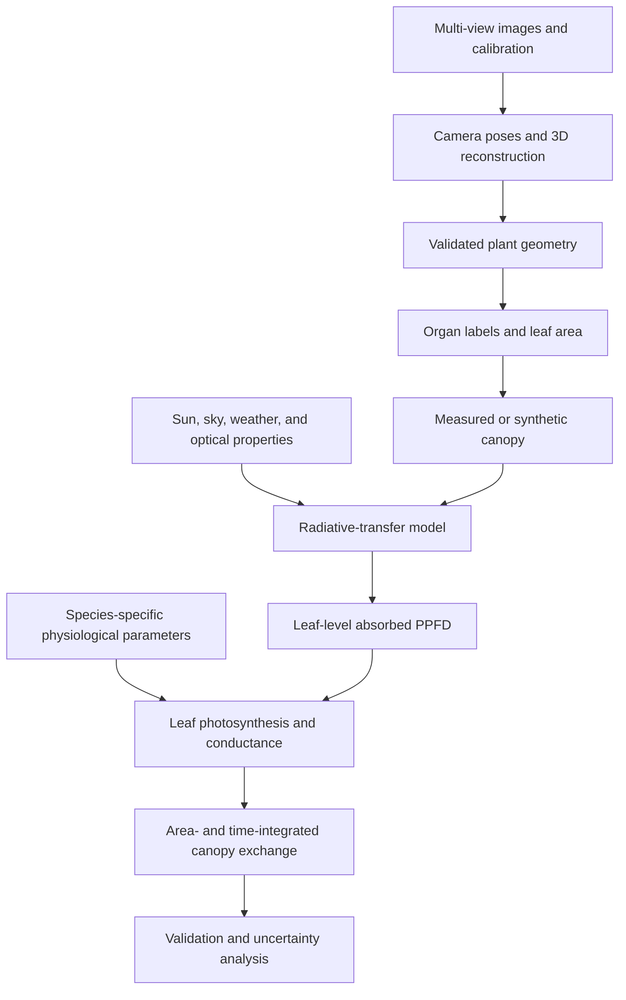

## Project overview

Canopy photosynthesis modeling links several distinct systems: image acquisition, 3D reconstruction, organ geometry, radiative transfer, leaf physiology, and environmental forcing. This article defines the interfaces and validation requirements between those stages.

It is a **conceptual research workflow**, not a complete executable simulator. Each stage requires a tested implementation, calibrated parameters, units, uncertainty analysis, and comparison with independent measurements.

<!-- truncate -->

## Workflow map



The arrows are data contracts. For example, a radiative-transfer model needs geometry with known units and normals; a photosynthesis model needs absorbed radiation in physical units, not arbitrary ray-hit counts.

## 1. Define the scientific question first

Possible questions include:

- How does leaf-angle distribution affect within-canopy light?
- Which architectural traits explain differences in daily carbon gain?
- Can reconstructed canopies reproduce measured light interception?
- How sensitive is a crop-model parameter to 3D structural variation?

The question determines the necessary spatial and temporal resolution. A visualization model does not automatically support quantitative carbon-flux claims.

Pre-register or document:

- target variable and unit;
- spatial unit: leaf, plant, plot, or canopy;
- temporal unit: instant, hour, or day;
- experimental factors and replicates;
- calibration and validation observations;
- acceptable error or decision threshold.

## 2. Acquire multi-view images

Use a capture protocol appropriate to the plant scale:

- stable illumination and minimal leaf motion;
- locked or recorded focus, exposure, white balance, and focal length;
- sufficient overlap and multiple elevations;
- measured scale controls;
- calibration images and camera metadata;
- subject identifiers that connect images to field or chamber records.

Turntable and field capture need different background strategies. In a turntable setup, static room features must be masked because the plant rotates relative to them. In field capture, wind and moving shadows can violate the static-scene assumption.

### Acquisition validation

Report image count, rejected images, angular or spatial coverage, blur screening, marker visibility, and missing views. Repeat a subset of plants to quantify capture repeatability.

## 3. Reconstruct geometry

### Structure from Motion and multi-view stereo

SfM estimates camera poses and sparse scene structure; multi-view stereo creates a denser point cloud. Tools such as COLMAP can provide these stages, but command-line option names change across versions. Save the exact software version and configuration.

The geometry pipeline should produce:

- camera poses and intrinsics;
- scaled point cloud or mesh;
- per-vertex or per-face normals;
- confidence or density information where available;
- reconstruction diagnostics.

### 3D Gaussian Splatting

3D Gaussian Splatting is primarily a learned radiance-field representation for novel-view rendering. A set of optimized Gaussians is not automatically a watertight, metrically validated plant mesh. Geometry extraction requires an additional, documented method and its own validation.

Do not replace an SfM-to-mesh pipeline with a few tensor parameters and call the result complete 3DGS. A practical implementation needs a differentiable rasterizer, constrained scale/rotation/opacity parameterization, densification and pruning, camera calibration, and a defined export path.

## 4. Validate and process the mesh

Thin leaves, self-occlusion, texture-poor surfaces, and motion produce holes and false surfaces. Surface reconstruction can also fill unsupported regions.

Inspect:

- scale error against independent distances;
- completeness by organ and canopy depth;
- false connections between overlapping leaves;
- mesh normals and orientation;
- non-manifold or degenerate geometry;
- sensitivity to masking and reconstruction settings.

Poisson reconstruction returns a smooth closed surface and can extrapolate into low-density areas. Use density information and measured evidence to crop unsupported surfaces rather than accepting the default mesh.

## 5. Derive plant organs and leaf area

A curvature threshold alone is not a robust leaf/stem segmentation method. Curvature depends on scale, mesh resolution, noise, and neighborhood definition.

Use a validated combination of:

- geometry and topology;
- color or spectral information;
- supervised organ labels;
- plant-development constraints;
- manual review on a representative subset.

For each organ, preserve:

- surface area and the method used to calculate it;
- orientation and normal convention;
- thickness or two-sided-leaf assumption;
- segmentation confidence;
- link to the original plant and treatment.

Compare total reconstructed leaf area with destructive leaf-area measurements or another independent method.

## 6. Build a measured or synthetic canopy

There are two different scientific products:

1. **Measured canopy:** positions and geometry are reconstructed from an observed stand.
2. **Synthetic canopy:** plant instances and traits are generated to test hypotheses.

Synthetic perturbations must be interpretable. Record the distribution, covariance, bounds, and random seed for plant spacing, height, azimuth, leaf angle, and size. Repeatedly cloning one plant and adding arbitrary vertex noise does not reproduce population-level architectural diversity.

Check for plant overlap, below-ground geometry, unrealistic leaf intersections, and changes in leaf area after transformation.

## 7. Model the light environment in physical units

A radiative-transfer stage needs:

- canopy coordinates and units;
- direct and diffuse sky radiation;
- sun position calculated from date, time, and location;
- leaf reflectance and transmittance by waveband;
- soil/background optical properties;
- an absorption and scattering model;
- a mapping from intercepted energy to absorbed PPFD or another defined quantity.

Angles provided in degrees must be converted before using NumPy trigonometric functions:

```python
import numpy as np

elevation = np.deg2rad(elevation_degrees)
azimuth = np.deg2rad(azimuth_degrees)
```

Counting first ray intersections produces a sampling density, not irradiance. Each ray needs a defined energy or probability weight, and the model must describe whether it includes transmission, reflection, multiple scattering, and diffuse radiation.

### Light-model validation

Compare predictions with independent observations such as:

- above- and below-canopy PAR sensors;
- vertical or horizontal light profiles;
- intercepted-radiation measurements;
- hemispherical images or ceptometers;
- energy conservation and convergence checks.

Increase ray count or spatial resolution until the output of interest converges within a predefined tolerance.

## 8. Parameterize leaf photosynthesis

The Farquhar–von Caemmerer–Berry model describes C3 leaf photosynthesis through biochemical limitations. A credible implementation needs more than a generic `Vcmax25` and `Jmax25`.

Define and justify:

- species, cultivar, leaf age, and nitrogen status;
- leaf temperature rather than air temperature when they differ;
- intercellular or chloroplastic CO₂ treatment;
- Rubisco-, electron-transport-, and, when relevant, TPU-limited rates;
- day respiration;
- temperature-response functions;
- stomatal and, when needed, mesophyll conductance;
- absorbed light and spectral assumptions;
- fitted parameter uncertainty.

Ambient CO₂ concentration cannot simply replace intercellular CO₂ without a conductance model or an explicitly justified approximation.

Fit physiological parameters from appropriate gas-exchange observations or cite a parameter source that matches the biological material and conditions. Generic literature constants are useful for sensitivity analysis, not automatically for quantitative prediction.

## 9. Integrate leaf rates without losing units

For leaf element `i` with net assimilation `A_i` in micromoles of CO₂ per square metre per second and one-sided area `a_i` in square metres:

```text
P_canopy = sum_i(A_i × a_i)
```

The result is micromoles of CO₂ per second. An area-weighted mean is:

```text
A_mean = sum_i(A_i × a_i) / sum_i(a_i)
```

Dividing total assimilation by the number of occupied voxels does not produce an area-based rate.

For daily carbon gain, integrate over time using environmental forcing and consistent time units. Report whether the canopy domain represents one plant, one row segment, one square metre of ground, or a whole plot.

## 10. Keep the implementation modular

A reproducible project can expose explicit stage interfaces:

```text
images + calibration
    -> camera poses + scaled geometry
geometry + organ labels
    -> leaf elements + area + normals
leaf elements + environment + optics
    -> absorbed PPFD by element and time
absorbed PPFD + physiology
    -> leaf assimilation by element and time
leaf assimilation + area
    -> canopy exchange + uncertainty
```

For every interface, validate:

- file schema and coordinate convention;
- shape, unit, range, and missing values;
- provenance and software version;
- stable identifiers across stages;
- a small fixture with a known or manually checked result.

## 11. Uncertainty and sensitivity

Uncertainty enters through:

- camera calibration and scale;
- missing or falsely reconstructed leaf area;
- organ segmentation;
- leaf normals and optical properties;
- sky and sun forcing;
- physiological parameter fitting;
- numerical sampling and time integration.

Use perturbation, Monte Carlo, or a designed sensitivity analysis to determine which uncertainties control the final canopy result. Report distributions or intervals, not only a single simulated value.

## Minimum evidence for a quantitative claim

- independent geometric measurements;
- measured or well-supported optical properties;
- light-model validation;
- physiological calibration or appropriate parameter provenance;
- canopy-level gas-exchange or biomass/carbon evidence when available;
- repeatability across plants or plots;
- a fully versioned environment, configuration, and data manifest.

Without this evidence, present the output as a hypothesis-generating simulation or visualization.

## References and implementations

- [COLMAP command-line interface](https://colmap.github.io/cli.html)
- [3D Gaussian Splatting paper and reference implementation](https://repo-sam.inria.fr/fungraph/3d-gaussian-splatting/)
- [Open3D surface reconstruction guide](https://www.open3d.org/docs/latest/tutorial/Advanced/surface_reconstruction.html)
- [Farquhar, von Caemmerer, and Berry (1980)](https://biocycle.atmos.colostate.edu/Documents/SiB/Farquhar_1980.pdf)

These resources document individual stages. They do not remove the need to validate the integrated crop or canopy model for the intended experiment.
