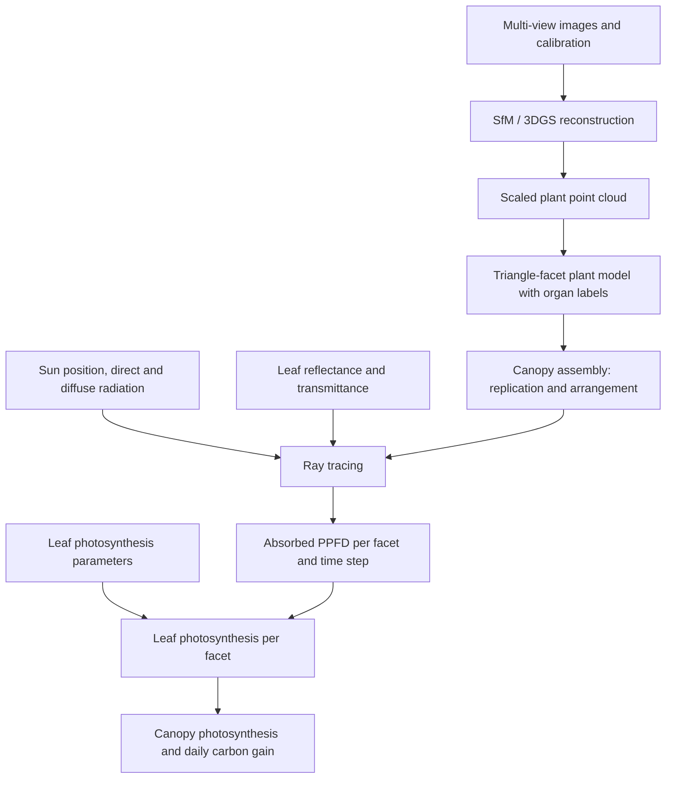

import { CottonCanopyFigure } from '@site/src/components/figures/Cotton3D';

## Overview

Canopy photosynthesis depends on how leaves are arranged in space: architecture decides how much light each leaf receives, and leaf physiology decides how much of that light is fixed as carbon. Big-leaf and multilayer models average this structure away. To keep it, I built a modular model that starts from images of real plants and ends with canopy carbon gain, with an explicit 3D canopy in between.

The model has five stages: **multi-view imaging → 3D reconstruction → triangle-facet plant model → ray-traced light distribution → leaf-to-canopy photosynthesis.** Each stage writes a defined data product, so stages can be replaced or re-run independently, for example swapping SfM for 3D Gaussian Splatting without touching the light model.

<!-- truncate -->

## Model structure


```mermaid
flowchart TD
    A[Multi-view images and calibration] --> B[SfM / 3DGS reconstruction]
    B --> C[Scaled plant point cloud]
    C --> D[Triangle-facet plant model with organ labels]
    D --> E[Canopy assembly: replication and arrangement]
    F[Sun position, direct and diffuse radiation] --> G[Ray tracing]
    O[Leaf reflectance and transmittance] --> G
    E --> G
    G --> H[Absorbed PPFD per facet and time step]
    I[Leaf photosynthesis parameters] --> J[Leaf photosynthesis per facet]
    H --> J
    J --> K[Canopy photosynthesis and daily carbon gain]
```

## 1. Multi-view image acquisition

Plants are photographed from multiple elevations around the full circumference, either on a turntable in a growth chamber or with a camera moving around the plant in the field. The capture protocol fixes focus, exposure, white balance and focal length, keeps the plant still, and includes scale markers so that the reconstruction can be brought to metric units. In turntable capture, the static background is masked because the plant rotates relative to it.

## 2. 3D reconstruction

**Structure from Motion and multi-view stereo.** SfM (COLMAP) estimates camera poses and a sparse structure; multi-view stereo densifies it into a point cloud. The software version and configuration are stored with each reconstruction.

**3D Gaussian Splatting.** 3DGS optimizes a set of anisotropic Gaussians against the images and renders thin, overlapping leaves more completely than dense stereo. Because the Gaussians are a radiance representation rather than a surface, a separate surface-extraction step converts them to geometry before the light simulation.

Reconstructed geometry is checked against independent distances (scale), and incomplete or falsely connected leaves are inspected before the next stage.

## 3. Triangle-facet plant model

The light model operates on triangles. The scaled point cloud is meshed, and each triangle (facet) carries:

- its three vertices and normal, in metres;
- an organ label, leaf or non-leaf (stem, branch, petiole);
- the optical properties of that organ, reflectance and transmittance.

Organ labels come from point-cloud segmentation, combining geometry and colour with manual review on a representative subset. Facet area summed by organ gives the leaf area of the plant, which is checked against destructive leaf-area measurement.

## 4. Canopy assembly

A canopy is assembled by placing plant models at the planting positions of the stand (row spacing, plant spacing, number of rows). Each instance can be rotated about its vertical axis and perturbed in position, so that leaves of neighbouring plants do not line up artificially. Overlaps, below-ground geometry and changes of leaf area after transformation are checked after assembly.

The canopy below is the cotton input used in the model: one reconstructed plant replicated 24 times, described as triangles, each facet carrying the reflectance and transmittance of its class (leaf or other organ).

<CottonCanopyFigure />

## 5. Light distribution by ray tracing

The sun position is computed from date, time and location. Direct radiation is traced as parallel rays from the sun direction; diffuse radiation is traced from discretized sky directions. At each hit, a ray deposits the absorbed fraction of its energy, and the reflected and transmitted fractions continue according to the facet's reflectance and transmittance, so multiple scattering inside the canopy is included. Rays that reach the ground are treated with the soil reflectance.

Each ray carries an energy weight, so the result is absorbed photosynthetic photon flux density (PPFD, µmol m⁻² s⁻¹) per facet, not a hit count. The number of rays is increased until the canopy-level result converges. Angles are converted to radians before trigonometric evaluation:

```python
import numpy as np

elevation = np.deg2rad(elevation_degrees)
azimuth = np.deg2rad(azimuth_degrees)
```

## 6. Leaf photosynthesis

Each facet's absorbed PPFD drives a C3 leaf photosynthesis model of the Farquhar–von Caemmerer–Berry type. Net assimilation is the minimum of the Rubisco-limited and electron-transport-limited rates minus day respiration. The electron transport rate J follows a non-rectangular hyperbola in absorbed light:

```text
θJ² − (αI + Jmax)J + αI·Jmax = 0
```

where I is absorbed PPFD, α the quantum efficiency, θ the curvature and Jmax the maximum electron transport rate. Vcmax and Jmax are adjusted from 25 °C to leaf temperature with Arrhenius-type temperature responses. Vcmax, Jmax and day respiration are fitted from gas-exchange measurements (A–Ci and light-response curves) of the simulated crop.

## 7. From leaves to canopy

For facet i with net assimilation A_i (µmol CO₂ m⁻² s⁻¹) and one-sided area a_i (m²):

```text
P_canopy = Σ A_i · a_i                 (µmol CO₂ s⁻¹)
A_mean   = Σ A_i · a_i / Σ a_i         (µmol CO₂ m⁻² s⁻¹)
```

Dividing P_canopy by the ground area of the simulated stand gives canopy photosynthesis per unit ground area, and integrating over the day's time steps gives daily carbon gain. The ground area, the time step and the simulated domain (plant, row segment or plot) are reported with every result.

## 8. Modular implementation

The stages exchange explicit data products:

```text
images + calibration          -> camera poses + scaled point cloud
point cloud + organ labels    -> triangle facets + area + normals + optics
facets + planting layout      -> canopy
canopy + sun and sky          -> absorbed PPFD per facet and time step
absorbed PPFD + leaf model    -> assimilation per facet and time step
assimilation + facet area     -> canopy photosynthesis
```

Each interface has a schema with units and coordinate conventions and a small test case with a hand-checked result. This modularity is what allows the same canopy to be re-run under different sun positions, optical properties or physiological parameters, and different plant architectures to be compared under the same light environment.

## Uses

- Quantify how leaf angle, leaf area distribution and plant spacing change within-canopy light and daily carbon gain.
- Compare cultivars or management (density, row orientation) on an explicit 3D canopy.
- Test the effect of leaf optical properties, including BRDF-based leaf reflectance, on canopy light absorption.
- Provide architecture-explicit inputs to crop growth models.

## Scope and limitations

The model resolves light at the level of individual facets, so its accuracy depends on the completeness of the reconstruction: missing or merged leaves change both leaf area and light interception. A canopy built by replicating one plant does not contain plant-to-plant variation; when that variation matters, several reconstructed plants are used. Light predictions are compared with above- and below-canopy PAR sensors, and canopy photosynthesis with canopy gas exchange where such measurements are available.

## References

- Farquhar, G. D., von Caemmerer, S., & Berry, J. A. (1980). A biochemical model of photosynthetic CO₂ assimilation in leaves of C3 species. _Planta, 149_, 78–90.
- [COLMAP](https://colmap.github.io/)
- [3D Gaussian Splatting](https://repo-sam.inria.fr/fungraph/3d-gaussian-splatting/)
- [Open3D surface reconstruction](https://www.open3d.org/docs/latest/tutorial/Advanced/surface_reconstruction.html)
