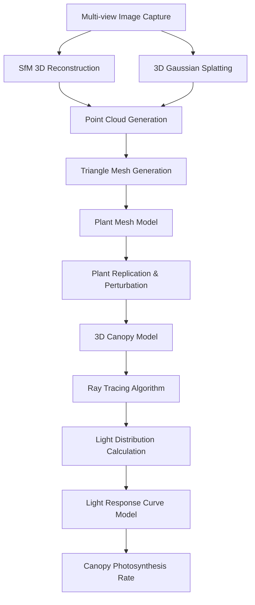

<!-- truncate -->

# Canopy Photosynthesis Modeling Tutorial Based on 3D Reconstruction

## Introduction

Canopy photosynthesis modeling is a crucial research area in precision agriculture and plant phenomics. This comprehensive tutorial demonstrates how to build a complete canopy photosynthesis simulation system through multi-view image acquisition, 3D reconstruction, canopy construction, and ray tracing techniques. The complete workflow includes: Camera Capture → SfM/3DGS Reconstruction → Mesh Generation → Canopy Construction → Light Distribution Simulation → Photosynthesis Calculation.

## Technical Workflow Overview



## Step 1: Multi-view Image Acquisition System

### Hardware Configuration

```python
# Multi-view capture system configuration
import numpy as np
import cv2
import json
from datetime import datetime

class MultiViewCaptureSystem:
    def __init__(self, camera_config):
        self.cameras = []
        self.calibration_data = {}
        self.capture_positions = self.generate_capture_positions()
        
    def generate_capture_positions(self, radius=1.5, height_levels=3, angles_per_level=12):
        """Generate spherical capture positions"""
        positions = []
        
        for h_idx in range(height_levels):
            # Height from 0.5m to 2.0m
            height = 0.5 + (h_idx * 0.75)
            
            for angle_idx in range(angles_per_level):
                angle = (angle_idx * 360 / angles_per_level) * np.pi / 180
                
                x = radius * np.cos(angle)
                y = radius * np.sin(angle)
                z = height
                
                # Camera looks at plant center
                look_at = np.array([0, 0, 1.0])  # Plant center height
                camera_pos = np.array([x, y, z])
                
                positions.append({
                    'position': camera_pos,
                    'look_at': look_at,
                    'up_vector': np.array([0, 0, 1])
                })
        
        return positions
    
    def capture_sequence(self, plant_id, output_dir):
        """Execute multi-view image capture"""
        metadata = {
            'plant_id': plant_id,
            'timestamp': datetime.now().isoformat(),
            'positions': [],
            'camera_params': self.get_camera_parameters()
        }
        
        for idx, pos_config in enumerate(self.capture_positions):
            # Move camera to specified position (requires robotic arm or rail system)
            self.move_camera_to_position(pos_config)
            
            # Capture image
            image_path = f"{output_dir}/image_{idx:03d}.jpg"
            image = self.capture_image()
            cv2.imwrite(image_path, image)
            
            # Record position information
            metadata['positions'].append({
                'image_id': idx,
                'position': pos_config['position'].tolist(),
                'look_at': pos_config['look_at'].tolist(),
                'up_vector': pos_config['up_vector'].tolist()
            })
        
        # Save metadata
        with open(f"{output_dir}/metadata.json", 'w') as f:
            json.dump(metadata, f, indent=2)
        
        return metadata
    
    def get_camera_parameters(self):
        """Get camera intrinsic parameters"""
        return {
            'focal_length': 35.0,  # mm
            'sensor_width': 36.0,  # mm
            'sensor_height': 24.0,  # mm
            'image_width': 4000,
            'image_height': 3000,
            'distortion_coeffs': [0.1, -0.2, 0.0, 0.0, 0.0]
        }
```

### Adaptive Capture Strategy

```python
class AdaptiveCaptureStrategy:
    def __init__(self):
        self.quality_threshold = 0.8
        self.overlap_ratio = 0.6
        
    def optimize_capture_positions(self, plant_bbox, complexity_map):
        """Optimize capture positions based on plant complexity"""
        base_positions = self.generate_base_positions(plant_bbox)
        
        # Increase capture density based on plant complexity
        enhanced_positions = []
        for pos in base_positions:
            enhanced_positions.append(pos)
            
            # Add extra views in complex regions
            complexity = self.estimate_local_complexity(pos, complexity_map)
            if complexity > 0.7:
                additional_views = self.generate_additional_views(pos, num_views=3)
                enhanced_positions.extend(additional_views)
        
        return enhanced_positions
    
    def estimate_image_quality(self, image):
        """Evaluate image quality"""
        # Calculate image sharpness
        gray = cv2.cvtColor(image, cv2.COLOR_BGR2GRAY)
        laplacian_var = cv2.Laplacian(gray, cv2.CV_64F).var()
        
        # Calculate exposure quality
        hist = cv2.calcHist([gray], [0], None, [256], [0, 256])
        exposure_quality = 1.0 - np.sum(hist[[0, 255]]) / image.size
        
        # Overall quality score
        quality_score = (laplacian_var / 1000.0) * exposure_quality
        return min(quality_score, 1.0)
```

## Step 2: Structure from Motion (SfM) Reconstruction

### COLMAP Integration

```python
import subprocess
import os
from pathlib import Path

class SfMReconstruction:
    def __init__(self, colmap_path="/usr/local/bin/colmap"):
        self.colmap_path = colmap_path
        
    def run_sfm_pipeline(self, image_dir, output_dir, camera_model="PINHOLE"):
        """Execute complete SfM reconstruction pipeline"""
        
        # Create output directory
        Path(output_dir).mkdir(parents=True, exist_ok=True)
        database_path = os.path.join(output_dir, "database.db")
        
        # 1. Feature extraction
        self.extract_features(image_dir, database_path, camera_model)
        
        # 2. Feature matching
        self.match_features(database_path)
        
        # 3. Sparse reconstruction
        sparse_dir = os.path.join(output_dir, "sparse")
        self.sparse_reconstruction(database_path, image_dir, sparse_dir)
        
        # 4. Dense reconstruction
        dense_dir = os.path.join(output_dir, "dense")
        self.dense_reconstruction(image_dir, sparse_dir, dense_dir)
        
        return dense_dir
    
    def extract_features(self, image_dir, database_path, camera_model):
        """Feature extraction"""
        cmd = [
            self.colmap_path, "feature_extractor",
            "--database_path", database_path,
            "--image_path", image_dir,
            "--ImageReader.camera_model", camera_model,
            "--SiftExtraction.use_gpu", "1",
            "--SiftExtraction.max_num_features", "8192"
        ]
        subprocess.run(cmd, check=True)
    
    def match_features(self, database_path):
        """Feature matching"""
        cmd = [
            self.colmap_path, "exhaustive_matcher",
            "--database_path", database_path,
            "--SiftMatching.use_gpu", "1"
        ]
        subprocess.run(cmd, check=True)
    
    def sparse_reconstruction(self, database_path, image_dir, output_dir):
        """Sparse reconstruction"""
        Path(output_dir).mkdir(parents=True, exist_ok=True)
        
        cmd = [
            self.colmap_path, "mapper",
            "--database_path", database_path,
            "--image_path", image_dir,
            "--output_path", output_dir
        ]
        subprocess.run(cmd, check=True)
    
    def dense_reconstruction(self, image_dir, sparse_dir, dense_dir):
        """Dense reconstruction"""
        Path(dense_dir).mkdir(parents=True, exist_ok=True)
        
        # Image undistortion
        cmd_undistort = [
            self.colmap_path, "image_undistorter",
            "--image_path", image_dir,
            "--input_path", os.path.join(sparse_dir, "0"),
            "--output_path", dense_dir,
            "--output_type", "COLMAP"
        ]
        subprocess.run(cmd_undistort, check=True)
        
        # Stereo matching
        cmd_stereo = [
            self.colmap_path, "patch_match_stereo",
            "--workspace_path", dense_dir,
            "--workspace_format", "COLMAP",
            "--PatchMatchStereo.geom_consistency", "1"
        ]
        subprocess.run(cmd_stereo, check=True)
        
        # Stereo fusion
        cmd_fusion = [
            self.colmap_path, "stereo_fusion",
            "--workspace_path", dense_dir,
            "--workspace_format", "COLMAP",
            "--input_type", "geometric",
            "--output_path", os.path.join(dense_dir, "fused.ply")
        ]
        subprocess.run(cmd_fusion, check=True)
```

## Step 3: 3D Gaussian Splatting Reconstruction

```python
import torch
import torch.nn as nn
import numpy as np
from scipy.spatial.transform import Rotation

class GaussianSplattingReconstruction:
    def __init__(self, device="cuda"):
        self.device = device
        self.gaussians = None
        
    def initialize_gaussians_from_sfm(self, point_cloud_path, num_gaussians=100000):
        """Initialize Gaussians from SfM point cloud"""
        # Load SfM point cloud
        points, colors = self.load_point_cloud(point_cloud_path)
        
        # Initialize Gaussian parameters
        positions = torch.tensor(points, dtype=torch.float32, device=self.device)
        colors = torch.tensor(colors, dtype=torch.float32, device=self.device)
        
        # Initialize scales and rotations
        scales = torch.ones((len(points), 3), device=self.device) * 0.01
        rotations = torch.zeros((len(points), 4), device=self.device)
        rotations[:, 0] = 1.0  # Unit quaternion
        
        # Initialize opacities
        opacities = torch.ones((len(points), 1), device=self.device) * 0.5
        
        self.gaussians = {
            'positions': nn.Parameter(positions),
            'colors': nn.Parameter(colors),
            'scales': nn.Parameter(scales),
            'rotations': nn.Parameter(rotations),
            'opacities': nn.Parameter(opacities)
        }
        
        return self.gaussians
    
    def train_gaussians(self, images, camera_poses, num_iterations=30000):
        """Train 3D Gaussians"""
        optimizer = torch.optim.Adam([
            {'params': [self.gaussians['positions']], 'lr': 0.00016},
            {'params': [self.gaussians['colors']], 'lr': 0.0025},
            {'params': [self.gaussians['scales']], 'lr': 0.005},
            {'params': [self.gaussians['rotations']], 'lr': 0.001},
            {'params': [self.gaussians['opacities']], 'lr': 0.05}
        ])
        
        for iteration in range(num_iterations):
            # Randomly select training view
            cam_idx = np.random.randint(0, len(images))
            target_image = images[cam_idx]
            camera_pose = camera_poses[cam_idx]
            
            # Render image
            rendered_image = self.render_gaussian_splatting(camera_pose)
            
            # Compute loss
            loss = self.compute_loss(rendered_image, target_image)
            
            # Backpropagation
            optimizer.zero_grad()
            loss.backward()
            optimizer.step()
            
            # Adaptive density control
            if iteration % 100 == 0:
                self.adaptive_density_control()
            
            if iteration % 1000 == 0:
                print(f"Iteration {iteration}, Loss: {loss.item():.6f}")
    
    def extract_mesh_from_gaussians(self, resolution=512):
        """Extract mesh from Gaussians"""
        # Use Marching Cubes algorithm
        from skimage import measure
        
        # Create voxel grid
        x = np.linspace(-2, 2, resolution)
        y = np.linspace(-2, 2, resolution)
        z = np.linspace(-2, 2, resolution)
        X, Y, Z = np.meshgrid(x, y, z)
        
        # Calculate density for each voxel
        density = self.evaluate_gaussian_density(X, Y, Z)
        
        # Extract isosurface
        vertices, faces, _, _ = measure.marching_cubes(density, level=0.1)
        
        return vertices, faces
```

## Step 4: Mesh Processing and Plant Model Construction

```python
import trimesh
import open3d as o3d
from scipy.spatial import ConvexHull

class PlantMeshProcessor:
    def __init__(self):
        self.mesh = None
        self.leaf_segments = []
        self.stem_segments = []
        
    def process_point_cloud_to_mesh(self, point_cloud_path):
        """Convert point cloud to mesh"""
        # Load point cloud
        pcd = o3d.io.read_point_cloud(point_cloud_path)
        
        # Point cloud preprocessing
        pcd = self.preprocess_point_cloud(pcd)
        
        # Poisson reconstruction
        mesh, _ = o3d.geometry.TriangleMesh.create_from_point_cloud_poisson(
            pcd, depth=9, width=0, scale=1.1, linear_fit=False
        )
        
        # Mesh post-processing
        mesh = self.postprocess_mesh(mesh)
        
        self.mesh = mesh
        return mesh
    
    def preprocess_point_cloud(self, pcd):
        """Point cloud preprocessing"""
        # Remove outliers
        pcd, _ = pcd.remove_statistical_outlier(nb_neighbors=20, std_ratio=2.0)
        
        # Estimate normals
        pcd.estimate_normals(
            search_param=o3d.geometry.KDTreeSearchParamHybrid(radius=0.1, max_nn=30)
        )
        
        # Orient normals consistently
        pcd.orient_normals_consistent_tangent_plane(100)
        
        return pcd
    
    def postprocess_mesh(self, mesh):
        """Mesh post-processing"""
        # Remove duplicate vertices
        mesh.remove_duplicated_vertices()
        
        # Remove duplicate triangles
        mesh.remove_duplicated_triangles()
        
        # Remove degenerate triangles
        mesh.remove_degenerate_triangles()
        
        # Remove non-manifold edges
        mesh.remove_non_manifold_edges()
        
        # Smooth mesh
        mesh = mesh.filter_smooth_simple(number_of_iterations=5)
        
        return mesh
    
    def segment_plant_organs(self, mesh):
        """Plant organ segmentation"""
        vertices = np.asarray(mesh.vertices)
        faces = np.asarray(mesh.triangles)
        
        # Geometry-based segmentation
        leaf_indices, stem_indices = self.geometric_segmentation(vertices, faces)
        
        # Create leaf and stem meshes
        leaf_mesh = self.create_submesh(mesh, leaf_indices)
        stem_mesh = self.create_submesh(mesh, stem_indices)
        
        self.leaf_segments = self.extract_individual_leaves(leaf_mesh)
        self.stem_segments = [stem_mesh]
        
        return self.leaf_segments, self.stem_segments
    
    def geometric_segmentation(self, vertices, faces):
        """Geometry-based segmentation"""
        # Calculate vertex geometric features
        curvatures = self.compute_curvature(vertices, faces)
        normals = self.compute_normals(vertices, faces)
        
        # Classify based on curvature and normals
        leaf_threshold = 0.5
        leaf_indices = np.where(curvatures > leaf_threshold)[0]
        stem_indices = np.where(curvatures <= leaf_threshold)[0]
        
        return leaf_indices, stem_indices
    
    def compute_curvature(self, vertices, faces):
        """Calculate vertex curvature"""
        # Simplified curvature calculation
        mesh_trimesh = trimesh.Trimesh(vertices=vertices, faces=faces)
        curvatures = trimesh.curvature.discrete_gaussian_curvature_measure(
            mesh_trimesh, vertices, radius=0.05
        )
        return np.abs(curvatures)
```

## Step 5: Canopy Construction with Random Perturbation

```python
class CanopyBuilder:
    def __init__(self, plant_mesh, plant_segments):
        self.base_plant = plant_mesh
        self.leaf_segments = plant_segments['leaves']
        self.stem_segments = plant_segments['stems']
        self.canopy_plants = []
        
    def build_canopy(self, canopy_config):
        """Build canopy structure"""
        # Generate plant positions
        positions = self.generate_plant_positions(canopy_config)
        
        # Create plant instance for each position
        for i, pos in enumerate(positions):
            plant_instance = self.create_plant_instance(pos, i)
            self.canopy_plants.append(plant_instance)
        
        # Merge all plants
        canopy_mesh = self.merge_plants()
        
        return canopy_mesh, self.canopy_plants
    
    def generate_plant_positions(self, config):
        """Generate plant positions"""
        row_spacing = config['row_spacing']  # Row spacing
        plant_spacing = config['plant_spacing']  # Plant spacing
        num_rows = config['num_rows']
        plants_per_row = config['plants_per_row']
        
        positions = []
        for row in range(num_rows):
            for plant in range(plants_per_row):
                x = plant * plant_spacing
                y = row * row_spacing
                z = 0  # Ground level
                
                # Add random perturbation
                x += np.random.normal(0, plant_spacing * 0.1)
                y += np.random.normal(0, row_spacing * 0.1)
                
                positions.append([x, y, z])
        
        return np.array(positions)
    
    def create_plant_instance(self, position, plant_id):
        """Create individual plant instance"""
        # Copy base plant
        plant_mesh = self.base_plant.copy()
        
        # Apply random transformation
        transform_matrix = self.generate_random_transform(position, plant_id)
        plant_mesh.transform(transform_matrix)
        
        # Apply morphological variation
        plant_mesh = self.apply_morphological_variation(plant_mesh, plant_id)
        
        return {
            'mesh': plant_mesh,
            'position': position,
            'id': plant_id,
            'transform': transform_matrix
        }
    
    def generate_random_transform(self, position, plant_id):
        """Generate random transformation matrix"""
        # Set random seed for reproducibility
        np.random.seed(plant_id)
        
        # Random rotation (mainly around Z-axis)
        rotation_z = np.random.uniform(0, 2 * np.pi)
        rotation_x = np.random.normal(0, 0.1)  # Slight tilt
        rotation_y = np.random.normal(0, 0.1)
        
        # Random scaling
        scale_factor = np.random.normal(1.0, 0.15)
        scale_factor = np.clip(scale_factor, 0.7, 1.3)
        
        # Build transformation matrix
        transform = np.eye(4)
        
        # Apply scaling
        transform[:3, :3] *= scale_factor
        
        # Apply rotation
        from scipy.spatial.transform import Rotation
        rotation = Rotation.from_euler('xyz', [rotation_x, rotation_y, rotation_z])
        transform[:3, :3] = rotation.as_matrix() @ transform[:3, :3]
        
        # Apply translation
        transform[:3, 3] = position
        
        return transform
    
    def apply_morphological_variation(self, mesh, plant_id):
        """Apply morphological variation"""
        vertices = np.asarray(mesh.vertices)
        
        # Leaf shape variation
        leaf_variation = self.generate_leaf_variation(plant_id)
        vertices = self.apply_leaf_deformation(vertices, leaf_variation)
        
        # Stem variation
        stem_variation = self.generate_stem_variation(plant_id)
        vertices = self.apply_stem_deformation(vertices, stem_variation)
        
        # Update mesh
        mesh.vertices = o3d.utility.Vector3dVector(vertices)
        mesh.compute_vertex_normals()
        
        return mesh
    
    def generate_leaf_variation(self, plant_id):
        """Generate leaf variation parameters"""
        np.random.seed(plant_id + 1000)
        
        return {
            'length_factor': np.random.normal(1.0, 0.2),
            'width_factor': np.random.normal(1.0, 0.15),
            'curvature_factor': np.random.normal(1.0, 0.3),
            'angle_variation': np.random.normal(0, 0.2)
        }
```

## Step 6: Ray Tracing Algorithm Implementation

```python
import numpy as np
from numba import jit, cuda
import matplotlib.pyplot as plt

class RayTracingEngine:
    def __init__(self, canopy_mesh, light_config):
        self.canopy_mesh = canopy_mesh
        self.light_config = light_config
        self.acceleration_structure = None
        self.build_acceleration_structure()
        
    def build_acceleration_structure(self):
        """Build acceleration structure (BVH tree)"""
        from rtree import index
        
        # Create spatial index
        idx = index.Index()
        
        faces = np.asarray(self.canopy_mesh.triangles)
        vertices = np.asarray(self.canopy_mesh.vertices)
        
        for i, face in enumerate(faces):
            # Calculate triangle bounding box
            triangle_vertices = vertices[face]
            min_coords = np.min(triangle_vertices, axis=0)
            max_coords = np.max(triangle_vertices, axis=0)
            
            # Insert into spatial index
            idx.insert(i, (*min_coords, *max_coords))
        
        self.acceleration_structure = idx
        self.faces = faces
        self.vertices = vertices
    
    def simulate_light_distribution(self, sun_angles, num_rays=1000000):
        """Simulate light distribution"""
        results = {}
        
        for time_step, sun_angle in enumerate(sun_angles):
            print(f"Computing light distribution for time step {time_step}")
            
            # Generate rays
            rays = self.generate_sun_rays(sun_angle, num_rays)
            
            # Ray tracing
            intersections = self.trace_rays(rays)
            
            # Calculate light intensity distribution
            light_map = self.compute_light_intensity_map(intersections)
            
            results[time_step] = {
                'sun_angle': sun_angle,
                'light_map': light_map,
                'intersections': intersections
            }
        
        return results
    
    def generate_sun_rays(self, sun_angle, num_rays):
        """Generate sun rays"""
        # Sun direction vector
        elevation, azimuth = sun_angle
        sun_direction = np.array([
            np.cos(elevation) * np.sin(azimuth),
            np.cos(elevation) * np.cos(azimuth),
            -np.sin(elevation)  # Downward
        ])
        
        # Generate parallel rays
        # Create ray origin grid above canopy
        canopy_bounds = self.get_canopy_bounds()
        
        # Extend bounds to ensure full canopy coverage
        x_min, x_max = canopy_bounds[0] - 1, canopy_bounds[1] + 1
        y_min, y_max = canopy_bounds[2] - 1, canopy_bounds[3] + 1
        z_start = canopy_bounds[5] + 2  # 2m above canopy top
        
        # Generate random origins
        origins = np.random.uniform(
            [x_min, y_min, z_start],
            [x_max, y_max, z_start],
            (num_rays, 3)
        )
        
        # All rays have same direction (parallel light)
        directions = np.tile(sun_direction, (num_rays, 1))
        
        return {
            'origins': origins,
            'directions': directions
        }
    
    @jit(nopython=True)
    def ray_triangle_intersection(self, ray_origin, ray_direction, v0, v1, v2):
        """Ray-triangle intersection test (Möller-Trumbore algorithm)"""
        epsilon = 1e-8
        
        edge1 = v1 - v0
        edge2 = v2 - v0
        h = np.cross(ray_direction, edge2)
        a = np.dot(edge1, h)
        
        if abs(a) < epsilon:
            return False, 0.0, 0.0, 0.0
        
        f = 1.0 / a
        s = ray_origin - v0
        u = f * np.dot(s, h)
        
        if u < 0.0 or u > 1.0:
            return False, 0.0, 0.0, 0.0
        
        q = np.cross(s, edge1)
        v = f * np.dot(ray_direction, q)
        
        if v < 0.0 or u + v > 1.0:
            return False, 0.0, 0.0, 0.0
        
        t = f * np.dot(edge2, q)
        
        if t > epsilon:
            return True, t, u, v
        
        return False, 0.0, 0.0, 0.0
    
    def trace_rays(self, rays):
        """Ray tracing"""
        origins = rays['origins']
        directions = rays['directions']
        intersections = []
        
        for i in range(len(origins)):
            ray_origin = origins[i]
            ray_direction = directions[i]
            
            # Use spatial index to accelerate intersection tests
            intersection = self.find_closest_intersection(ray_origin, ray_direction)
            
            if intersection is not None:
                intersections.append({
                    'ray_id': i,
                    'point': intersection['point'],
                    'normal': intersection['normal'],
                    'face_id': intersection['face_id'],
                    'distance': intersection['distance']
                })
        
        return intersections
    
    def compute_light_intensity_map(self, intersections):
        """Calculate light intensity distribution map"""
        # Create 3D grid
        bounds = self.get_canopy_bounds()
        resolution = 100
        
        x = np.linspace(bounds[0], bounds[1], resolution)
        y = np.linspace(bounds[2], bounds[3], resolution)
        z = np.linspace(bounds[4], bounds[5], resolution)
        
        light_intensity = np.zeros((resolution, resolution, resolution))
        
        # Map intersection points to grid
        for intersection in intersections:
            point = intersection['point']
            
            # Find corresponding grid indices
            xi = int((point[0] - bounds[0]) / (bounds[1] - bounds[0]) * (resolution - 1))
            yi = int((point[1] - bounds[2]) / (bounds[3] - bounds[2]) * (resolution - 1))
            zi = int((point[2] - bounds[4]) / (bounds[5] - bounds[4]) * (resolution - 1))
            
            # Ensure indices are within valid range
            xi = np.clip(xi, 0, resolution - 1)
            yi = np.clip(yi, 0, resolution - 1)
            zi = np.clip(zi, 0, resolution - 1)
            
            # Increase light intensity
            light_intensity[xi, yi, zi] += 1
        
        return {
            'intensity': light_intensity,
            'bounds': bounds,
            'resolution': resolution,
            'coordinates': (x, y, z)
        }
```

## Step 7: Light Response Curve Model

```python
class PhotosynthesisModel:
    def __init__(self):
        # Farquhar-von Caemmerer-Berry model parameters
        self.vcmax25 = 60.0  # Maximum carboxylation rate at 25°C (μmol m⁻² s⁻¹)
        self.jmax25 = 120.0  # Maximum electron transport rate at 25°C (μmol m⁻² s⁻¹)
        self.rd25 = 1.5      # Dark respiration rate at 25°C (μmol m⁻² s⁻¹)
        
        # Temperature response parameters
        self.ha_vcmax = 65330.0  # Vcmax activation energy (J mol⁻¹)
        self.ha_jmax = 43540.0   # Jmax activation energy (J mol⁻¹)
        self.ha_rd = 46390.0     # Rd activation energy (J mol⁻¹)
        
        # Other parameters
        self.kc25 = 404.9    # CO2 Michaelis constant at 25°C (μmol mol⁻¹)
        self.ko25 = 278.4    # O2 Michaelis constant at 25°C (mmol mol⁻¹)
        self.cp25 = 42.75    # CO2 compensation point at 25°C (μmol mol⁻¹)
        
        self.r_gas = 8.314   # Gas constant (J mol⁻¹ K⁻¹)
        
    def compute_photosynthesis_rate(self, light_intensity, temperature, co2_conc, leaf_area):
        """Calculate photosynthesis rate"""
        # Temperature correction
        vcmax = self.temperature_correction(self.vcmax25, self.ha_vcmax, temperature)
        jmax = self.temperature_correction(self.jmax25, self.ha_jmax, temperature)
        rd = self.temperature_correction(self.rd25, self.ha_rd, temperature)
        
        # Temperature correction for Michaelis constants
        kc = self.temperature_correction(self.kc25, 79430.0, temperature)
        ko = self.temperature_correction(self.ko25, 36380.0, temperature)
        cp = self.temperature_correction(self.cp25, 37830.0, temperature)
        
        # Calculate electron transport rate
        j = self.compute_electron_transport_rate(light_intensity, jmax)
        
        # Calculate RuBisCO-limited photosynthesis rate
        wc = (vcmax * (co2_conc - cp)) / (co2_conc + kc * (1 + 210 / ko))
        
        # Calculate RuBP regeneration-limited photosynthesis rate
        wj = (j * (co2_conc - cp)) / (4 * (co2_conc + 2 * cp))
        
        # Take minimum (limiting factor)
        gross_photosynthesis = min(wc, wj)
        
        # Net photosynthesis rate
        net_photosynthesis = gross_photosynthesis - rd
        
        # Multiply by leaf area to get total photosynthesis rate
        total_rate = net_photosynthesis * leaf_area
        
        return {
            'net_rate': net_photosynthesis,
            'total_rate': total_rate,
            'gross_rate': gross_photosynthesis,
            'respiration': rd,
            'electron_transport': j,
            'rubisco_limited': wc,
            'rubp_limited': wj
        }
    
    def temperature_correction(self, rate25, activation_energy, temperature):
        """Temperature correction function"""
        temp_k = temperature + 273.15
        temp25_k = 25.0 + 273.15
        
        return rate25 * np.exp(activation_energy * (temp_k - temp25_k) / (self.r_gas * temp_k * temp25_k))
    
    def compute_electron_transport_rate(self, light_intensity, jmax):
        """Calculate electron transport rate"""
        # Light response curve parameters
        alpha = 0.24  # Quantum efficiency
        theta = 0.7   # Curvature factor
        
        # Non-rectangular hyperbola model
        a = theta
        b = -(alpha * light_intensity + jmax)
        c = alpha * light_intensity * jmax
        
        # Solve quadratic equation
        discriminant = b**2 - 4*a*c
        if discriminant >= 0:
            j = (-b - np.sqrt(discriminant)) / (2*a)
        else:
            j = 0
        
        return max(0, j)
    
    def compute_canopy_photosynthesis(self, light_distribution, leaf_area_distribution, 
                                    temperature_map, co2_concentration=400):
        """Calculate canopy photosynthesis rate"""
        total_photosynthesis = 0
        detailed_results = []
        
        # Get light distribution data
        light_intensity = light_distribution['intensity']
        coordinates = light_distribution['coordinates']
        
        # Iterate through each voxel
        for i in range(light_intensity.shape[0]):
            for j in range(light_intensity.shape[1]):
                for k in range(light_intensity.shape[2]):
                    if light_intensity[i, j, k] > 0:
                        # Get parameters for this voxel
                        x, y, z = coordinates[0][i], coordinates[1][j], coordinates[2][k]
                        light = light_intensity[i, j, k]
                        leaf_area = leaf_area_distribution.get((i, j, k), 0)
                        temperature = temperature_map.get((i, j, k), 25.0)
                        
                        if leaf_area > 0:
                            # Calculate photosynthesis rate for this voxel
                            result = self.compute_photosynthesis_rate(
                                light, temperature, co2_concentration, leaf_area
                            )
                            
                            total_photosynthesis += result['total_rate']
                            
                            detailed_results.append({
                                'position': (x, y, z),
                                'voxel_index': (i, j, k),
                                'light_intensity': light,
                                'leaf_area': leaf_area,
                                'temperature': temperature,
                                'photosynthesis_rate': result['total_rate'],
                                'details': result
                            })
        
        return {
            'total_canopy_photosynthesis': total_photosynthesis,
            'voxel_results': detailed_results,
            'average_rate': total_photosynthesis / len(detailed_results) if detailed_results else 0
        }
```

## Step 8: Complete Workflow Integration

```python
class CanopyPhotosynthesisSimulator:
    def __init__(self):
        self.capture_system = None
        self.reconstruction_engine = None
        self.mesh_processor = None
        self.canopy_builder = None
        self.ray_tracer = None
        self.photosynthesis_model = None
        
    def run_complete_simulation(self, config):
        """Run complete canopy photosynthesis simulation"""
        print("Starting canopy photosynthesis simulation...")
        
        # 1. Image capture
        print("Step 1: Multi-view image capture")
        if config['use_existing_images']:
            image_dir = config['image_directory']
        else:
            image_dir = self.capture_multi_view_images(config['capture_config'])
        
        # 2. 3D reconstruction
        print("Step 2: 3D reconstruction")
        if config['reconstruction_method'] == 'sfm':
            point_cloud = self.run_sfm_reconstruction(image_dir)
        elif config['reconstruction_method'] == '3dgs':
            point_cloud = self.run_3dgs_reconstruction(image_dir)
        else:
            raise ValueError("Unsupported reconstruction method")
        
        # 3. Mesh generation
        print("Step 3: Mesh generation")
        plant_mesh = self.generate_plant_mesh(point_cloud)
        
        # 4. Organ segmentation
        print("Step 4: Organ segmentation")
        plant_segments = self.segment_plant_organs(plant_mesh)
        
        # 5. Canopy construction
        print("Step 5: Canopy construction")
        canopy_mesh, canopy_plants = self.build_canopy(plant_mesh, plant_segments, config['canopy_config'])
        
        # 6. Ray tracing
        print("Step 6: Ray tracing simulation")
        light_distribution = self.simulate_light_distribution(canopy_mesh, config['light_config'])
        
        # 7. Photosynthesis calculation
        print("Step 7: Photosynthesis calculation")
        photosynthesis_results = self.calculate_canopy_photosynthesis(
            light_distribution, canopy_plants, config['environmental_config']
        )
        
        # 8. Results analysis and visualization
        print("Step 8: Results analysis and visualization")
        self.analyze_and_visualize_results(photosynthesis_results, config['output_dir'])
        
        return photosynthesis_results
    
    def analyze_and_visualize_results(self, results, output_dir):
        """Analyze and visualize results"""
        import matplotlib.pyplot as plt
        from mpl_toolkits.mplot3d import Axes3D
        
        # Create output directory
        os.makedirs(output_dir, exist_ok=True)
        
        # 1. Photosynthesis rate distribution plot
        self.plot_photosynthesis_distribution(results, output_dir)
        
        # 2. Light distribution visualization
        self.plot_light_distribution(results, output_dir)
        
        # 3. Statistical analysis
        self.generate_statistical_report(results, output_dir)
        
        # 4. 3D visualization
        self.create_3d_visualization(results, output_dir)
    
    def generate_statistical_report(self, results, output_dir):
        """Generate statistical report"""
        report = {
            'total_canopy_photosynthesis': results['total_canopy_photosynthesis'],
            'average_rate': results['average_rate'],
            'num_active_voxels': len(results['voxel_results']),
            'statistics': {}
        }
        
        if results['voxel_results']:
            rates = [r['photosynthesis_rate'] for r in results['voxel_results']]
            light_intensities = [r['light_intensity'] for r in results['voxel_results']]
            
            report['statistics'] = {
                'photosynthesis_rate': {
                    'mean': np.mean(rates),
                    'std': np.std(rates),
                    'min': np.min(rates),
                    'max': np.max(rates),
                    'median': np.median(rates)
                },
                'light_intensity': {
                    'mean': np.mean(light_intensities),
                    'std': np.std(light_intensities),
                    'min': np.min(light_intensities),
                    'max': np.max(light_intensities),
                    'median': np.median(light_intensities)
                }
            }
        
        # Save report
        with open(os.path.join(output_dir, 'simulation_report.json'), 'w') as f:
            json.dump(report, f, indent=2)
        
        # Generate text report
        with open(os.path.join(output_dir, 'simulation_report.txt'), 'w') as f:
            f.write("Canopy Photosynthesis Simulation Report\n")
            f.write("=" * 40 + "\n\n")
            f.write(f"Total Canopy Photosynthesis: {report['total_canopy_photosynthesis']:.2f} μmol s⁻¹\n")
            f.write(f"Average Rate: {report['average_rate']:.2f} μmol m⁻² s⁻¹\n")
            f.write(f"Number of Active Voxels: {report['num_active_voxels']}\n\n")
            
            if 'photosynthesis_rate' in report['statistics']:
                stats = report['statistics']['photosynthesis_rate']
                f.write("Photosynthesis Rate Statistics:\n")
                f.write(f"  Mean: {stats['mean']:.2f} μmol m⁻² s⁻¹\n")
                f.write(f"  Std:  {stats['std']:.2f} μmol m⁻² s⁻¹\n")
                f.write(f"  Min:  {stats['min']:.2f} μmol m⁻² s⁻¹\n")
                f.write(f"  Max:  {stats['max']:.2f} μmol m⁻² s⁻¹\n")

# Usage example
def main():
    # Configuration parameters
    config = {
        'use_existing_images': True,
        'image_directory': './plant_images',
        'reconstruction_method': 'sfm',  # 'sfm' or '3dgs'
        'canopy_config': {
            'row_spacing': 0.75,
            'plant_spacing': 0.25,
            'num_rows': 5,
            'plants_per_row': 10
        },
        'light_config': {
            'sun_angles': [(60, 180), (45, 180), (30, 180)],  # (elevation, azimuth)
            'num_rays': 100000
        },
        'environmental_config': {
            'temperature': 25.0,
            'co2_concentration': 400.0,
            'humidity': 0.6
        },
        'output_dir': './simulation_results'
    }
    
    # Run simulation
    simulator = CanopyPhotosynthesisSimulator()
    results = simulator.run_complete_simulation(config)
    
    print(f"Simulation completed. Total canopy photosynthesis: {results['total_canopy_photosynthesis']:.2f} μmol s⁻¹")

if __name__ == "__main__":
    main()
```

## Conclusion

This comprehensive tutorial presents a complete workflow for canopy photosynthesis modeling based on 3D reconstruction, including:

1. **Multi-view Image Capture**: Spherical capture strategy and quality control
2. **3D Reconstruction**: Both SfM and 3D Gaussian Splatting methods
3. **Mesh Processing**: Point cloud to mesh conversion and organ segmentation
4. **Canopy Construction**: Plant replication with random perturbation
5. **Ray Tracing**: Efficient light distribution simulation algorithms
6. **Photosynthesis Calculation**: Farquhar model-based photosynthesis rate computation
7. **Results Analysis**: Statistical analysis and visualization

This system provides powerful tools for precision agriculture, plant breeding, and ecological research, helping researchers understand canopy photosynthetic characteristics and optimize cultivation management strategies.

---

*Last updated: September 2025*