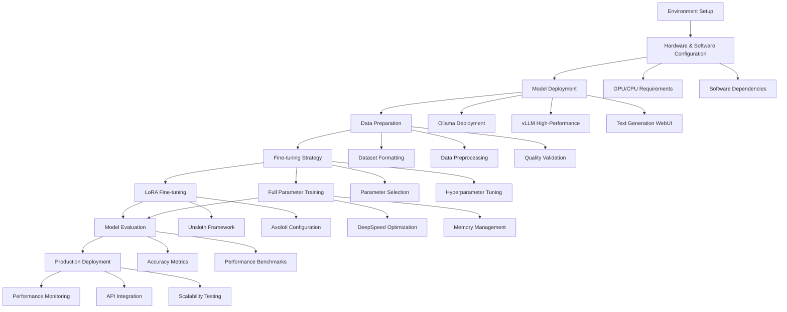

<!-- truncate -->

# Guide to Local LLM Deployment, Training and Fine-tuning

This comprehensive guide covers the complete process of deploying, training, and fine-tuning large language models in local environments, from environment setup to production deployment.

## Technical Workflow Overview



This workflow illustrates the end-to-end process for local LLM training and deployment, highlighting key decision points and alternative approaches at each stage.

## Quick Start (10 Minutes)

**For beginners who want to test LLM deployment before diving into training:**

This quick start gets you running a local LLM using Ollama, which is the easiest way to experiment with LLMs on your local machine without any complex setup.

### Installation and First Run

```bash
# 1. Install Ollama (works on macOS, Linux, Windows)
# macOS/Linux:
curl -fsSL https://ollama.com/install.sh | sh

# Windows: Download from https://ollama.com/download

# 2. Download and run your first model (7B model, ~4GB download)
ollama pull llama2:7b

# 3. Test the model
ollama run llama2:7b

# Try asking: "Explain what machine learning is in simple terms"
```

### Quick Environment Check

Before proceeding with training, verify your system is ready:

```python
# save as check_llm_env.py
import sys
import subprocess

def check_environment():
    """Check if your system is ready for LLM work"""

    print("=== LLM Environment Check ===\n")

    # 1. Python version
    print(f"✓ Python version: {sys.version.split()[0]}")
    if sys.version_info < (3, 10):
        print("  ⚠ Warning: Python 3.10+ recommended for best compatibility")

    # 2. CUDA availability
    try:
        import torch
        print(f"✓ PyTorch installed: {torch.__version__}")

        if torch.cuda.is_available():
            print(f"✓ CUDA available: Yes")
            print(f"  GPU count: {torch.cuda.device_count()}")
            for i in range(torch.cuda.device_count()):
                gpu_name = torch.cuda.get_device_name(i)
                gpu_memory = torch.cuda.get_device_properties(i).total_memory / 1024**3
                print(f"  GPU {i}: {gpu_name} ({gpu_memory:.1f} GB VRAM)")

                # Hardware recommendations
                if gpu_memory < 12:
                    print(f"    ⚠ Warning: {gpu_memory:.1f}GB VRAM is low for training")
                    print(f"    → Consider cloud GPU options (see below)")
                elif gpu_memory >= 24:
                    print(f"    ✓ Excellent! Can train 7B-13B models with LoRA")
        else:
            print("⚠ CUDA not available - CPU only mode")
            print("  → You can run inference with Ollama, but training will be very slow")
            print("  → Recommend cloud GPU for training (see Cloud Options below)")
    except ImportError:
        print("✗ PyTorch not installed")
        print("  Install: pip install torch torchvision torchaudio")

    # 3. RAM check
    try:
        import psutil
        ram_gb = psutil.virtual_memory().total / 1024**3
        print(f"✓ System RAM: {ram_gb:.1f} GB")
        if ram_gb < 32:
            print("  ⚠ Warning: 32GB+ RAM recommended for training")
    except ImportError:
        print("⚠ psutil not installed (can't check RAM)")
        print("  Install: pip install psutil")

    # 4. Disk space
    try:
        import shutil
        disk = shutil.disk_usage("/")
        free_gb = disk.free / 1024**3
        print(f"✓ Free disk space: {free_gb:.1f} GB")
        if free_gb < 100:
            print("  ⚠ Warning: 100GB+ free space recommended")
    except Exception as e:
        print(f"⚠ Could not check disk space: {e}")

    print("\n=== Cloud GPU Options (if local GPU insufficient) ===")
    print("• Google Colab Pro ($10/month): T4/V100 GPUs, good for learning")
    print("• Vast.ai: Rent GPUs starting at $0.20/hour")
    print("• RunPod: $0.39/hour for RTX 3090, easy setup")
    print("• Lambda Labs: $0.50/hour for A100, professional tier")
    print("• Paperspace Gradient: $8/month for basic GPU access")

    print("\n=== Recommended Starting Points ===")
    try:
        if torch.cuda.is_available():
            gpu_memory = torch.cuda.get_device_properties(0).total_memory / 1024**3
            if gpu_memory >= 24:
                print("✓ Your GPU: Start with 7B LoRA fine-tuning (Section: LoRA Fine-tuning)")
            elif gpu_memory >= 12:
                print("✓ Your GPU: Start with quantized training (4-bit LoRA)")
            else:
                print("→ Your GPU: Inference only, use cloud for training")
        else:
            print("→ No GPU: Start with Ollama for inference, use Colab for training")
    except:
        print("→ Install PyTorch first, then rerun this check")

if __name__ == "__main__":
    check_environment()
```

Run the check:
```bash
python check_llm_env.py
```

### What's Next?

Based on your hardware:

**If you have RTX 3090/4090 (24GB) or better:**
- Continue with "Environment Setup" below
- Jump to "LoRA Fine-tuning" section for your first training

**If you have RTX 3060/3070 (8-12GB):**
- Use 4-bit quantization (covered in LoRA section)
- Start with smaller datasets (< 10k samples)

**If you have no GPU or < 8GB VRAM:**
- Continue using Ollama for inference
- Use Google Colab Pro for training experiments
- Consider cloud GPU rental for serious projects

## Environment Setup

### Hardware Requirements

**Minimum Configuration (7B models):**

- GPU: RTX 3090/4090 (24GB VRAM) or A100 (40GB)
- CPU: 16+ cores
- Memory: 64GB DDR4/DDR5
- Storage: 1TB NVMe SSD

**Recommended Configuration (13B-70B models):**

- GPU: Multi-card A100/H100 (80GB VRAM)
- CPU: 32+ cores
- Memory: 128GB+
- Storage: 2TB NVMe SSD

### Software Environment Setup

```bash
# Create conda environment
conda create -n llm-training python=3.10
conda activate llm-training

# Install PyTorch (CUDA 12.1)
pip install torch torchvision torchaudio --index-url https://download.pytorch.org/whl/cu121

# Install core dependencies
pip install transformers datasets accelerate
pip install deepspeed bitsandbytes
pip install wandb tensorboard
pip install flash-attn --no-build-isolation

# Install training frameworks
pip install unsloth[colab-new] @ git+https://github.com/unslothai/unsloth.git
pip install axolotl[flash-attn,deepspeed] @ git+https://github.com/OpenAccess-AI-Collective/axolotl.git
```

## Model Deployment

### Quick Deployment with Ollama

```bash
# Install Ollama
curl -fsSL https://ollama.com/install.sh | sh

# Download and run models
ollama pull llama2:7b
ollama pull qwen2:7b
ollama pull codellama:7b

# Start API service
ollama serve

# Test API
curl http://localhost:11434/api/generate -d '{
  "model": "llama2:7b",
  "prompt": "Why is the sky blue?",
  "stream": false
}'
```

### High-Performance Deployment with vLLM

```python
from vllm import LLM, SamplingParams
import torch

# Check GPU availability
print(f"CUDA available: {torch.cuda.is_available()}")
print(f"GPU count: {torch.cuda.device_count()}")

# Initialize vLLM
llm = LLM(
    model="Qwen/Qwen2-7B-Instruct",
    tensor_parallel_size=1,  # Number of GPUs
    gpu_memory_utilization=0.9,
    max_model_len=4096,
    trust_remote_code=True,
    dtype="half"  # Use FP16 to save VRAM
)

# Set sampling parameters
sampling_params = SamplingParams(
    temperature=0.7,
    top_p=0.9,
    max_tokens=512
)

# Batch inference
prompts = [
    "Explain what machine learning is",
    "Write a Python sorting algorithm",
    "Introduce basic concepts of deep learning"
]

outputs = llm.generate(prompts, sampling_params)

for output in outputs:
    prompt = output.prompt
    generated_text = output.outputs[0].text
    print(f"Prompt: {prompt}")
    print(f"Generated: {generated_text}")
    print("-" * 50)
```

### Using Text Generation WebUI

```bash
# Clone repository
git clone https://github.com/oobabooga/text-generation-webui.git
cd text-generation-webui

# Install dependencies
pip install -r requirements.txt

# Start WebUI
python server.py --model-dir ./models --listen --api

# Download models to models directory
# Supports HuggingFace, GGUF, AWQ, GPTQ formats
```

## Data Preparation and Preprocessing

### Dataset Formats

**Instruction Fine-tuning Format (Alpaca):**

```json
{
  "instruction": "Please explain what artificial intelligence is",
  "input": "",
  "output": "Artificial Intelligence (AI) is a branch of computer science that aims to create systems capable of performing tasks that typically require human intelligence..."
}
```

**Conversation Format (ChatML):**

```json
{
  "messages": [
    {"role": "system", "content": "You are a helpful AI assistant"},
    {"role": "user", "content": "What is deep learning?"},
    {"role": "assistant", "content": "Deep learning is a subset of machine learning..."}
  ]
}
```

### Data Preprocessing Script

```python
import json
import pandas as pd
from datasets import Dataset, load_dataset
from transformers import AutoTokenizer

def prepare_alpaca_dataset(data_path, tokenizer, max_length=2048):
    """Prepare Alpaca format dataset"""
  
    # Load data
    with open(data_path, 'r', encoding='utf-8') as f:
        data = json.load(f)
  
    def format_prompt(example):
        if example['input']:
            prompt = f"### Instruction:\n{example['instruction']}\n\n### Input:\n{example['input']}\n\n### Response:\n"
        else:
            prompt = f"### Instruction:\n{example['instruction']}\n\n### Response:\n"
    
        full_text = prompt + example['output']
        return {"text": full_text}
  
    # Format data
    formatted_data = [format_prompt(item) for item in data]
    dataset = Dataset.from_list(formatted_data)
  
    # Tokenize
    def tokenize_function(examples):
        return tokenizer(
            examples["text"],
            truncation=True,
            padding=False,
            max_length=max_length,
            return_overflowing_tokens=False,
        )
  
    tokenized_dataset = dataset.map(
        tokenize_function,
        batched=True,
        remove_columns=dataset.column_names
    )
  
    return tokenized_dataset

# Usage example
tokenizer = AutoTokenizer.from_pretrained("Qwen/Qwen2-7B")
tokenizer.pad_token = tokenizer.eos_token

train_dataset = prepare_alpaca_dataset("train_data.json", tokenizer)
eval_dataset = prepare_alpaca_dataset("eval_data.json", tokenizer)
```

## LoRA Fine-tuning

### Efficient Fine-tuning with Unsloth

```python
from unsloth import FastLanguageModel
import torch

# Load model and tokenizer
model, tokenizer = FastLanguageModel.from_pretrained(
    model_name="unsloth/qwen2-7b-bnb-4bit",  # 4bit quantized version
    max_seq_length=2048,
    dtype=None,  # Auto detect
    load_in_4bit=True,
)

# Add LoRA adapters
model = FastLanguageModel.get_peft_model(
    model,
    r=16,  # LoRA rank
    target_modules=["q_proj", "k_proj", "v_proj", "o_proj",
                   "gate_proj", "up_proj", "down_proj"],
    lora_alpha=16,
    lora_dropout=0.05,
    bias="none",
    use_gradient_checkpointing="unsloth",
    random_state=3407,
)

# Training configuration
from transformers import TrainingArguments
from trl import SFTTrainer

trainer = SFTTrainer(
    model=model,
    tokenizer=tokenizer,
    train_dataset=train_dataset,
    eval_dataset=eval_dataset,
    dataset_text_field="text",
    max_seq_length=2048,
    dataset_num_proc=2,
    packing=False,
    args=TrainingArguments(
        per_device_train_batch_size=2,
        gradient_accumulation_steps=4,
        warmup_steps=5,
        max_steps=100,
        learning_rate=2e-4,
        fp16=not torch.cuda.is_bf16_supported(),
        bf16=torch.cuda.is_bf16_supported(),
        logging_steps=1,
        optim="adamw_8bit",
        weight_decay=0.01,
        lr_scheduler_type="linear",
        seed=3407,
        output_dir="outputs",
        save_steps=25,
        eval_steps=25,
        evaluation_strategy="steps",
        load_best_model_at_end=True,
        metric_for_best_model="eval_loss",
        greater_is_better=False,
    ),
)

# Start training
trainer_stats = trainer.train()

# Save model
model.save_pretrained("lora_model")
tokenizer.save_pretrained("lora_model")
```

### Professional Fine-tuning with Axolotl

**Configuration file (config.yml):**

```yaml
base_model: Qwen/Qwen2-7B-Instruct
model_type: LlamaForCausalLM
tokenizer_type: AutoTokenizer

load_in_8bit: false
load_in_4bit: true
strict: false

datasets:
  - path: ./data/train.jsonl
    type: alpaca
    conversation: false

dataset_prepared_path: ./prepared_data
val_set_size: 0.1
output_dir: ./outputs

sequence_len: 2048
sample_packing: true
pad_to_sequence_len: true

adapter: lora
lora_model_dir:
lora_r: 32
lora_alpha: 16
lora_dropout: 0.05
lora_target_linear: true
lora_fan_in_fan_out:

wandb_project: llm-finetune
wandb_entity:
wandb_watch:
wandb_name:
wandb_log_model:

gradient_accumulation_steps: 4
micro_batch_size: 2
num_epochs: 3
optimizer: adamw_bnb_8bit
lr_scheduler: cosine
learning_rate: 0.0002

train_on_inputs: false
group_by_length: false
bf16: auto
fp16:
tf32: false

gradient_checkpointing: true
early_stopping_patience:
resume_from_checkpoint:
local_rank:

logging_steps: 1
xformers_attention:
flash_attention: true

warmup_steps: 10
evals_per_epoch: 4
eval_table_size:
saves_per_epoch: 1
debug:
deepspeed:
weight_decay: 0.0
fsdp:
fsdp_config:
special_tokens:
```

**Start training:**

```bash
# Prepare data
python -m axolotl.cli.preprocess config.yml

# Start training
python -m axolotl.cli.train config.yml

# Inference test
python -m axolotl.cli.inference config.yml --lora_model_dir="./outputs"
```

## Full Parameter Fine-tuning

### Large Model Training with DeepSpeed

**DeepSpeed configuration (ds_config.json):**

```json
{
  "fp16": {
    "enabled": "auto",
    "loss_scale": 0,
    "loss_scale_window": 1000,
    "initial_scale_power": 16,
    "hysteresis": 2,
    "min_loss_scale": 1
  },
  "bf16": {
    "enabled": "auto"
  },
  "optimizer": {
    "type": "AdamW",
    "params": {
      "lr": "auto",
      "betas": "auto",
      "eps": "auto",
      "weight_decay": "auto"
    }
  },
  "scheduler": {
    "type": "WarmupLR",
    "params": {
      "warmup_min_lr": "auto",
      "warmup_max_lr": "auto",
      "warmup_num_steps": "auto"
    }
  },
  "zero_optimization": {
    "stage": 3,
    "offload_optimizer": {
      "device": "cpu",
      "pin_memory": true
    },
    "offload_param": {
      "device": "cpu",
      "pin_memory": true
    },
    "overlap_comm": true,
    "contiguous_gradients": true,
    "sub_group_size": 1e9,
    "reduce_bucket_size": "auto",
    "stage3_prefetch_bucket_size": "auto",
    "stage3_param_persistence_threshold": "auto",
    "stage3_max_live_parameters": 1e9,
    "stage3_max_reuse_distance": 1e9,
    "stage3_gather_16bit_weights_on_model_save": true
  },
  "gradient_accumulation_steps": "auto",
  "gradient_clipping": "auto",
  "steps_per_print": 2000,
  "train_batch_size": "auto",
  "train_micro_batch_size_per_gpu": "auto",
  "wall_clock_breakdown": false
}
```

**Training script:**

```python
import torch
from transformers import (
    AutoModelForCausalLM,
    AutoTokenizer,
    TrainingArguments,
    Trainer,
    DataCollatorForLanguageModeling
)
import deepspeed

def main():
    # Model and tokenizer
    model_name = "Qwen/Qwen2-7B"
    tokenizer = AutoTokenizer.from_pretrained(model_name)
    tokenizer.pad_token = tokenizer.eos_token
  
    model = AutoModelForCausalLM.from_pretrained(
        model_name,
        torch_dtype=torch.bfloat16,
        trust_remote_code=True
    )
  
    # Data collator
    data_collator = DataCollatorForLanguageModeling(
        tokenizer=tokenizer,
        mlm=False,
    )
  
    # Training arguments
    training_args = TrainingArguments(
        output_dir="./full_finetune_output",
        overwrite_output_dir=True,
        num_train_epochs=3,
        per_device_train_batch_size=1,
        per_device_eval_batch_size=1,
        gradient_accumulation_steps=8,
        evaluation_strategy="steps",
        eval_steps=500,
        save_steps=1000,
        logging_steps=100,
        learning_rate=5e-5,
        weight_decay=0.01,
        warmup_steps=100,
        lr_scheduler_type="cosine",
        bf16=True,
        dataloader_pin_memory=False,
        deepspeed="ds_config.json",
        report_to="wandb",
        run_name="qwen2-7b-full-finetune"
    )
  
    # Trainer
    trainer = Trainer(
        model=model,
        args=training_args,
        train_dataset=train_dataset,
        eval_dataset=eval_dataset,
        data_collator=data_collator,
        tokenizer=tokenizer,
    )
  
    # Start training
    trainer.train()
  
    # Save model
    trainer.save_model()
    tokenizer.save_pretrained(training_args.output_dir)

if __name__ == "__main__":
    main()
```

**Start multi-GPU training:**

```bash
deepspeed --num_gpus=4 train_full.py
```

## Pre-training

### Pre-training from Scratch

**Data preparation:**

```python
from datasets import load_dataset
from transformers import AutoTokenizer
import multiprocessing

def prepare_pretraining_data():
    # Load large-scale text data
    dataset = load_dataset("wikitext", "wikitext-103-raw-v1")
  
    tokenizer = AutoTokenizer.from_pretrained("Qwen/Qwen2-7B")
  
    def tokenize_function(examples):
        return tokenizer(
            examples["text"],
            truncation=True,
            padding=False,
            max_length=2048,
            return_overflowing_tokens=True,
            return_length=True,
        )
  
    # Parallel processing
    tokenized_dataset = dataset.map(
        tokenize_function,
        batched=True,
        num_proc=multiprocessing.cpu_count(),
        remove_columns=dataset["train"].column_names,
    )
  
    return tokenized_dataset

# Group texts
def group_texts(examples, block_size=2048):
    concatenated_examples = {k: sum(examples[k], []) for k in examples.keys()}
    total_length = len(concatenated_examples[list(examples.keys())[0]])
  
    if total_length >= block_size:
        total_length = (total_length // block_size) * block_size
  
    result = {
        k: [t[i : i + block_size] for i in range(0, total_length, block_size)]
        for k, t in concatenated_examples.items()
    }
    result["labels"] = result["input_ids"].copy()
    return result
```

**Pre-training configuration:**

```python
from transformers import (
    AutoConfig,
    AutoModelForCausalLM,
    TrainingArguments,
    Trainer
)

# Model configuration
config = AutoConfig.from_pretrained("Qwen/Qwen2-7B")
config.vocab_size = len(tokenizer)

# Initialize model
model = AutoModelForCausalLM.from_config(config)

# Pre-training parameters
training_args = TrainingArguments(
    output_dir="./pretrain_output",
    overwrite_output_dir=True,
    num_train_epochs=1,
    per_device_train_batch_size=4,
    gradient_accumulation_steps=16,
    save_steps=10000,
    logging_steps=1000,
    learning_rate=1e-4,
    weight_decay=0.1,
    warmup_steps=10000,
    lr_scheduler_type="cosine",
    bf16=True,
    deepspeed="ds_config_pretrain.json",
    dataloader_num_workers=4,
    remove_unused_columns=False,
)

# Pre-training
trainer = Trainer(
    model=model,
    args=training_args,
    train_dataset=grouped_dataset["train"],
    data_collator=DataCollatorForLanguageModeling(tokenizer, mlm=False),
)

trainer.train()
```

## Model Evaluation

### Automatic Evaluation Metrics

```python
import torch
from transformers import pipeline
from datasets import load_metric
import numpy as np

def evaluate_model(model_path, test_dataset):
    # Load model
    generator = pipeline(
        "text-generation",
        model=model_path,
        tokenizer=model_path,
        torch_dtype=torch.float16,
        device_map="auto"
    )
  
    # BLEU score
    bleu_metric = load_metric("bleu")
  
    predictions = []
    references = []
  
    for example in test_dataset:
        # Generate response
        prompt = example["instruction"]
        generated = generator(
            prompt,
            max_length=512,
            num_return_sequences=1,
            temperature=0.7,
            do_sample=True,
            pad_token_id=generator.tokenizer.eos_token_id
        )[0]["generated_text"]
    
        # Extract generated part
        generated_text = generated[len(prompt):].strip()
    
        predictions.append(generated_text)
        references.append([example["output"]])
  
    # Calculate BLEU score
    bleu_score = bleu_metric.compute(
        predictions=predictions,
        references=references
    )
  
    print(f"BLEU Score: {bleu_score['bleu']:.4f}")
  
    return {
        "bleu": bleu_score["bleu"],
        "predictions": predictions,
        "references": references
    }

# Perplexity evaluation
def calculate_perplexity(model, tokenizer, test_texts):
    model.eval()
    total_loss = 0
    total_tokens = 0
  
    with torch.no_grad():
        for text in test_texts:
            inputs = tokenizer(text, return_tensors="pt", truncation=True, max_length=512)
            inputs = {k: v.to(model.device) for k, v in inputs.items()}
        
            outputs = model(**inputs, labels=inputs["input_ids"])
            loss = outputs.loss
        
            total_loss += loss.item() * inputs["input_ids"].size(1)
            total_tokens += inputs["input_ids"].size(1)
  
    perplexity = torch.exp(torch.tensor(total_loss / total_tokens))
    return perplexity.item()
```

### Human Evaluation Framework

```python
import gradio as gr
import json
from datetime import datetime

class ModelEvaluator:
    def __init__(self, models_dict):
        self.models = models_dict
        self.results = []
  
    def create_evaluation_interface(self):
        def evaluate_response(prompt, model_name, response, relevance, accuracy, fluency, helpfulness, comments):
            result = {
                "timestamp": datetime.now().isoformat(),
                "prompt": prompt,
                "model": model_name,
                "response": response,
                "scores": {
                    "relevance": relevance,
                    "accuracy": accuracy,
                    "fluency": fluency,
                    "helpfulness": helpfulness
                },
                "comments": comments,
                "overall_score": (relevance + accuracy + fluency + helpfulness) / 4
            }
        
            self.results.append(result)
        
            # Save results
            with open("evaluation_results.json", "w", encoding="utf-8") as f:
                json.dump(self.results, f, ensure_ascii=False, indent=2)
        
            return f"Evaluation saved! Overall score: {result['overall_score']:.2f}"
    
        def generate_response(prompt, model_name):
            if model_name in self.models:
                generator = self.models[model_name]
                response = generator(prompt, max_length=512, temperature=0.7)[0]["generated_text"]
                return response[len(prompt):].strip()
            return "Model not found"
    
        # Gradio interface
        with gr.Blocks(title="LLM Model Evaluation System") as demo:
            gr.Markdown("# LLM Model Evaluation System")
        
            with gr.Row():
                with gr.Column():
                    prompt_input = gr.Textbox(label="Input Prompt", lines=3)
                    model_dropdown = gr.Dropdown(
                        choices=list(self.models.keys()),
                        label="Select Model",
                        value=list(self.models.keys())[0] if self.models else None
                    )
                    generate_btn = gr.Button("Generate Response")
            
                with gr.Column():
                    response_output = gr.Textbox(label="Model Response", lines=5)
        
            gr.Markdown("## Evaluation Metrics (1-5 scale)")
        
            with gr.Row():
                relevance_slider = gr.Slider(1, 5, value=3, label="Relevance")
                accuracy_slider = gr.Slider(1, 5, value=3, label="Accuracy")
                fluency_slider = gr.Slider(1, 5, value=3, label="Fluency")
                helpfulness_slider = gr.Slider(1, 5, value=3, label="Helpfulness")
        
            comments_input = gr.Textbox(label="Comments", lines=2)
            evaluate_btn = gr.Button("Submit Evaluation")
            result_output = gr.Textbox(label="Evaluation Result")
        
            # Event binding
            generate_btn.click(
                generate_response,
                inputs=[prompt_input, model_dropdown],
                outputs=response_output
            )
        
            evaluate_btn.click(
                evaluate_response,
                inputs=[
                    prompt_input, model_dropdown, response_output,
                    relevance_slider, accuracy_slider, fluency_slider, helpfulness_slider,
                    comments_input
                ],
                outputs=result_output
            )
    
        return demo

# Usage example
models = {
    "Original Model": pipeline("text-generation", model="Qwen/Qwen2-7B"),
    "Fine-tuned Model": pipeline("text-generation", model="./lora_model")
}

evaluator = ModelEvaluator(models)
demo = evaluator.create_evaluation_interface()
demo.launch(share=True)
```

## Model Quantization and Optimization

### GPTQ Quantization

```python
from auto_gptq import AutoGPTQForCausalLM, BaseQuantizeConfig
from transformers import AutoTokenizer

# Quantization configuration
quantize_config = BaseQuantizeConfig(
    bits=4,  # 4bit quantization
    group_size=128,
    desc_act=False,
    damp_percent=0.1,
    sym=True,
    true_sequential=True,
)

# Load model
model = AutoGPTQForCausalLM.from_pretrained(
    "Qwen/Qwen2-7B",
    quantize_config=quantize_config,
    low_cpu_mem_usage=True,
    device_map="auto"
)

tokenizer = AutoTokenizer.from_pretrained("Qwen/Qwen2-7B")

# Prepare calibration data
calibration_dataset = [
    "What is the history of artificial intelligence development?",
    "Please explain the basic principles of deep learning.",
    "What are the main algorithms in machine learning?",
    # More calibration data...
]

# Execute quantization
model.quantize(calibration_dataset)

# Save quantized model
model.save_quantized("./qwen2-7b-gptq")
tokenizer.save_pretrained("./qwen2-7b-gptq")
```

### AWQ Quantization

```python
from awq import AutoAWQForCausalLM
from transformers import AutoTokenizer

# Load model
model_path = "Qwen/Qwen2-7B"
quant_path = "qwen2-7b-awq"

model = AutoAWQForCausalLM.from_pretrained(model_path, safetensors=True)
tokenizer = AutoTokenizer.from_pretrained(model_path, trust_remote_code=True)

# Quantization configuration
quant_config = {
    "zero_point": True,
    "q_group_size": 128,
    "w_bit": 4,
    "version": "GEMM"
}

# Execute quantization
model.quantize(tokenizer, quant_config=quant_config)

# Save quantized model
model.save_quantized(quant_path)
tokenizer.save_pretrained(quant_path)

print(f"Quantized model saved to: {quant_path}")
```

## Production Deployment

### Docker Containerization

**Dockerfile:**

```dockerfile
FROM nvidia/cuda:12.1-devel-ubuntu22.04

# Install system dependencies
RUN apt-get update && apt-get install -y \
    python3.10 python3-pip git wget curl \
    && rm -rf /var/lib/apt/lists/*

# Set working directory
WORKDIR /app

# Copy requirements file
COPY requirements.txt .

# Install Python dependencies
RUN pip install --no-cache-dir -r requirements.txt

# Copy application code
COPY . .

# Set environment variables
ENV PYTHONPATH=/app
ENV CUDA_VISIBLE_DEVICES=0

# Expose port
EXPOSE 8000

# Health check
HEALTHCHECK --interval=30s --timeout=10s --start-period=60s \
  CMD curl -f http://localhost:8000/health || exit 1

# Start command
CMD ["python", "serve.py"]
```

**Service script (serve.py):**

```python
from fastapi import FastAPI, HTTPException
from pydantic import BaseModel
from transformers import pipeline
import torch
import uvicorn
from typing import Optional

app = FastAPI(title="LLM Service API", version="1.0.0")

# Global variables
generator = None

class GenerateRequest(BaseModel):
    prompt: str
    max_length: int = 512
    temperature: float = 0.7
    top_p: float = 0.9
    do_sample: bool = True

class GenerateResponse(BaseModel):
    generated_text: str
    prompt: str

@app.on_event("startup")
async def load_model():
    global generator
    print("Loading model...")
  
    generator = pipeline(
        "text-generation",
        model="./qwen2-7b-awq",  # Quantized model path
        tokenizer="./qwen2-7b-awq",
        torch_dtype=torch.float16,
        device_map="auto",
        trust_remote_code=True
    )
  
    print("Model loaded successfully!")

@app.get("/health")
async def health_check():
    return {"status": "healthy", "model_loaded": generator is not None}

@app.post("/generate", response_model=GenerateResponse)
async def generate_text(request: GenerateRequest):
    if generator is None:
        raise HTTPException(status_code=503, detail="Model not loaded")
  
    try:
        result = generator(
            request.prompt,
            max_length=request.max_length,
            temperature=request.temperature,
            top_p=request.top_p,
            do_sample=request.do_sample,
            pad_token_id=generator.tokenizer.eos_token_id
        )
    
        generated_text = result[0]["generated_text"][len(request.prompt):].strip()
    
        return GenerateResponse(
            generated_text=generated_text,
            prompt=request.prompt
        )
  
    except Exception as e:
        raise HTTPException(status_code=500, detail=f"Generation failed: {str(e)}")

if __name__ == "__main__":
    uvicorn.run(app, host="0.0.0.0", port=8000)
```

### Kubernetes Deployment

**deployment.yaml:**

```yaml
apiVersion: apps/v1
kind: Deployment
metadata:
  name: llm-service
  labels:
    app: llm-service
spec:
  replicas: 2
  selector:
    matchLabels:
      app: llm-service
  template:
    metadata:
      labels:
        app: llm-service
    spec:
      containers:
      - name: llm-service
        image: your-registry/llm-service:latest
        ports:
        - containerPort: 8000
        resources:
          requests:
            nvidia.com/gpu: 1
            memory: "16Gi"
            cpu: "4"
          limits:
            nvidia.com/gpu: 1
            memory: "24Gi"
            cpu: "6"
        env:
        - name: MODEL_PATH
          value: "/models/qwen2-7b-awq"
        - name: CUDA_VISIBLE_DEVICES
          value: "0"
        volumeMounts:
        - name: model-storage
          mountPath: /models
          readOnly: true
        livenessProbe:
          httpGet:
            path: /health
            port: 8000
          initialDelaySeconds: 120
          periodSeconds: 30
          timeoutSeconds: 10
        readinessProbe:
          httpGet:
            path: /health
            port: 8000
          initialDelaySeconds: 60
          periodSeconds: 10
          timeoutSeconds: 5
      volumes:
      - name: model-storage
        persistentVolumeClaim:
          claimName: model-pvc
      nodeSelector:
        accelerator: nvidia-gpu
      tolerations:
      - key: nvidia.com/gpu
        operator: Exists
        effect: NoSchedule
---
apiVersion: v1
kind: Service
metadata:
  name: llm-service
spec:
  selector:
    app: llm-service
  ports:
  - port: 80
    targetPort: 8000
    protocol: TCP
  type: LoadBalancer
```

## Monitoring and Logging

### Prometheus Monitoring

```python
from prometheus_client import Counter, Histogram, Gauge, start_http_server
import time
import functools

# Define metrics
REQUEST_COUNT = Counter('llm_requests_total', 'Total requests', ['method', 'endpoint', 'status'])
REQUEST_LATENCY = Histogram('llm_request_duration_seconds', 'Request latency')
ACTIVE_REQUESTS = Gauge('llm_active_requests', 'Active requests')
GPU_MEMORY = Gauge('llm_gpu_memory_usage_bytes', 'GPU memory usage', ['gpu_id'])
MODEL_LOAD_TIME = Gauge('llm_model_load_time_seconds', 'Model load time')

def monitor_requests(func):
    @functools.wraps(func)
    async def wrapper(*args, **kwargs):
        start_time = time.time()
        ACTIVE_REQUESTS.inc()
    
        try:
            result = await func(*args, **kwargs)
            REQUEST_COUNT.labels(method='POST', endpoint='/generate', status='success').inc()
            return result
        except Exception as e:
            REQUEST_COUNT.labels(method='POST', endpoint='/generate', status='error').inc()
            raise
        finally:
            ACTIVE_REQUESTS.dec()
            REQUEST_LATENCY.observe(time.time() - start_time)
  
    return wrapper

# Use in FastAPI
@app.post("/generate")
@monitor_requests
async def generate_text(request: GenerateRequest):
    # Original logic
    pass

# Start Prometheus metrics server
start_http_server(9090)
```

### Structured Logging

```python
import logging
import json
from datetime import datetime
import sys

class StructuredLogger:
    def __init__(self, name):
        self.logger = logging.getLogger(name)
        self.logger.setLevel(logging.INFO)
    
        # Create handler
        handler = logging.StreamHandler(sys.stdout)
        handler.setFormatter(self.JSONFormatter())
    
        self.logger.addHandler(handler)
  
    class JSONFormatter(logging.Formatter):
        def format(self, record):
            log_entry = {
                "timestamp": datetime.utcnow().isoformat(),
                "level": record.levelname,
                "logger": record.name,
                "message": record.getMessage(),
                "module": record.module,
                "function": record.funcName,
                "line": record.lineno
            }
        
            # Add extra fields
            if hasattr(record, 'user_id'):
                log_entry['user_id'] = record.user_id
            if hasattr(record, 'request_id'):
                log_entry['request_id'] = record.request_id
            if hasattr(record, 'model_name'):
                log_entry['model_name'] = record.model_name
        
            return json.dumps(log_entry, ensure_ascii=False)
  
    def info(self, message, **kwargs):
        extra = {k: v for k, v in kwargs.items()}
        self.logger.info(message, extra=extra)
  
    def error(self, message, **kwargs):
        extra = {k: v for k, v in kwargs.items()}
        self.logger.error(message, extra=extra)
  
    def warning(self, message, **kwargs):
        extra = {k: v for k, v in kwargs.items()}
        self.logger.warning(message, extra=extra)

# Usage example
logger = StructuredLogger("llm_service")

@app.post("/generate")
async def generate_text(request: GenerateRequest):
    request_id = str(uuid.uuid4())
  
    logger.info(
        "Received generation request",
        request_id=request_id,
        prompt_length=len(request.prompt),
        max_length=request.max_length,
        temperature=request.temperature
    )
  
    try:
        start_time = time.time()
        result = generator(request.prompt, ...)
        generation_time = time.time() - start_time
    
        logger.info(
            "Generation completed",
            request_id=request_id,
            generation_time=generation_time,
            output_length=len(result[0]["generated_text"])
        )
    
        return result
    
    except Exception as e:
        logger.error(
            "Generation failed",
            request_id=request_id,
            error=str(e),
            error_type=type(e).__name__
        )
        raise
```

## Best Practices Summary

### Performance Optimization Tips

1. **Memory Management**

   - Use gradient checkpointing to reduce memory usage
   - Enable CPU offloading for large models
   - Set appropriate batch size and sequence length
2. **Training Acceleration**

   - Use FlashAttention-2
   - Enable mixed precision training (FP16/BF16)
   - Use DeepSpeed ZeRO optimization
3. **Inference Optimization**

   - Model quantization (GPTQ/AWQ)
   - Use vLLM for efficient inference
   - Batch requests to improve throughput

### Security Considerations

1. **Data Security**

   - Anonymize training data
   - Filter model output content
   - Validate and sanitize user inputs
2. **Model Security**

   - Regular backup of model checkpoints
   - Version control and rollback mechanisms
   - Access control and permissions
3. **Deployment Security**

   - API authentication and authorization
   - Request rate limiting
   - Network security configuration

### Cost Control

1. **Compute Resources**

   - Use Spot instances to reduce costs
   - Auto-scaling based on load
   - Choose appropriate GPU models
2. **Storage Optimization**

   - Model compression and quantization
   - Data deduplication and compression
   - Tiered storage for hot/cold data

This complete guide covers the entire workflow from environment setup to production deployment, and you can choose the appropriate technical solutions based on specific requirements.

## Troubleshooting

### 1. CUDA Out of Memory Error

**Error:**
```
RuntimeError: CUDA out of memory. Tried to allocate X GB
```

**Solutions:**
```python
# Option 1: Reduce batch size
per_device_train_batch_size=1  # Instead of 2 or 4
gradient_accumulation_steps=8  # Increase to maintain effective batch size

# Option 2: Enable gradient checkpointing
gradient_checkpointing=True

# Option 3: Use 4-bit quantization
load_in_4bit=True

# Option 4: Reduce max sequence length
max_seq_length=1024  # Instead of 2048

# Option 5: Clear cache between batches
import torch
torch.cuda.empty_cache()
```

### 2. Model Loading Fails with "Safetensors" Error

**Error:**
```
OSError: Unable to load weights from safetensors file
```

**Solutions:**
```bash
# Solution 1: Install safetensors
pip install safetensors

# Solution 2: Download model files manually
git lfs install
git clone https://huggingface.co/Qwen/Qwen2-7B

# Solution 3: Use legacy format
model = AutoModelForCausalLM.from_pretrained(
    model_name,
    use_safetensors=False  # Use legacy .bin files
)
```

### 3. Flash Attention Installation Fails

**Error:**
```
ERROR: Failed building wheel for flash-attn
```

**Solutions:**
```bash
# Solution 1: Install prebuilt wheel
pip install flash-attn --no-build-isolation

# Solution 2: Check CUDA version compatibility
# Flash Attention requires CUDA 11.6+
python -c "import torch; print(torch.version.cuda)"

# Solution 3: Install from source with correct CUDA arch
CUDA_HOME=/usr/local/cuda pip install flash-attn --no-build-isolation

# Solution 4: Skip flash attention
# Remove flash_attention: true from config
# Training will be slower but functional
```

### 4. Tokenizer Padding Issues

**Error:**
```
ValueError: Asking to pad but the tokenizer does not have a padding token
```

**Solutions:**
```python
# Solution 1: Set pad token
tokenizer.pad_token = tokenizer.eos_token

# Solution 2: Add special tokens
tokenizer.add_special_tokens({'pad_token': '[PAD]'})
model.resize_token_embeddings(len(tokenizer))

# Solution 3: Use padding_side parameter
tokenizer.padding_side = "right"
```

### 5. DeepSpeed Configuration Errors

**Error:**
```
AssertionError: [deepspeed] Expected X parameters, but got Y
```

**Solutions:**
```bash
# Solution 1: Verify DeepSpeed installation
pip install deepspeed --upgrade

# Solution 2: Check ZeRO stage compatibility
# Stage 3 requires specific model modifications
# Try Stage 2 first:
{
  "zero_optimization": {
    "stage": 2  # Instead of 3
  }
}

# Solution 3: Clear old checkpoints
rm -rf outputs/
rm -rf ~/.cache/huggingface/accelerate/

# Solution 4: Disable CPU offload for debugging
"offload_optimizer": {
  "device": "none"  # Instead of "cpu"
}
```

### 6. Training Loss Not Decreasing

**Problem:** Loss stays constant or increases during training

**Solutions:**
```python
# Check 1: Verify data format
# Print first example to ensure it's formatted correctly
print(tokenizer.decode(train_dataset[0]['input_ids']))

# Check 2: Adjust learning rate
learning_rate=5e-5  # Try different values: 1e-5, 2e-4, 5e-5

# Check 3: Check LoRA rank
lora_r=32  # Try higher: 64, 128 (uses more memory)

# Check 4: Disable train_on_inputs for instruction tuning
train_on_inputs=False  # Only train on outputs

# Check 5: Verify labels are set correctly
# Labels should match input_ids for causal LM
```

### 7. Slow Training Speed

**Problem:** Training is significantly slower than expected

**Solutions:**
```python
# Solution 1: Enable mixed precision
bf16=True  # For Ampere+ GPUs (RTX 30 series, A100)
fp16=True  # For older GPUs

# Solution 2: Use faster optimizer
optim="adamw_8bit"  # Instead of standard adamw

# Solution 3: Enable compilation (PyTorch 2.0+)
import torch
model = torch.compile(model)

# Solution 4: Optimize dataloader
dataloader_num_workers=4  # Adjust based on CPU cores
dataloader_pin_memory=True

# Solution 5: Use gradient checkpointing selectively
gradient_checkpointing=True
gradient_checkpointing_kwargs={"use_reentrant": False}
```

### 8. vLLM Initialization Fails

**Error:**
```
ValueError: Model architecture not supported by vLLM
```

**Solutions:**
```bash
# Solution 1: Check supported models
# vLLM supports: Llama, Mistral, Qwen2, GPT-2, etc.
# See: https://docs.vllm.ai/en/latest/models/supported_models.html

# Solution 2: Use transformers pipeline instead
from transformers import pipeline
generator = pipeline('text-generation', model="model_path")

# Solution 3: Convert model format
# Some models need conversion to vLLM format
python -m vllm.entrypoints.openai.api_server \
    --model model_path \
    --tensor-parallel-size 1

# Solution 4: Update vLLM
pip install vllm --upgrade
```

### 9. Hugging Face Hub Authentication

**Error:**
```
OSError: You are trying to access a gated repo
```

**Solutions:**
```bash
# Solution 1: Login to Hugging Face
pip install huggingface_hub
huggingface-cli login

# Solution 2: Use access token
from huggingface_hub import login
login(token="your_token_here")

# Solution 3: Accept model license
# Visit the model page on HuggingFace
# Example: https://huggingface.co/meta-llama/Llama-2-7b
# Click "Agree and access repository"

# Solution 4: Use local model files
model_path = "./local_models/qwen2-7b"
model = AutoModelForCausalLM.from_pretrained(model_path, local_files_only=True)
```

### 10. Multi-GPU Training Issues

**Error:**
```
RuntimeError: Distributed package doesn't have NCCL built in
```

**Solutions:**
```bash
# Solution 1: Reinstall PyTorch with NCCL
pip uninstall torch
pip install torch --index-url https://download.pytorch.org/whl/cu121

# Solution 2: Use correct launcher
# Instead of: python train.py
# Use: torchrun --nproc_per_node=4 train.py
# Or: accelerate launch train.py

# Solution 3: Check GPU visibility
export CUDA_VISIBLE_DEVICES=0,1,2,3
python -c "import torch; print(torch.cuda.device_count())"

# Solution 4: Use DeepSpeed launcher
deepspeed --num_gpus=4 train.py --deepspeed ds_config.json
```

## Complete Setup Validation

Save this script to verify your complete environment:

```python
# save as validate_llm_setup.py
import sys
import subprocess
from typing import List, Tuple

def run_checks() -> List[Tuple[str, bool, str]]:
    """Run comprehensive environment checks"""
    results = []

    # 1. Python packages
    print("\n=== Checking Python Packages ===")
    required_packages = [
        'torch',
        'transformers',
        'datasets',
        'accelerate',
        'peft',
        'bitsandbytes',
        'sentencepiece',
    ]

    for package in required_packages:
        try:
            __import__(package)
            version = __import__(package).__version__
            results.append((f"{package}", True, f"v{version}"))
            print(f"✓ {package:20s} v{version}")
        except ImportError:
            results.append((f"{package}", False, "Not installed"))
            print(f"✗ {package:20s} NOT INSTALLED")

    # 2. CUDA check
    print("\n=== Checking CUDA ===")
    try:
        import torch
        if torch.cuda.is_available():
            cuda_version = torch.version.cuda
            gpu_count = torch.cuda.device_count()
            results.append(("CUDA", True, f"v{cuda_version}, {gpu_count} GPU(s)"))
            print(f"✓ CUDA v{cuda_version}")
            print(f"✓ {gpu_count} GPU(s) available")

            for i in range(gpu_count):
                name = torch.cuda.get_device_name(i)
                memory = torch.cuda.get_device_properties(i).total_memory / 1024**3
                print(f"  GPU {i}: {name} ({memory:.1f} GB)")
                results.append((f"GPU {i}", True, f"{name} ({memory:.1f}GB)"))
        else:
            results.append(("CUDA", False, "Not available"))
            print("✗ CUDA not available (CPU-only mode)")
    except Exception as e:
        results.append(("CUDA", False, str(e)))
        print(f"✗ CUDA check failed: {e}")

    # 3. Quick inference test
    print("\n=== Testing Model Inference ===")
    try:
        from transformers import AutoTokenizer, AutoModelForCausalLM
        import torch

        print("Loading tiny test model...")
        model_name = "hf-internal-testing/tiny-random-GPTJForCausalLM"
        tokenizer = AutoTokenizer.from_pretrained(model_name)
        model = AutoModelForCausalLM.from_pretrained(model_name)

        if torch.cuda.is_available():
            model = model.cuda()

        # Test inference
        inputs = tokenizer("Hello world", return_tensors="pt")
        if torch.cuda.is_available():
            inputs = {k: v.cuda() for k, v in inputs.items()}

        with torch.no_grad():
            outputs = model.generate(**inputs, max_length=10)

        results.append(("Model Inference", True, "Success"))
        print("✓ Model inference test passed")
    except Exception as e:
        results.append(("Model Inference", False, str(e)))
        print(f"✗ Model inference test failed: {e}")

    # 4. Ollama check
    print("\n=== Checking Ollama ===")
    try:
        result = subprocess.run(['ollama', '--version'],
                              capture_output=True, text=True, timeout=5)
        if result.returncode == 0:
            version = result.stdout.strip()
            results.append(("Ollama", True, version))
            print(f"✓ Ollama installed: {version}")
        else:
            results.append(("Ollama", False, "Not working"))
            print("✗ Ollama installed but not working")
    except FileNotFoundError:
        results.append(("Ollama", False, "Not installed"))
        print("✗ Ollama not installed")
    except Exception as e:
        results.append(("Ollama", False, str(e)))
        print(f"⚠ Ollama check failed: {e}")

    # 5. Flash Attention check
    print("\n=== Checking Flash Attention ===")
    try:
        import flash_attn
        results.append(("Flash Attention", True, flash_attn.__version__))
        print(f"✓ Flash Attention installed: {flash_attn.__version__}")
    except ImportError:
        results.append(("Flash Attention", False, "Not installed (optional)"))
        print("⚠ Flash Attention not installed (optional, improves speed)")

    return results

def print_summary(results: List[Tuple[str, bool, str]]):
    """Print final summary"""
    print("\n" + "="*60)
    print("VALIDATION SUMMARY")
    print("="*60)

    passed = sum(1 for _, success, _ in results if success)
    total = len(results)
    critical_failures = [name for name, success, _ in results
                        if not success and name in ['torch', 'transformers', 'datasets']]

    print(f"\nPassed: {passed}/{total} checks")

    if critical_failures:
        print(f"\n✗ CRITICAL: Missing required packages: {', '.join(critical_failures)}")
        print("  Install with: pip install torch transformers datasets accelerate")
        print("\n⚠ Cannot proceed with LLM training until these are installed.")
    elif passed == total:
        print("\n✓ ALL CHECKS PASSED! Your environment is ready for LLM training.")
        print("\nRecommended next steps:")
        print("1. Start with Ollama for quick inference testing")
        print("2. Try LoRA fine-tuning with a small dataset")
        print("3. Scale up to larger models as needed")
    else:
        print("\n⚠ Some optional checks failed, but you can still proceed.")
        print("  Missing components may limit functionality or performance.")

    print("\n" + "="*60)

def main():
    print("="*60)
    print("LLM ENVIRONMENT VALIDATION")
    print("="*60)
    print("\nThis script validates your environment for LLM training and deployment.")

    results = run_checks()
    print_summary(results)

    # Save results
    try:
        with open("validation_results.txt", "w") as f:
            f.write("LLM Environment Validation Results\n")
            f.write("="*50 + "\n\n")
            for name, success, detail in results:
                status = "✓ PASS" if success else "✗ FAIL"
                f.write(f"{status} | {name:25s} | {detail}\n")

        print(f"\nResults saved to: validation_results.txt")
    except Exception as e:
        print(f"\n⚠ Could not save results: {e}")

if __name__ == "__main__":
    main()
```

Run the validation:
```bash
python validate_llm_setup.py
```

This will check all critical components and give you a clear picture of what's working and what needs attention before starting your LLM projects.

---

*Last updated: January 2025*
