UAV-based 3D phenotyping connects flight planning, photogrammetry, point-cloud processing, and biological validation. The reconstruction is only one part of the workflow: flight safety, scale, coordinate reference, canopy motion, occlusion, and ground truth all determine whether a derived trait is useful.

This article presents a practical workflow built around **Cross-Circular Oblique (CCO)** acquisition and Structure from Motion (SfM). It distinguishes geometric measurements from visualization products and avoids treating every 3D representation as a calibrated phenotype.

<!-- truncate -->

## Workflow at a glance

```mermaid
flowchart LR
  A[Field design and permissions] --> B[CCO plus grid acquisition]
  B --> C[Image quality control]
  C --> D[SfM alignment and calibration]
  D --> E[Orthomosaic, DSM, and point cloud]
  E --> F[Plot or row segmentation]
  F --> G[Candidate 3D traits]
  G --> H[Ground-truth validation]
  H --> I[Statistical or machine-learning model]
```

## 1. Design acquisition around the trait

A **Cross-Circular Oblique** flight path collects oblique views around sampling locations or plots. The changing azimuth improves view diversity around complex canopies, while an additional grid or cross-hatch flight can provide more uniform coverage and strengthen the spatial frame.

Before defining waypoints, specify:

- the biological unit: plant, row, plot, or field;
- the smallest structure that must remain visible;
- the required ground sampling distance;
- the expected canopy height and safe clearance;
- camera focal length, focus, shutter speed, and image interval;
- overlap targets appropriate to the scene and software;
- wind, illumination, battery, and legal operating limits;
- ground control points (GCPs), RTK/PPK strategy, or another source of scale.

There is no universal altitude, radius, camera pitch, or overlap setting. Validate a small pilot block before committing to a field campaign.

:::caution Flight safety and compatibility

Generated waylines are planning aids. Confirm local aviation rules, obstacle clearance, return-to-home behavior, battery reserve, aircraft and controller compatibility, and the imported mission in the manufacturer's software before flight.

:::

The browser-based [CCO Waylines Builder](/app/cco) can turn a KML boundary into previewable DJI-compatible KML, WPML, and KMZ planning files. Its [tutorial](/docs/tutorial-apps/cco-mission-planner-tutorial) explains the current export and compatibility boundaries.

## 2. Control image quality in the field

Photogrammetry cannot recover detail that is consistently blurred, saturated, occluded, or absent.

1. Use manual or locked exposure where practical so brightness does not jump between adjacent frames.
2. Prefer a shutter speed that limits motion blur from both aircraft motion and wind-driven leaves.
3. Verify focus before each flight block.
4. Avoid abrupt illumination changes when possible; record cloud and wind conditions.
5. Check representative images at full resolution before leaving the site.
6. Preserve original files and metadata. Do not resize, sharpen, or re-encode the only copy.

Record the aircraft, payload, lens, image dimensions, mission geometry, timestamps, coordinate system, weather, and any interrupted flight.

## 3. Build the spatial reference

Multi-view images can be aligned and orthorectified to create an orthomosaic, digital surface model (DSM), camera poses, and dense point cloud. These products serve different purposes:

| Product | Primary role | Important caveat |
| --- | --- | --- |
| Orthomosaic | Plot boundaries, labels, two-dimensional context, and spatial indexing | Relief displacement and canopy motion can affect seams |
| DSM | Surface elevation relative to the chosen reference | Height requires a defensible ground or terrain estimate |
| SfM point cloud | Geometric analysis and spatial sampling | Scale, noise, occlusion, and registration error must be checked |
| Camera poses | Reprojection, view selection, and downstream neural rendering | Pose quality depends on successful alignment |

Orthomosaics are not merely decorative baselines: they can support plot extraction and two-dimensional traits. They should not, however, be treated as the sole source of three-dimensional canopy structure.

## 4. Reconstruct measurable geometry with SfM

SfM estimates camera poses and sparse geometry from shared visual features; dense reconstruction then estimates additional surface points.

Before extracting traits, inspect:

- aligned-camera coverage and rejected images;
- reprojection error and tie-point distribution;
- GCP/RTK residuals and independent checkpoints;
- scale and coordinate-system consistency;
- holes beneath dense upper foliage;
- floating points, ground leakage, and duplicated surfaces;
- registration consistency across dates.

Canopy height is typically calculated relative to a ground model or local reference surface, not directly from maximum point elevation. Report the percentile or robust statistic used; a single highest point is sensitive to noise.

## 5. Use 3D Gaussian Splatting for the right purpose

3D Gaussian Splatting (3DGS) can provide high-quality interactive novel-view rendering from calibrated images and camera poses. It is valuable for visual inspection, communication, and research on appearance-aware scene representation.

3DGS should not automatically replace the SfM point cloud for metric phenotyping. A rendered Gaussian representation is not inherently a watertight surface or a calibrated biological measurement. Any geometry extracted from a 3DGS pipeline requires its own scale, accuracy, repeatability, and ground-truth validation.

## 6. Segment fields, plots, and rows

Use the orthomosaic and experimental design to create plot polygons, then project or crop the corresponding point-cloud regions. A robust boundary workflow may combine:

1. surveyed or design-derived plot geometry;
2. vegetation or color cues from the orthomosaic;
3. topology constraints such as expected row order and spacing;
4. manual quality control for borders, missing stands, and mixed plots.

The [Land Surveyor](/app/land-survey) can help capture and export field polygons, but browser GPS accuracy varies by device and environment. Survey-grade boundaries require appropriate positioning equipment and procedures.

## 7. Derive candidate traits

Candidate point-cloud descriptors can include:

- height percentiles and vertical profiles;
- projected canopy area;
- convex or alpha-shape volume with fully reported parameters;
- point density and spatial occupancy;
- row width and gap statistics;
- surface roughness or local height variation.

These are algorithm outputs until they are linked to a biological definition and validated. Point density, for example, also reflects image geometry, texture, reconstruction settings, and occlusion.

### CanopyPC research workflow

CanopyPC refers here to a research workflow for canopy point-cloud processing, including statistical outlier removal, optional ground filtering, row segmentation, bounding geometry, and interactive inspection. It should not be interpreted as a publicly released, installable package unless a repository, version, license, and example dataset are provided with the analysis.

## 8. Validate before modeling

Select ground truth that matches the proposed claim. Examples include surveyed canopy height, manual organ measurements, destructive leaf-area measurements, or a higher-accuracy reference scan.

Use grouped validation that keeps related plants, plots, flights, sites, or dates together. Randomly splitting individual points or repeated images can create severe leakage.

Report at least:

- sample counts at the biological-unit level;
- train, validation, and test grouping;
- error metrics with units and uncertainty;
- calibration and residual plots when predicting continuous traits;
- performance by crop, growth stage, site, and acquisition condition;
- missing reconstructions and excluded cases;
- a comparison with a simple baseline.

Transfer to a new crop or environment must be measured; it should not be assumed from cross-validation in one field.

## Limitations to state explicitly

- Dense upper canopies hide lower organs, and no flight path can reconstruct surfaces that are never observed.
- Wind violates the static-scene assumption of conventional photogrammetry.
- Repeated-date comparisons require stable scale, ground reference, and registration.
- 3D models may underestimate leaf area as occlusion increases.
- Automatic segmentation can fail at plot borders, lodging, senescence, weeds, and missing stands.
- Flight efficiency and geometric completeness trade off against battery, data volume, blur, and safety.

## Reproducibility checklist

- [ ] Raw images and metadata archived
- [ ] Mission and camera settings recorded
- [ ] Coordinate system and scale source documented
- [ ] Software versions and reconstruction parameters saved
- [ ] Plot geometry versioned
- [ ] Point-cloud filters and thresholds reported
- [ ] Independent ground truth retained
- [ ] Failed cases included in the report

*Workflow reviewed: July 2026. Parameters must be adapted and validated for each aircraft, crop, field, and research question.*
