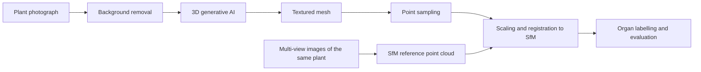

import { CottonCompareFigure } from '@site/src/components/figures/Cotton3D';

## Overview

Multi-view reconstruction gives accurate plant geometry, but it needs dozens to hundreds of images per plant, a controlled capture setup and long processing. **3D generative AI** takes a different route: from a **single photograph** it produces a complete, textured 3D model, inferring the parts the camera did not see. If that inference is accurate enough for plants, 3D phenotyping could scale to many more plants at much lower cost.

This work applies a 3D generative AI model to cotton images and evaluates the generated plants against independent multi-view SfM reconstructions of the same specimens, organ by organ.


<!-- truncate -->

## Method



Each plant is photographed once for generation and captured separately with the [turntable protocol](/blog/growth-chamber-cotton-3d) for an SfM reference reconstruction. The generated model and the reference are then brought into the same frame, labelled into the same organ classes and compared.

## 1. Input images

Each plant is photographed against a simple background with the whole plant in frame, and the background is removed before generation. The original image, background-removal method, camera and lighting information, species, genotype and growth stage are stored with an identifier that links every generated model to its source image. The test set includes simple plants as well as dense canopies, thin leaves and overlapping organs.

## 2. Generation

The model generates a textured triangle mesh from each image. For every sample the model version, generation settings, random seed, runtime, peak GPU memory and success or failure are recorded. Failed generations stay in the record, because leaving them out would overstate robustness.

## 3. From mesh to point cloud

For comparison with SfM, the mesh is sampled into points with Open3D:

```python
import open3d as o3d

mesh = o3d.io.read_triangle_mesh("generated_mesh.obj")
if mesh.is_empty():
    raise ValueError("The generated mesh could not be loaded")

mesh.compute_vertex_normals()
points = mesh.sample_points_poisson_disk(number_of_points=100_000)
o3d.io.write_point_cloud("generated_mesh_sampled.ply", points)
```

## 4. Comparison with SfM

A generated model has no physical scale and an arbitrary pose. It is scaled and registered to the SfM reconstruction of the same plant, and both point clouds are labelled into the same organ classes: main stem, branches and petioles, and leaves. The figure shows cotton sample 20240109-84-5: the generated point cloud aligned to the SfM reconstruction, with **Overlay** showing where the generated geometry departs from the measured one.

<CottonCompareFigure />

The evaluation covered:

- **Geometry:** point-to-point and surface distances to the SfM reference, in metres, overall and by organ class.
- **Traits:** plant height, canopy width and organ-level measures from both reconstructions, with errors per plant.
- **Structure:** missing, duplicated or fused organs; stem and branch continuity; plausibility of the unseen side.
- **Stability:** variation across random seeds, background removal and input view.
- **Coverage:** results by growth stage and degree of occlusion.

Each sample's record links the source image, model version, seed, settings and status:

```json
{
  "sample_id": "plant-001",
  "source_image": "plant-001.png",
  "model_version": "<model-version>",
  "settings": "<generation-settings>",
  "seed": 0,
  "status": "success"
}
```

## Scope and limitations

A single image does not observe the back of the plant, its absolute scale or organs hidden by leaves; the model infers them. Generated geometry is therefore evaluated against an independent, scaled reconstruction, and scale is taken from the reference, not from the model. Thin leaves, petioles, branch junctions and dense canopies are the hardest cases.
