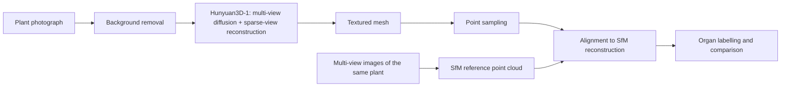

import { CottonCompareFigure } from '@site/src/components/figures/Cotton3D';

## Overview

Multi-view reconstruction gives accurate plant geometry but needs dozens to hundreds of images per plant, a controlled capture setup and long processing. Generative image-to-3D models take a different route: from a **single photograph** they produce a complete textured 3D model, inferring the parts the camera did not see. If that inference is good enough for plants, 3D phenotyping could scale to far more plants at far lower cost.

This work applies Tencent's **Hunyuan3D-1** to plant images and evaluates the result against independent multi-view reconstruction of the same plants. This note describes the generation workflow and the comparison with SfM, using cotton as the test crop.


<!-- truncate -->

## Method


```mermaid
flowchart LR
  A[Plant photograph] --> B[Background removal]
  B --> C[Hunyuan3D-1: multi-view diffusion + sparse-view reconstruction]
  C --> D[Textured mesh]
  D --> E[Point sampling]
  E --> F[Alignment to SfM reconstruction]
  G[Multi-view images of the same plant] --> H[SfM reference point cloud]
  H --> F
  F --> I[Organ labelling and comparison]
```

Hunyuan3D-1 works in two stages: a diffusion model generates consistent multi-view images from the input photograph, and a feed-forward reconstruction model turns those views into a 3D mesh. The generated plant is compared with an SfM reconstruction of the same specimen, captured with the [turntable protocol](/blog/growth-chamber-cotton-3d).

## 1. Input images

Each plant is photographed against a simple background with the whole plant in frame. The background is removed before generation. The original image, the background-removal method, camera and lighting information, species, genotype and growth stage are stored with an identifier that links every generated model to its source image. Test sets include easy cases as well as dense canopies, thin leaves and overlapping organs.

## 2. Installation

Hunyuan3D-1 uses its own repository, weight layout and `main.py` entry point. The commands below follow the upstream [repository](https://github.com/tencent/Hunyuan3D-1) and [model card](https://huggingface.co/tencent/Hunyuan3D-1) on Linux with an NVIDIA GPU; install the PyTorch build that matches the driver and CUDA runtime first.

```bash
git clone https://github.com/tencent/Hunyuan3D-1
cd Hunyuan3D-1

conda create -n hunyuan3d-1 python=3.10
conda activate hunyuan3d-1
bash env_install.sh
python -m pip install "huggingface_hub[cli]"
```

Weights:

```bash
mkdir -p weights
huggingface-cli download tencent/Hunyuan3D-1 --local-dir ./weights

mkdir -p weights/hunyuanDiT
huggingface-cli download Tencent-Hunyuan/HunyuanDiT-v1.1-Diffusers-Distilled \
  --local-dir ./weights/hunyuanDiT
```

The repository commit, model revision and Python environment are recorded for every run:

```bash
git rev-parse HEAD
python -m pip freeze > environment-lock.txt
```

Newer Hunyuan3D releases have different code and hardware requirements; this workflow is specific to Hunyuan3D-1.

## 3. Generation

```bash
python3 main.py \
  --image_prompt "/absolute/path/to/plant.png" \
  --save_folder ./outputs/plant-001/ \
  --max_faces_num 90000 \
  --do_texture_mapping \
  --do_render
```

For each sample the command, random seed, runtime, peak GPU memory and success or failure are saved. Failed generations are kept in the record, because excluding them would overstate robustness.

## 4. From mesh to point cloud

The output is a textured mesh. For comparison with SfM it is sampled into points with Open3D:

```python
import open3d as o3d

mesh = o3d.io.read_triangle_mesh("generated_mesh.obj")
if mesh.is_empty():
    raise ValueError("The generated mesh could not be loaded")

mesh.compute_vertex_normals()
points = mesh.sample_points_poisson_disk(number_of_points=100_000)
o3d.io.write_point_cloud("generated_mesh_sampled.ply", points)
```

## 5. Comparison with SfM

A generated model has no physical scale and an arbitrary pose. It is scaled and registered to the SfM reconstruction of the same plant, and both point clouds are labelled into the same organ classes: main stem, branches and petioles, and leaves. The figure shows cotton sample 20240109-84-5: the Hunyuan3D point cloud aligned to the SfM reconstruction, with **Overlay** showing where the generated geometry departs from the measured one.

<CottonCompareFigure />

The evaluation covers:

- **Geometry:** point-to-point and surface distances to the SfM reference, in metres, overall and by organ class.
- **Traits:** plant height, canopy width and organ-level measures from both reconstructions, with errors per plant.
- **Structure:** missing, duplicated or fused organs; stem and branch continuity; plausibility of the unseen side.
- **Stability:** variation across random seeds, background removal and input view.
- **Coverage:** results by species, growth stage and degree of occlusion.

Each sample's record links the source image, repository commit, model revision, seed, command and status:

```json
{
  "sample_id": "plant-001",
  "source_image": "plant-001.png",
  "repository_commit": "<git-commit>",
  "model_revision": "<model-revision>",
  "seed": 0,
  "command": "python3 main.py ...",
  "status": "success"
}
```

## Scope and limitations

A single image does not observe the back of the plant, its absolute scale or organs hidden by leaves; the model infers them. Generated geometry is therefore evaluated against an independent, scaled reconstruction before any trait derived from it is used, and scale comes from the reference, not from the model. Thin leaves, petioles, branch junctions and dense canopies are the hardest cases. Model and code licences apply to research and commercial use.
