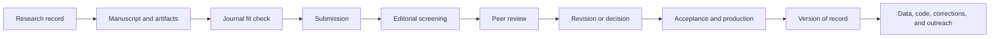

Publishing a scientific paper is not a single submission event. It is a documented process that connects a research question, a defensible method, transparent evidence, appropriate journal selection, peer review, and long-term stewardship of the resulting paper, data, and code.

This guide provides a publisher-neutral workflow. Exact status labels, DOI timing, accepted-manuscript policies, and indexing practices vary by journal, so always follow the current instructions for the selected venue.


<!-- truncate -->

## Publication workflow



## 1. Define the contribution before choosing a journal

Write one sentence for each item:

- **Problem:** What unresolved question or practical limitation is addressed?
- **Evidence:** What observations, experiments, simulations, or analyses answer it?
- **Contribution:** What becomes possible or better understood because of the work?
- **Boundary:** Where should the conclusion not be generalized?

Choose the paper type that matches the evidence: research article, methods paper, data paper, software paper, brief report, perspective, or review. A new tool without validation is not automatically a methods contribution, and a large dataset without adequate documentation is not automatically reusable.

## 2. Select a journal by fit and trustworthiness

Start with scope and audience rather than a single metric.

| Criterion | Questions to ask |
| --- | --- |
| Scope | Has the journal recently published work with a similar question and evidence type? |
| Audience | Will the intended scientific community find and use the result? |
| Article format | Does it accept the manuscript, data, software, or methods format? |
| Review and production | Are typical timelines, editorial policies, and fees transparent? |
| Access and rights | What are the open-access options, licenses, and self-archiving rules? |
| Research integrity | Are ethics, corrections, retractions, and data policies clearly stated? |
| Indexing | Is the journal actually indexed in the databases relevant to the field? |

Impact Factor can describe a journal-level citation pattern; it does not measure the quality of an individual paper. Avoid journals that guarantee acceptance, imitate another journal's identity, conceal fees, or provide unverifiable editorial information.

## 3. Build a reproducible manuscript package

Most empirical papers use an IMRaD-like structure, but the journal's author guide takes precedence.

| Section | Core job |
| --- | --- |
| Introduction | Define the question, gap, and contribution without reviewing every related paper |
| Materials and Methods | Enable a qualified reader to understand and, where possible, reproduce the work |
| Results | Report evidence without hiding negative or null findings |
| Discussion | Interpret results, compare alternatives, and state limitations |
| Conclusion | Answer the research question without introducing new evidence |

Prepare the manuscript together with its supporting artifacts:

- figures and tables with units, sample sizes, uncertainty, and accessible labels;
- data dictionary and analysis-ready data where sharing is permitted;
- source code, environment information, and an executable workflow;
- author contributions using a consistent taxonomy such as CRediT;
- funding, conflicts of interest, ethics approvals, and consent statements;
- data and code availability statements;
- reporting checklist required by the field;
- disclosure of any generative-AI use according to journal policy.

Vector formats are useful for diagrams and plots when accepted, while raster images should meet the journal's dimensions, color mode, and resolution requirements. “300 dpi” alone is not a universal rule for every figure type.

## 4. Perform a pre-submission audit

- [ ] Title and abstract match the actual evidence.
- [ ] Every stated objective is answered in the Results and Discussion.
- [ ] Sample counts are consistent across text, tables, figures, and supplements.
- [ ] Statistical units match the experimental design.
- [ ] Code reproduces the final figures and tables from the archived inputs.
- [ ] References are complete and checked against primary sources.
- [ ] All authors approve the manuscript and author order.
- [ ] Permissions are available for reused material.
- [ ] The manuscript is not simultaneously submitted elsewhere.
- [ ] The journal's formatting and policy checklist is complete.

Reference managers such as Zotero or EndNote can reduce formatting work, but imported metadata still needs human verification.

## 5. Submit a complete, consistent record

Submission portals differ, but commonly request:

| Item | Purpose |
| --- | --- |
| Manuscript | Main scientific narrative |
| Figures and tables | Separate production-quality files when required |
| Supplementary material | Extended methods, results, media, or appendices |
| Cover letter | Journal fit, contribution, and required declarations |
| Author metadata | Names, affiliations, ORCID IDs, and contribution roles |
| Suggested or opposed reviewers | Expertise and conflicts, when requested |
| Data/code statement | Persistent links, access conditions, or justified restrictions |

Save the submitted PDF, source files, metadata, cover letter, and manuscript ID together. Check the generated submission PDF before final confirmation; conversion can alter equations, fonts, line breaks, and figure order.

## 6. Interpret editorial statuses cautiously

Status names are publisher-specific. The following table describes common patterns, not universal rules.

| Typical status | Usual meaning | Public and citable? |
| --- | --- | --- |
| Submitted / With editor | Administrative or editorial assessment | Usually not public; a separate preprint may be citable |
| Under review | External review is in progress | Usually not public through the journal |
| Revision requested | Authors may submit a revised version and response | The decision is not acceptance |
| Accepted | Scientific decision is positive; production may not be complete | Citation format depends on journal and style; a DOI may not yet exist |
| Article in press / early view | A publisher-hosted version may be available before issue assignment | Often citable by DOI, but terminology varies |
| Version of record | Final publisher version | Citable using its final DOI and available bibliographic metadata |

Volume, issue, page range, article number, DOI assignment, online publication, and database indexing do not always occur at the same time. Verify the article record instead of inferring its state from one label.

## 7. Respond to reviewers point by point

A useful response document is easy to navigate and separates the reviewer's text, the response, and the exact manuscript change.

```text
Reviewer 1, Comment 3
[Paste the complete comment]

Response
Thank you for identifying this ambiguity. We now define the biological
replicate before the statistical model and have rerun the analysis at the
plot level.

Change in manuscript
Methods, Section 2.4: “The plot, rather than an individual image, was
treated as the biological replicate ...”
```

When declining a suggestion, explain the scientific or practical reason and, when possible, add a limitation or alternative analysis. Do not claim a change was made if only the response letter changed.

## 8. Check proofs and the version of record

During production, verify:

- title, author names, affiliations, and corresponding-author details;
- equations, symbols, units, and special characters;
- figure resolution, labels, captions, and color interpretation;
- table rows, footnotes, and supplementary links;
- funding, ethics, data, and code statements;
- references and DOI links.

Proof correction is not normally a second opportunity to redesign the study. If a substantive error is discovered, contact the production editor transparently.

## 9. Cite the actual publication state

Use the metadata available for the version being cited and follow the required style. Do not invent a DOI, issue, or year for an accepted manuscript.

An updated APA-style reference for the example paper is:

> Deng, L., Yu, L. X., Mao, L., Wang, Y., Guo, X., Wang, M., Zhang, Y., Song, Q., & Zhu, X.-G. (2025). Leaf bidirectional reflectance distribution function (BRDF) prediction with phenotypic traits in four species: Development of a novel measuring and analyzing framework. *Plant Phenomics, 7*(4), 100135. https://doi.org/10.1016/j.plaphe.2025.100135

The DOI is the durable link: [https://doi.org/10.1016/j.plaphe.2025.100135](https://doi.org/10.1016/j.plaphe.2025.100135).

## 10. Maintain the research record

After publication:

1. Deposit the permitted manuscript version according to the journal policy.
2. Update ORCID, institutional profiles, Google Scholar, Web of Science Researcher Profile, and the personal website.
3. Release data and code at the promised persistent locations.
4. Create a tagged software release matching the paper.
5. Monitor repository issues and document known limitations.
6. Correct material errors promptly through the appropriate journal mechanism.
7. Preserve the analysis environment and provenance needed to reproduce the figures.

## Journal-analysis workbook

The accompanying workbook is a personal comparison aid, not an authoritative or permanently current ranking. Journal metrics, fees, scope, and review practices change; verify every decision on the official journal site.

[Download the journal-analysis workbook (.xlsx)](/files/2025journalanalysis.xlsx)

## Final checklist

Define the contribution → select by fit → preserve provenance → write from evidence → submit consistently → respond transparently → verify the record → maintain artifacts.

**Citation of this guide**

Deng, L. (2025). *From manuscript to publication: A practical guide for researchers.* Digital Crop Photosynthesis Phenotyping Platform.

*Content reviewed and bibliographic example updated: July 2026.*
