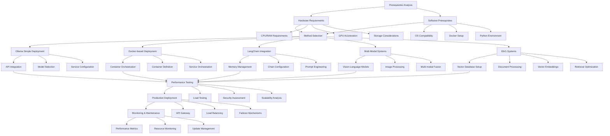

<!-- truncate -->

# Guide to Local AI Agent Deployment

## Introduction

Deploying AI agents locally offers numerous advantages including data privacy, reduced latency, cost control, and independence from cloud services. This comprehensive guide covers multiple approaches to setting up AI agents on your local infrastructure, from simple chatbots to complex multi-modal systems.

## Technical Workflow Overview



This workflow outlines the comprehensive process for deploying AI agents locally, highlighting multiple deployment strategies and their integration points for building robust, scalable AI systems.

## Prerequisites

### Hardware Requirements

**Minimum Configuration:**

- CPU: 8-core processor (Intel i7/AMD Ryzen 7 or equivalent)
- RAM: 16GB DDR4
- Storage: 100GB available SSD space
- GPU: Optional but recommended (NVIDIA GTX 1060 or better)

**Recommended Configuration:**

- CPU: 12+ core processor (Intel i9/AMD Ryzen 9 or equivalent)
- RAM: 32GB+ DDR4/DDR5
- Storage: 500GB+ NVMe SSD
- GPU: NVIDIA RTX 3080/4070 or better with 12GB+ VRAM

### Software Prerequisites

- Operating System: Ubuntu 20.04+, macOS 12+, or Windows 10/11
- Docker and Docker Compose
- Python 3.8+ with pip
- Git
- NVIDIA drivers (for GPU acceleration)

## Method 1: Ollama - The Simplest Approach

### Installation

**Linux/macOS:**

```bash
curl -fsSL https://ollama.ai/install.sh | sh
```

**Windows:**
Download and install from https://ollama.ai/download

### Basic Usage

```bash
# Pull a model
ollama pull llama2

# Run interactive chat
ollama run llama2

# Start as service
ollama serve
```

### API Integration

```python
import requests
import json

def chat_with_ollama(message, model="llama2"):
    url = "http://localhost:11434/api/generate"
    payload = {
        "model": model,
        "prompt": message,
        "stream": False
    }
  
    response = requests.post(url, json=payload)
    return response.json()["response"]

# Example usage
response = chat_with_ollama("Explain quantum computing")
print(response)
```

### Available Models

- **llama2**: General purpose conversational AI
- **codellama**: Code generation and analysis
- **mistral**: Efficient multilingual model
- **neural-chat**: Optimized for dialogue
- **llava**: Vision-language model

## Method 2: Docker-based Deployment

### Create Docker Environment

**Dockerfile:**

```dockerfile
FROM python:3.9-slim

WORKDIR /app

# Install system dependencies
RUN apt-get update && apt-get install -y \
    git \
    curl \
    build-essential \
    && rm -rf /var/lib/apt/lists/*

# Install Python dependencies
COPY requirements.txt .
RUN pip install --no-cache-dir -r requirements.txt

# Copy application code
COPY . .

EXPOSE 8000

CMD ["python", "app.py"]
```

**requirements.txt:**

```
fastapi==0.104.1
uvicorn==0.24.0
transformers==4.35.0
torch==2.1.0
accelerate==0.24.1
langchain==0.0.335
chromadb==0.4.15
sentence-transformers==2.2.2
```

**docker-compose.yml:**

```yaml
version: '3.8'

services:
  ai-agent:
    build: .
    ports:
      - "8000:8000"
    volumes:
      - ./models:/app/models
      - ./data:/app/data
    environment:
      - CUDA_VISIBLE_DEVICES=0
    deploy:
      resources:
        reservations:
          devices:
            - driver: nvidia
              count: 1
              capabilities: [gpu]

  vector-db:
    image: chromadb/chroma:latest
    ports:
      - "8001:8000"
    volumes:
      - ./chroma_data:/chroma/chroma
```

### FastAPI Application

**app.py:**

```python
from fastapi import FastAPI, HTTPException
from pydantic import BaseModel
from transformers import AutoTokenizer, AutoModelForCausalLM
import torch
import uvicorn

app = FastAPI(title="Local AI Agent API")

class ChatRequest(BaseModel):
    message: str
    max_length: int = 512
    temperature: float = 0.7

class AIAgent:
    def __init__(self, model_name="microsoft/DialoGPT-medium"):
        self.device = torch.device("cuda" if torch.cuda.is_available() else "cpu")
        self.tokenizer = AutoTokenizer.from_pretrained(model_name)
        self.model = AutoModelForCausalLM.from_pretrained(model_name)
        self.model.to(self.device)
    
        if self.tokenizer.pad_token is None:
            self.tokenizer.pad_token = self.tokenizer.eos_token

    def generate_response(self, message, max_length=512, temperature=0.7):
        inputs = self.tokenizer.encode(message, return_tensors="pt").to(self.device)
    
        with torch.no_grad():
            outputs = self.model.generate(
                inputs,
                max_length=max_length,
                temperature=temperature,
                do_sample=True,
                pad_token_id=self.tokenizer.eos_token_id
            )
    
        response = self.tokenizer.decode(outputs[0], skip_special_tokens=True)
        return response[len(message):].strip()

# Initialize agent
agent = AIAgent()

@app.post("/chat")
async def chat(request: ChatRequest):
    try:
        response = agent.generate_response(
            request.message,
            request.max_length,
            request.temperature
        )
        return {"response": response}
    except Exception as e:
        raise HTTPException(status_code=500, detail=str(e))

@app.get("/health")
async def health_check():
    return {"status": "healthy", "device": str(agent.device)}

if __name__ == "__main__":
    uvicorn.run(app, host="0.0.0.0", port=8000)
```

## Method 3: LangChain with Local Models

### Setup LangChain Environment

```python
from langchain.llms import LlamaCpp
from langchain.callbacks.manager import CallbackManager
from langchain.callbacks.streaming_stdout import StreamingStdOutCallbackHandler
from langchain.chains import ConversationChain
from langchain.memory import ConversationBufferMemory
from langchain.prompts import PromptTemplate

class LocalAIAgent:
    def __init__(self, model_path):
        callback_manager = CallbackManager([StreamingStdOutCallbackHandler()])
    
        self.llm = LlamaCpp(
            model_path=model_path,
            temperature=0.7,
            max_tokens=512,
            top_p=1,
            callback_manager=callback_manager,
            verbose=True,
            n_ctx=2048,
            n_gpu_layers=35  # Adjust based on your GPU
        )
    
        self.memory = ConversationBufferMemory()
    
        template = """
        You are a helpful AI assistant. Have a conversation with the human.
    
        Current conversation:
        {history}
        Human: {input}
        AI Assistant:"""
    
        prompt = PromptTemplate(
            input_variables=["history", "input"],
            template=template
        )
    
        self.conversation = ConversationChain(
            llm=self.llm,
            memory=self.memory,
            prompt=prompt,
            verbose=True
        )
  
    def chat(self, message):
        return self.conversation.predict(input=message)

# Usage
agent = LocalAIAgent("./models/llama-2-7b-chat.gguf")
response = agent.chat("What is machine learning?")
```

## Method 4: Multi-Modal AI Agent

### Vision-Language Model Setup

```python
import torch
from transformers import BlipProcessor, BlipForConditionalGeneration
from PIL import Image
import requests
from io import BytesIO

class MultiModalAgent:
    def __init__(self):
        self.device = torch.device("cuda" if torch.cuda.is_available() else "cpu")
    
        # Load vision-language model
        self.processor = BlipProcessor.from_pretrained("Salesforce/blip-image-captioning-base")
        self.model = BlipForConditionalGeneration.from_pretrained("Salesforce/blip-image-captioning-base")
        self.model.to(self.device)
  
    def analyze_image(self, image_path_or_url, question=None):
        # Load image
        if image_path_or_url.startswith('http'):
            response = requests.get(image_path_or_url)
            image = Image.open(BytesIO(response.content))
        else:
            image = Image.open(image_path_or_url)
    
        if question:
            # Visual question answering
            inputs = self.processor(image, question, return_tensors="pt").to(self.device)
            out = self.model.generate(**inputs, max_length=50)
            answer = self.processor.decode(out[0], skip_special_tokens=True)
            return answer
        else:
            # Image captioning
            inputs = self.processor(image, return_tensors="pt").to(self.device)
            out = self.model.generate(**inputs, max_length=50)
            caption = self.processor.decode(out[0], skip_special_tokens=True)
            return caption

# Usage
agent = MultiModalAgent()
caption = agent.analyze_image("path/to/image.jpg")
answer = agent.analyze_image("path/to/image.jpg", "What color is the car?")
```

## Method 5: RAG (Retrieval-Augmented Generation) System

### Vector Database Setup

```python
import chromadb
from langchain.embeddings import HuggingFaceEmbeddings
from langchain.vectorstores import Chroma
from langchain.text_splitter import RecursiveCharacterTextSplitter
from langchain.document_loaders import DirectoryLoader, TextLoader

class RAGAgent:
    def __init__(self, documents_path, persist_directory="./chroma_db"):
        # Initialize embeddings
        self.embeddings = HuggingFaceEmbeddings(
            model_name="sentence-transformers/all-MiniLM-L6-v2"
        )
    
        # Load and process documents
        loader = DirectoryLoader(documents_path, glob="*.txt", loader_cls=TextLoader)
        documents = loader.load()
    
        # Split documents
        text_splitter = RecursiveCharacterTextSplitter(
            chunk_size=1000,
            chunk_overlap=200
        )
        texts = text_splitter.split_documents(documents)
    
        # Create vector store
        self.vectorstore = Chroma.from_documents(
            documents=texts,
            embedding=self.embeddings,
            persist_directory=persist_directory
        )
    
        # Initialize LLM (using Ollama)
        from langchain.llms import Ollama
        self.llm = Ollama(model="llama2")
  
    def query(self, question, k=3):
        # Retrieve relevant documents
        docs = self.vectorstore.similarity_search(question, k=k)
    
        # Create context from retrieved documents
        context = "\n\n".join([doc.page_content for doc in docs])
    
        # Generate response
        prompt = f"""
        Based on the following context, answer the question:
    
        Context:
        {context}
    
        Question: {question}
    
        Answer:"""
    
        response = self.llm(prompt)
        return response, docs

# Usage
rag_agent = RAGAgent("./documents")
answer, sources = rag_agent.query("What is the main topic discussed?")
```

## Performance Optimization

### GPU Acceleration

```python
# Check GPU availability
import torch
print(f"CUDA available: {torch.cuda.is_available()}")
print(f"GPU count: {torch.cuda.device_count()}")
if torch.cuda.is_available():
    print(f"GPU name: {torch.cuda.get_device_name(0)}")

# Optimize memory usage
torch.cuda.empty_cache()

# Use mixed precision
from torch.cuda.amp import autocast, GradScaler

scaler = GradScaler()

with autocast():
    # Your model inference here
    pass
```

### Model Quantization

```python
from transformers import AutoModelForCausalLM, BitsAndBytesConfig

# 4-bit quantization
quantization_config = BitsAndBytesConfig(
    load_in_4bit=True,
    bnb_4bit_compute_dtype=torch.float16,
    bnb_4bit_use_double_quant=True,
    bnb_4bit_quant_type="nf4"
)

model = AutoModelForCausalLM.from_pretrained(
    "model_name",
    quantization_config=quantization_config,
    device_map="auto"
)
```

## Monitoring and Logging

### System Monitoring

```python
import psutil
import GPUtil
import logging
from datetime import datetime

class SystemMonitor:
    def __init__(self):
        logging.basicConfig(
            level=logging.INFO,
            format='%(asctime)s - %(levelname)s - %(message)s',
            handlers=[
                logging.FileHandler('ai_agent.log'),
                logging.StreamHandler()
            ]
        )
        self.logger = logging.getLogger(__name__)
  
    def log_system_stats(self):
        # CPU usage
        cpu_percent = psutil.cpu_percent(interval=1)
    
        # Memory usage
        memory = psutil.virtual_memory()
        memory_percent = memory.percent
    
        # GPU usage
        gpus = GPUtil.getGPUs()
        gpu_stats = []
        for gpu in gpus:
            gpu_stats.append({
                'id': gpu.id,
                'name': gpu.name,
                'load': gpu.load * 100,
                'memory_used': gpu.memoryUsed,
                'memory_total': gpu.memoryTotal,
                'temperature': gpu.temperature
            })
    
        self.logger.info(f"CPU: {cpu_percent}%, Memory: {memory_percent}%")
        for gpu_stat in gpu_stats:
            self.logger.info(f"GPU {gpu_stat['id']}: {gpu_stat['load']:.1f}% load, "
                           f"{gpu_stat['memory_used']}/{gpu_stat['memory_total']}MB memory")

monitor = SystemMonitor()
monitor.log_system_stats()
```

## Security Considerations

### API Security

```python
from fastapi import FastAPI, Depends, HTTPException, status
from fastapi.security import HTTPBearer, HTTPAuthorizationCredentials
import jwt
import hashlib
import os

app = FastAPI()
security = HTTPBearer()

SECRET_KEY = os.getenv("SECRET_KEY", "your-secret-key")

def verify_token(credentials: HTTPAuthorizationCredentials = Depends(security)):
    try:
        payload = jwt.decode(credentials.credentials, SECRET_KEY, algorithms=["HS256"])
        return payload
    except jwt.PyJWTError:
        raise HTTPException(
            status_code=status.HTTP_401_UNAUTHORIZED,
            detail="Invalid authentication credentials"
        )

@app.post("/secure-chat")
async def secure_chat(request: ChatRequest, user=Depends(verify_token)):
    # Your secure chat logic here
    pass
```

### Input Sanitization

```python
import re
from typing import str

def sanitize_input(text: str) -> str:
    # Remove potentially harmful characters
    text = re.sub(r'[<>"\']', '', text)
  
    # Limit length
    text = text[:1000]
  
    # Remove excessive whitespace
    text = ' '.join(text.split())
  
    return text

def validate_input(text: str) -> bool:
    # Check for common injection patterns
    dangerous_patterns = [
        r'<script',
        r'javascript:',
        r'eval\(',
        r'exec\(',
        r'import\s+os',
        r'__import__'
    ]
  
    for pattern in dangerous_patterns:
        if re.search(pattern, text, re.IGNORECASE):
            return False
  
    return True
```

## Deployment Scripts

### Automated Setup Script

```bash
#!/bin/bash

# setup_ai_agent.sh

set -e

echo "Setting up Local AI Agent Environment..."

# Update system
sudo apt update && sudo apt upgrade -y

# Install Docker
curl -fsSL https://get.docker.com -o get-docker.sh
sh get-docker.sh
sudo usermod -aG docker $USER

# Install Docker Compose
sudo curl -L "https://github.com/docker/compose/releases/download/v2.20.0/docker-compose-$(uname -s)-$(uname -m)" -o /usr/local/bin/docker-compose
sudo chmod +x /usr/local/bin/docker-compose

# Install NVIDIA Container Toolkit (if GPU present)
if lspci | grep -i nvidia; then
    distribution=$(. /etc/os-release;echo $ID$VERSION_ID)
    curl -s -L https://nvidia.github.io/nvidia-docker/gpgkey | sudo apt-key add -
    curl -s -L https://nvidia.github.io/nvidia-docker/$distribution/nvidia-docker.list | sudo tee /etc/apt/sources.list.d/nvidia-docker.list
    sudo apt-get update && sudo apt-get install -y nvidia-docker2
    sudo systemctl restart docker
fi

# Install Python dependencies
pip3 install --upgrade pip
pip3 install -r requirements.txt

# Download models
mkdir -p models
cd models

# Download Llama 2 model (example)
wget https://huggingface.co/TheBloke/Llama-2-7B-Chat-GGUF/resolve/main/llama-2-7b-chat.q4_0.gguf

echo "Setup complete! Run 'docker-compose up' to start the AI agent."
```

### Systemd Service

```ini
# /etc/systemd/system/ai-agent.service

[Unit]
Description=Local AI Agent Service
After=network.target

[Service]
Type=simple
User=aiagent
WorkingDirectory=/opt/ai-agent
ExecStart=/usr/local/bin/docker-compose up
ExecStop=/usr/local/bin/docker-compose down
Restart=always
RestartSec=10

[Install]
WantedBy=multi-user.target
```

## Troubleshooting

### Common Issues

**Out of Memory Errors:**

```python
# Reduce batch size
batch_size = 1

# Use gradient checkpointing
model.gradient_checkpointing_enable()

# Clear cache regularly
torch.cuda.empty_cache()
```

**Slow Inference:**

```python
# Use torch.no_grad() for inference
with torch.no_grad():
    output = model(input_ids)

# Optimize for inference
model.eval()
torch.backends.cudnn.benchmark = True
```

**Model Loading Issues:**

```python
# Check available disk space
import shutil
free_space = shutil.disk_usage('.').free / (1024**3)  # GB
print(f"Free space: {free_space:.2f} GB")

# Use model caching
from transformers import AutoModel
model = AutoModel.from_pretrained("model_name", cache_dir="./model_cache")
```

## Best Practices

1. **Resource Management**: Monitor CPU, GPU, and memory usage continuously
2. **Model Selection**: Choose models appropriate for your hardware capabilities
3. **Caching**: Implement proper caching for models and embeddings
4. **Logging**: Maintain comprehensive logs for debugging and monitoring
5. **Security**: Implement proper authentication and input validation
6. **Backup**: Regular backup of models and configuration files
7. **Updates**: Keep dependencies and models updated
8. **Testing**: Implement comprehensive testing for all components

## Conclusion

Local AI agent deployment offers significant advantages in terms of privacy, control, and cost-effectiveness. The methods outlined in this guide provide various approaches depending on your specific requirements, from simple chatbots using Ollama to complex multi-modal RAG systems.

Choose the approach that best fits your hardware capabilities, technical requirements, and use case. Start with simpler methods like Ollama for proof-of-concept, then scale up to more complex deployments as needed.

Remember to continuously monitor performance, implement proper security measures, and maintain your deployment for optimal results.

---

*Last updated: September 2025*
