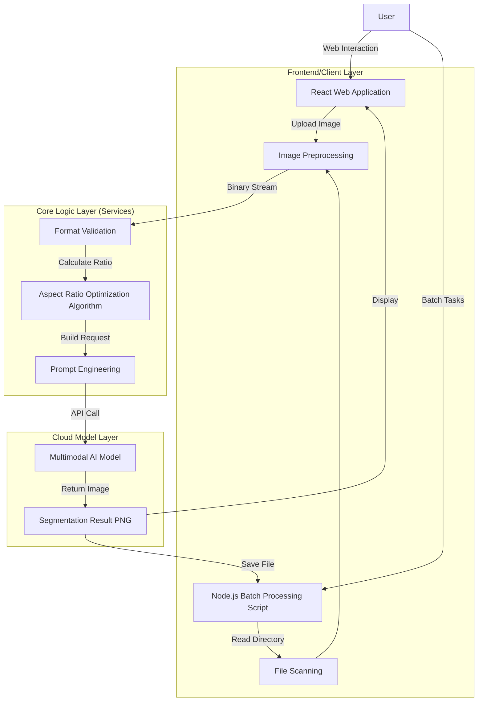

## 1. Project Overview

**Botanical Extract AI Pro** is a project designed to address the challenges of background interference and high manual segmentation costs in traditional plant phenotyping analysis. By leveraging the visual understanding and generation capabilities of **multimodal AI models**, the system achieves **zero-shot** high-precision plant image background removal and segmentation. The system supports both single-image interactive processing (Web end) and large-scale batch processing (script end), providing efficient data preprocessing tools for botanical research.


### Key Features:
- **Zero-Shot Segmentation**: No training required, works directly with multimodal AI models
- **Dual-Mode Processing**: Web interface for interactive processing + Node.js script for batch processing
- **Intelligent Aspect Ratio Adaptation**: Automatically matches optimal image ratios for model input
- **Robust Binary Stream Processing**: Handles multiple input formats and sources
- **Batch Pipeline**: Automated processing for hundreds/thousands of images

<!-- truncate -->

## 2. System Architecture

The system adopts a "dual-end, single-core" architecture design, where the Web interactive end and Node.js batch processing end share the same core multimodal AI service logic.

### Architecture Diagram:



### 2.1 Technology Stack
- **Core Model**: Multimodal AI Model (Vision Capable)
- **Web End**: React 19, TypeScript, Vite, Tailwind CSS
- **Batch Processing End**: Node.js, fs/promises
- **SDK**: Multimodal AI SDK (compatible with various providers)

## 3. Key Technical Implementations

### 3.1 Prompt Engineering (TAS Framework)

To ensure segmentation accuracy and consistency, we designed a structured **TAS (Task-Action-Specification)** prompt system.

**Core Prompt (Constants/Script)**:
```text
TASK: Image Segmentation / Background Replacement.
INPUT: A photo of a plant.
OUTPUT: The exact same plant pixels, but with the background replaced by pure solid white (#FFFFFF).

INSTRUCTIONS:
1. OUTPUT: Return the input image with the background replaced by solid white.
2. PRESERVATION: The plant (leaves, stems, flowers, pots if integral) must remain pixel-perfectly identical to the original. Do not redraw or restyle.
3. BACKGROUND: All non-plant pixels (walls, ground, shadows) must be solid white.
4. FORMAT: Return a PNG image.
```

**Design Highlights**:
*   **Role Definition**: Explicit "Technical editing task" positioning reduces model "creative" interpretation and minimizes hallucination.
*   **Constraint Reinforcement**: Using "pixel-perfectly identical" keywords forces the model to preserve original texture details.
*   **Negative Constraints**: Clearly specifies elements to remove (walls, ground, shadows).

### 3.2 Intelligent Aspect Ratio Adaptation Algorithm

Multimodal AI models are sensitive to input image aspect ratios. To avoid image stretching and deformation, we implemented an **optimal ratio matching algorithm**.

**Algorithm Logic**:
1.  Read original image dimensions ($W, H$).
2.  Calculate original ratio $R = W / H$.
3.  Define supported ratio set $S = \{1:1, 3:4, 4:3, 9:16, 16:9\}$.
4.  Calculate absolute difference between $R$ and each standard ratio in set $S$.
5.  Select the standard ratio with minimum difference as the API request parameter `aspectRatio`.

**Code Snippet (Simplified)**:
```typescript
const supported = [
  { id: "1:1", val: 1.0 },
  { id: "4:3", val: 1.33 },
  // ... other ratios
];

// Reduce to find closest ratio
const closest = supported.reduce((prev, curr) => {
  return (Math.abs(curr.val - ratio) < Math.abs(prev.val - ratio) ? curr : prev);
});
return closest.id;
```

### 3.3 Robust Binary Stream Processing

To be compatible with multiple input sources (File objects from Web end, Buffers from batch processing end), we uniformly handle Base64 encoding and MIME type detection at the底层.

*   **Format Sniffing**: Not relying on file extensions, directly reading binary headers (Magic Bytes) to determine if it's PNG ($89 50...), JPEG ($FF D8...), or BMP.
*   **Data Cleaning**: Automatically stripping Data URL Scheme (`data:image/...;base64,`) to ensure clean payload is sent to the API.

## 4. Batch Processing Pipeline

For research scenarios requiring processing of hundreds or thousands of images, we developed an automated batch processing script (`batch-process.js`).

**Workflow**:
1.  **Scanning**: Recursively traverse the `input` directory, filtering target files via regex `/\.(jpg|jpeg...)$/i`.
2.  **Mirror Structure**: Generate a file tree structure in the `output` directory that is completely consistent with the input directory.
3.  **Exception Circuit Breaker & Retry**:
    *   Capture API errors (e.g., Rate Limit), record failed file paths.
    *   Implement basic backoff strategy for `500` or `429` errors (currently controlled via simple delay).
4.  **Progress Feedback**: Real-time output of progress bar (Current/Total) and success/failure statistics in the console.

## 5. Technical Implementation Details

### 5.1 Web End (React + TypeScript)

**Key Components**:
- **Image Upload**: Drag-and-drop support, file validation
- **Preview Area**: Real-time display of original and processed images
- **Settings Panel**: Adjustable parameters (aspect ratio, output format)
- **Progress Indicator**: Visual feedback for processing status

**Core Logic**:
```typescript
// Aspect ratio calculation
const calculateAspectRatio = (width: number, height: number): string => {
  const ratio = width / height;
  const supported = [
    { id: "1:1", val: 1.0 },
    { id: "4:3", val: 1.33 },
    { id: "3:4", val: 0.75 },
    { id: "16:9", val: 1.78 },
    { id: "9:16", val: 0.56 }
  ];
  
  return supported.reduce((prev, curr) => {
    return Math.abs(curr.val - ratio) < Math.abs(prev.val - ratio) ? curr : prev;
  }).id;
};

// Image processing
const processImage = async (file: File): Promise<Blob> => {
  // 1. Read file as binary
  // 2. Convert to Base64
  // 3. Build prompt with TAS framework
  // 4. Call multimodal AI API
  // 5. Return processed PNG
};
```

### 5.2 Batch Processing (Node.js)

**Key Features**:
- **Directory Traversal**: Recursive file scanning
- **Parallel Processing**: Controlled concurrency to avoid rate limits
- **Error Handling**: Comprehensive error logging and retry mechanism
- **Progress Tracking**: Real-time console output

**Core Logic**:
```javascript
// Batch processing script
const processBatch = async (inputDir, outputDir) => {
  // 1. Scan directory
  const files = await scanDirectory(inputDir);
  
  // 2. Process with controlled concurrency
  const results = await Promise.allSettled(
    files.map(async (file, index) => {
      try {
        // 3. Read and preprocess image
        const imageBuffer = await fs.readFile(file.path);
        const aspectRatio = calculateAspectRatio(imageBuffer);
        
        // 4. Call multimodal AI API
        const result = await callMultimodalAI(imageBuffer, aspectRatio);
        
        // 5. Save result
        const outputPath = file.path.replace(inputDir, outputDir);
        await fs.writeFile(outputPath, result);
        
        console.log(`[${index + 1}/${files.length}] ✓ ${file.name}`);
        return { success: true, file: file.name };
      } catch (error) {
        console.error(`[${index + 1}/${files.length}] ✗ ${file.name}: ${error.message}`);
        return { success: false, file: file.name, error: error.message };
      }
    })
  );
  
  // 6. Generate summary
  const summary = generateSummary(results);
  console.log(summary);
};
```

## 6. Use Cases

### 6.1 Plant Phenotyping Research
- **Leaf Area Measurement**: Accurate segmentation for leaf area calculation
- **Canopy Structure Analysis**: Background removal for 3D reconstruction
- **Growth Monitoring**: Consistent image preprocessing for time-series analysis

### 6.2 Agricultural Applications
- **Crop Health Assessment**: Clean images for disease detection
- **Yield Prediction**: Standardized data for machine learning models
- **Breeding Programs**: High-throughput phenotyping data collection

### 6.3 Educational Purposes
- **Botany Teaching**: Demonstrate plant anatomy without background distractions
- **Computer Vision Labs**: Practical examples of zero-shot segmentation
- **Research Methodology**: Data preprocessing best practices

## 7. Performance Considerations

### 7.1 API Rate Limits
- Implement exponential backoff for rate limit errors
- Use request queuing to control concurrency
- Monitor API usage and adjust batch sizes accordingly

### 7.2 Memory Management
- Stream large images instead of loading entirely into memory
- Implement garbage collection for long-running batch processes
- Use buffer pooling for repeated operations

### 7.3 Error Recovery
- Log all failures with detailed context
- Implement retry logic with configurable attempts
- Provide resume capability for interrupted batch processes

## 8. Future Enhancements

### 8.1 Model Optimization
- Fine-tune prompts for specific plant species
- Implement model-specific optimizations
- Add support for multiple multimodal AI providers

### 8.2 Feature Expansion
- **Interactive Mask Editing**: Manual correction of segmentation results
- **Batch Parameter Tuning**: Optimize settings for different plant types
- **Quality Metrics**: Automated evaluation of segmentation quality
- **Export Formats**: Support for multiple output formats (JPEG, WebP, etc.)

### 8.3 Integration
- **Cloud Storage**: Direct integration with Google Drive, AWS S3
- **API Endpoints**: RESTful API for programmatic access
- **Desktop Application**: Cross-platform GUI application
- **Mobile Support**: React Native app for field data collection

## 9. Conclusion

Botanical Extract AI Pro demonstrates the power of multimodal AI models in solving real-world botanical research challenges. By combining zero-shot learning with intelligent preprocessing algorithms, the system provides an efficient, scalable solution for plant phenotyping data preparation.

The project's dual-mode architecture ensures flexibility for both interactive research workflows and large-scale batch processing needs. As multimodal AI models continue to evolve, the system's modular design allows for easy integration of future improvements and new capabilities.

---

*Botanical Extract AI Pro is an open-source project designed to advance plant phenotyping research through accessible AI tools. For questions, contributions, or collaboration opportunities, visit the project repository.*
