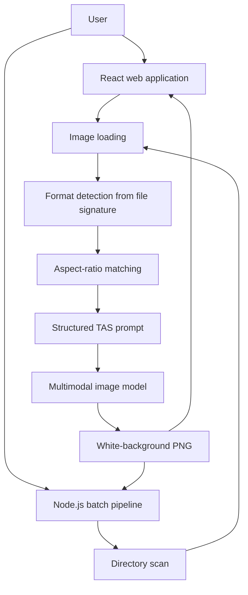

## Overview


Plant images taken in greenhouses, growth chambers and fields carry cluttered backgrounds: soil, pots, walls, labels and neighbouring plants. Removing them is the first step of most image-based phenotyping, and manual segmentation is slow, while trained segmentation models need annotated data for each species and setting.

**Botanical Extract AI Pro** removes plant backgrounds without task-specific training. It uses the visual understanding and image-editing capability of a multimodal model: the model receives the plant photograph with a structured instruction and returns the same plant on a pure white (#FFFFFF) background. The same core runs in an interactive web application for single images and in a Node.js pipeline for batch processing of whole image collections.

<!-- truncate -->

## System design

The system has two clients and one shared core.


```mermaid
graph TD
    U[User] --> W[React web application]
    U --> B[Node.js batch pipeline]
    W --> P[Image loading]
    B --> F[Directory scan]
    F --> P
    P --> V[Format detection from file signature]
    V --> R[Aspect-ratio matching]
    R --> T[Structured TAS prompt]
    T --> M[Multimodal image model]
    M --> O[White-background PNG]
    O --> W
    O --> B
```

- **Web client:** React 19, TypeScript, Vite and Tailwind CSS. Drag-and-drop upload, side-by-side display of original and result, and settings for aspect ratio and output format.
- **Batch client:** Node.js with `fs/promises`, for hundreds to thousands of images.
- **Core:** format detection, aspect-ratio matching and prompt construction, shared by both clients so that interactive tests and batch runs use identical requests.

## Key methods

### Structured prompt (Task–Action–Specification)

The instruction is written as a technical editing task, not a creative one, which reduces the model's tendency to restyle the plant:

```text
TASK: Image segmentation / background replacement.
INPUT: A photo of a plant.
OUTPUT: The same plant, with the background replaced by pure solid white (#FFFFFF).

INSTRUCTIONS:
1. OUTPUT: Return the input image with the background replaced by solid white.
2. PRESERVATION: The plant (leaves, stems, flowers, pots if integral) must remain
   identical to the original. Do not redraw or restyle.
3. BACKGROUND: All non-plant pixels (walls, ground, shadows) must be solid white.
4. FORMAT: Return a PNG image.
```

The prompt defines the task, the object to keep, what counts as background (walls, ground, shadows) and the output format.

### Aspect-ratio matching

Image models accept a fixed set of output ratios. To avoid stretching and cropping, the system computes the input ratio R = W/H and selects the closest supported ratio from `{1:1, 3:4, 4:3, 9:16, 16:9}`:

```typescript
const supported = [
  { id: "1:1", val: 1.0 },
  { id: "4:3", val: 4 / 3 },
  { id: "3:4", val: 3 / 4 },
  { id: "16:9", val: 16 / 9 },
  { id: "9:16", val: 9 / 16 },
];
const closest = supported.reduce((prev, curr) =>
  Math.abs(curr.val - ratio) < Math.abs(prev.val - ratio) ? curr : prev
);
```

### Format detection from file signatures

Inputs arrive as browser `File` objects or Node.js `Buffer`s. Instead of trusting file extensions, the core reads the leading bytes (magic numbers) to identify PNG (`89 50 4E 47`), JPEG (`FF D8`) or BMP, strips any data-URL prefix, and sends a clean Base64 payload with the correct MIME type.

### Batch pipeline

The batch script (`batch-process.js`):

1. recursively scans the input directory for image files;
2. mirrors the input folder structure in the output directory, so results stay organized by experiment, treatment or date;
3. catches API errors, retries rate-limit (`429`) and server (`5xx`) errors with a delay, and records the paths of failed files;
4. reports progress and success/failure counts during the run.

## Quality control

Every output is stored next to its untouched original. For use in phenotyping, results are reviewed by overlaying output and source at the same scale and checking thin stems, leaf tips, holes and pot edges. Because the background is uniform white, a binary plant mask follows from a simple threshold, which allows comparison with manually annotated masks on a validation subset.

## Scope and limitations

The model edits the image rather than classifying pixels, so fine structures such as thin stems, leaf margins and small flowers can be altered or lost, and repeated requests or model versions can give different results. For measurements that need pixel-exact masks, such as leaf area or lesion area, outputs are checked against annotated masks or a trained segmentation model is used. Images are processed by the model provider, so the provider's data policy applies to research images, and API keys are kept on the server or in environment configuration, never in client code.
