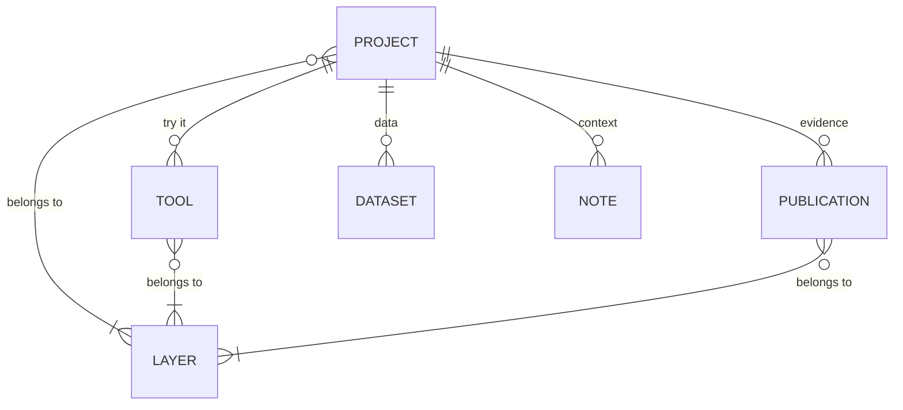
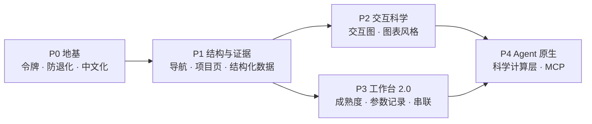

# smiler488 设计技术规范 · Design Spec v1.0

> **状态**：执行路线图（plan of record）· **版本** 1.1 · **日期** 2026-10-09 · **维护** Liangchao Deng（邓良超）
> **范围**：https://smiler488.github.io 全站（en + zh-Hans）。Docusaurus 3 静态站，托管于 GitHub Pages。
> **目标**：把网站从"个人作品集"升级为**一个研究计划的门户**，成为 AI4Science 个人网站的范例：对人可读、可操作，对机器可解析，结果可复现。

---

## 0. 如何使用本文档

- 每次升级先找到对应章节，按 §12 的阶段推进。每个阶段都有**交付物**和**验收标准**，未达标不算完成。
- 规范分三种强度：
  - **必须**：违反即视为缺陷，需修复。
  - **应当**：默认遵守；例外需在 §14 决策记录中写明理由。
  - **可以**：推荐做法。
- 修改设计原则、设计令牌或信息架构时，在 §14 追加一条决策记录，并更新文首版本号。
- 本文件位于 `design/`，**不会**被 Docusaurus 发布。

---

## 1. 愿景与定位

**一句话主张（全站唯一叙事）**

- EN：*Making plant science measurable with AI — from sensing crops to designing crops.*
- 中文：*用 AI 让植物科学可度量——从感知作物，走向设计作物。*

**范例标准**：任何访客在 30 秒内能回答三个问题。

1. 他在解决什么科学问题？（主张 + 四层架构）
2. 证据在哪里？（论文、数据、代码，两次点击内可达）
3. 我能拿来用什么？（可运行的工具、可复现的流程、可引用的成果）

**受众**

| 受众 | 他们要什么 | 首要入口 |
|---|---|---|
| 同行与评审 | 方法、结果、可信度 | Research → 项目页 → 论文 / 数据 |
| 合作者与学生 | 研究方向、开放问题、合作方式 | Open problems、About |
| 产业与机构 | 可落地的工具与平台 | Lab（App Lab） |
| AI 助手 / agent | 准确的结构化事实与引用 | `llms.txt`、JSON-LD |

---

## 2. 设计原则

1. **证据先于修辞**：每一个主张都必须能在两次点击内到达论文、数据、代码或可运行工具。
2. **科学可操作**：每个核心项目至少有一个可交互的科学图示，而不是只有静态图。
3. **安静的界面，响亮的数据**：界面保持中性、扁平、克制；颜色和动效留给数据与科学图示。
4. **一套系统，四个维度一致**：中英文、深浅色、桌面与移动端（含折叠屏）、静态与交互。
5. **可复现是默认**：工具输出自带参数、版本和输入摘要。
6. **人机双读**：页面对人清晰易读，同时对搜索引擎和 AI agent 提供结构化数据。
7. **本地优先，尊重隐私**：不引入新的行为分析或追踪脚本（现有的页脚 MapMyVisitors 访客地图**保留**，其数据处理已在 `/privacy` 页公开说明）；用户数据默认不离开浏览器；AI 调用使用用户自己的密钥（BYOK），由浏览器直连供应商。

---

## 3. 现状基线（2026-10）

### 3.1 已完成

- **OpenAI 风格重设计**：
  - Hanken Grotesk 字体；中性灰阶；扁平表面；1px 细线 `#e8e7e3`。
  - 主按钮为墨色，随主题自动反转；绿色 `#10a37f` 只用于链接和小标记。
- **统一的提示框样式**：2px 左侧竖线 + 淡底色，圆角 `0 10px 10px 0`。警告用琥珀色 `#c98a12`，信息用灰色。
- **首页**：极简首屏；四层叙事动画 `LayerMorph`（纯 Canvas，支持 reduced-motion，离屏暂停）；三张漫画 comic1/2/3。
- **App Lab**：14 个工具统一用 `AppScaffold` 外壳；Hub 页为产品卡片，配真实截图；首屏是截图拼图。
- **内容页**：博客、文档、资源、隐私、404 已去除光晕、玻璃效果和箭头，改为编辑式排版。
- **SEO 基础**：robots.txt、双语 sitemap、hreflang；Search Console 与 Bing 已接入。
- **结构化数据**：博客文章已输出 JSON-LD（`src/theme/BlogPostPage/StructuredData`）。

### 3.2 技术债（量化，作为 P0 的消除目标）

| 项 | 现值 | 目标 |
|---|---|---|
| CSS 总行数（`src/**/*.css`） | 16,187 | 逐步下降，不设硬指标 |
| 遗留 `--glass-*` 令牌引用 | 300 处 | 0（替换为语义令牌） |
| 硬编码品牌色（`#10a37f` `#c98a12` `#f1f0ec` `#1d1d1c` `#d14343`） | 41 处 | 0（`tokens.css` 之外） |
| CSS 中的十六进制颜色（工具页之外 / 工具页内） | 146 / 23 | 0 / 允许（工具专属的画布与图表色，P3 再收敛） |
| 写死的 `backdrop-filter` 模糊 | 约 50 处 | 仅保留导航栏、移动端菜单、遮罩层与 Hologram 特效页 |
| 论文数据重复（`cvData.js` 中英文各存一份） | 2 份 | 1 份数据源 + 本地化字段 |
| 博客外框（日期、标签、页头）中文化 | 未完成 | 已在独立任务中进行 |
| 字重种类 | 22 种（400–850） | 仅 400 / 500 / 600 |

### 3.3 现有功能清单（全部保留）

> **最高约束**：本文档中的任何升级都**只做重新设计、重新布局和增强**，不删除、不下线任何现有功能、页面或 URL。若某项功能确需改动其行为，必须先征得作者同意，并在 §14 记录。

| 类别 | 功能 | 位置 | 本规范中的处理 |
|---|---|---|---|
| 页面 | 首页（首屏、LayerMorph 四层动画、漫画 comic1/2/3、双击首屏进入 Bonnie 空间的彩蛋） | `src/pages/index.js` 等 | 保留，增加证据链接 |
| 页面 | 研究笔记博客（列表、文章、话题、归档、Giscus 评论） | `blog/`、`src/theme/Blog*`、`src/components/comment.js` | 保留，加层标识 |
| 页面 | App 教程文档 | `docs/tutorial-apps/` | 保留，入口归入 Lab |
| 页面 | CV（含 Altmetric 徽章） | `src/pages/cv/` | 保留，成为 About |
| 页面 | Resources 学习资源 | `src/pages/resources/` | 保留，入口移到页脚和 About/Lab |
| 页面 | Navigator 网址导航 | `src/pages/navigator/` | 保留，入口移到页脚和 About/Lab |
| 页面 | mPicks 好物推荐 | `src/pages/mpicks.js` | 保留，入口移到页脚和 About/Lab |
| 页面 | 隐私说明 | `src/pages/privacy/` | 保留 |
| 页面 | Hologram 粒子页 | `src/pages/hologram/` | 保留（未列入 sitemap） |
| 页面 | 账户页（Supabase 登录） | `src/pages/auth/` | 保留（未列入 sitemap） |
| 页面 | 404 页 | `src/theme/NotFound/` | 保留 |
| 工具 | App Lab 14 个工具 + Hub | `src/pages/app/*`、`src/pages/app.js` | 全部保留，按 §10 增强 |
| 全站 | 页脚 MapMyVisitors 访客地图 | `src/components/VisitorMap`、`src/theme/Footer` | 保留 |
| 全站 | 微信悬浮按钮与二维码 | `src/theme/Root.js` | 保留 |
| 全站 | 自定义光标 | `src/components/CustomCursor` | 保留 |
| 全站 | 本地搜索 | `@easyops-cn/docusaurus-search-local` | 保留 |
| 全站 | 中英文切换、深浅色切换 | Docusaurus 配置 | 保留 |
| 组件 | AI 供应商设置（BYOK） | `src/components/AIProviderSettings` | 保留 |
| 组件 | 引用提示（APA / BibTeX） | `src/components/CitationNotice` | 保留并复用 |
| 组件 | 朗读按钮、登录提示横幅（当前未挂载） | `src/components/SpeechButton`、`RequireAuthBanner.js` | 保留代码，不删除 |

---

## 4. 信息架构

### 4.1 导航 v2

**必须**：主导航不超过 4 项，只放"研究身份"相关内容。

| 位置 | 现状（7 项） | v2 |
|---|---|---|
| 主导航 | Tutorial · Research（→/blog）· CV · Resource · Navigator · App · mPicks | **Research**（/research）· **Lab**（/app）· **Notes**（/blog）· **About**（/cv） |
| 右侧 | 搜索 · 语言 · GitHub | 不变 |
| 页脚 Explore 栏 | — | Resources、Navigator、mPicks、App tutorials、Privacy |

- **Resources、Navigator、mPicks 不移除**：页面、功能、URL 全部保留，只是不再占用主导航。入口改到页脚 Explore 栏，并在 About 页和 Lab 页底部加入口。这三个页面同样适用全站设计系统，后续照常维护和升级。
- Tutorials 归入 Lab：Hub 页和每张工具卡片都提供"教程"入口。
- 中文标签：研究 · 实验室 · 笔记 · 关于。

**URL 规则**

- **必须**保留全部现有 URL，因为它们已被搜索引擎收录。
- 新增路由：`/research`、`/research/<slug>`、`/publications`、`/now`、`/open-problems`。
- 任何改名都用官方插件 `@docusaurus/plugin-client-redirects` 生成跳转页（GitHub Pages 不支持服务端 301）。

### 4.2 四层分类法（全站主干）

沿用 `cvData.js` 中已有的四层标识，**不再新造**。

| ID | EN | 中文 | 定义 |
|---|---|---|---|
| `DIG` | Digitize | 数字化 | 把物理作物变成可计算的数据：成像、三维重建、传感 |
| `UND` | Understand | 理解 | 从数据中提取性状与机理：视觉、光学反演、AI 分析 |
| `PRE` | Predict | 预测 | 模拟与预测：冠层光合、作物模型、光传输 |
| `DES` | Design | 设计 | 面向目标的理想株型与管理方案设计 |

**挂载位置**：

- 博客 front matter：`layers: [DIG, UND]`
- 工具 manifest：`layers`
- 论文、项目、数据集：`layers`

**渲染方式**：

- 统一组件 `LayerBadge`。
- `/research` 支持按层筛选。
- 首页 `LayerMorph` 的每一步链接到 `/research?layer=<ID>`，让叙事直接落到证据上。

**必须**：`layers` 与 `slug`、`tags` 一样**不翻译**。需把它加入 `scripts/check-blog-i18n.mjs` 的检查项。

### 4.3 内容模型



| 实体 | 唯一数据源 | 位置 | 中文化方式 |
|---|---|---|---|
| Project 项目 | MDX 文件 | 新增 docs 实例 `research`（目录 `research/`） | `i18n/zh-Hans/docusaurus-plugin-content-docs-research/current/` |
| Publication 论文 | JS 数据 | `src/data/publications.js`（从 `cvData.js` 抽出合并） | 字段级 `{ en, zh }` |
| Tool 工具 | JS 数据 | `src/data/appManifest.js` v2（见 §10.1） | 字段级 `{ en, zh }`（已有） |
| Dataset 数据集 | JS 数据 | `src/data/datasets.js`（新增） | 字段级 `{ en, zh }` |
| Note 笔记 | Markdown | `blog/` | 现有翻译流程 |

### 4.4 项目页 front matter 规范

项目页由 `DocItem/Layout` 根据 `project: true` 选择模板，做法与现有 `app_route` 选择教程模板一致。

```yaml
---
slug: brdf-traits                # 不翻译
title: Leaf BRDF prediction from phenotypic traits
description: One-sentence result, written as a finding rather than a topic.
project: true
layers: [UND, PRE]               # 不翻译
status: published                # active | published | archived
period: 2023–2025
hero_media: /img/research/brdf/hero.mp4   # 可选，需同时提供 poster
hero_poster: /img/research/brdf/hero.jpg
publications: [deng2025brdf]     # 对应 publications.js 中的 id
tools: []                        # 对应 appManifest 中的 id
datasets: []
code: https://github.com/...     # 可选
updated: 2026-10-09
---
```

---

## 5. 视觉设计系统 v2

### 5.1 设计令牌

**必须**：所有颜色、圆角、动效值只在 `src/css/tokens.css` 中定义，组件只引用语义令牌。新令牌统一用 `--ds-` 前缀，现有 Docusaurus `--ifm-*` 变量从令牌派生。

| 语义令牌 | 浅色 | 深色 | 用途 |
|---|---|---|---|
| `--ds-bg` | `#ffffff` | `#0d0d0d` | 页面底色 |
| `--ds-surface` | `#faf9f7` | `#171717` | 次级区块、输入框、提示框 |
| `--ds-surface-warm` | `#f1f0ec` | `#1d1d1c` | 排版封面、图标底块 |
| `--ds-line` | `#e8e7e3` | `#2a2a2a` | 细线、卡片边框 |
| `--ds-line-strong` | emphasis-300 | emphasis-300 | 表头分隔、按钮描边 |
| `--ds-text` | `#0d0d0d` | `#f5f5f5` | 正文、标题 |
| `--ds-text-muted` | `#525252` | `#a3a3a3` | 说明、标签、元信息 |
| `--ds-accent` | `#10a37f` | `#10a37f` | 链接、状态点、单个强调（克制使用） |
| `--ds-warn` | `#c98a12` | `#c98a12` | 警告类提示框 |
| `--ds-danger` | `#d14343` | `#d14343` | 错误 |
| `--ds-ink` / `--ds-on-ink` | emphasis-900 / emphasis-0 | 自动反转 | 主按钮 |

### 5.2 字体排版

- 字体：Hanken Grotesk（可变字重）。中文回退到系统字体。等宽用 `--ifm-font-family-monospace`。
- **必须**：只用 400 / 500 / 600 三种字重。

| 层级 | 字号 | 字重 | 字距 | 行高 |
|---|---|---|---|---|
| Display（首屏） | `clamp(2.5rem, 5.6vw, 4.6rem)` | 600 | -0.045em | 1.02 |
| H1（页面） | `clamp(2.1rem, 4.4vw, 3.4rem)` | 600 | -0.04em | 1.05 |
| H2（章节） | `clamp(1.45rem, 2.6vw, 1.85rem)` | 600 | -0.03em | 1.2 |
| H3 | `clamp(1.15rem, 1.8vw, 1.35rem)` | 600 | -0.02em | 1.3 |
| Lead（导语） | `clamp(1rem, 1.6vw, 1.15rem)` | 400 | 0 | 1.6 |
| Body（正文） | `1rem`–`1.07rem` | 400 | 0 | 1.7 |
| Label（标签/元信息） | `0.84rem`–`0.86rem` | 500 | 0 | 1.3 |
| Caption（图注） | `0.8rem` | 400 | 0 | 1.5 |

- 中文标题：行高加到 1.12–1.15，字距放宽到 -0.02em（参照 `privacy` 页中 `html[lang="zh-Hans"]` 的写法）。
- 数字：统计数字和日期用 `font-variant-numeric: tabular-nums`。

### 5.3 间距与栅格

- 基础单位 4px。区块纵向间距用 `clamp(2rem, 5vw, 4rem)` 一档，章节间距用 `clamp(4rem, 9vw, 8rem)` 一档。
- 容器宽度：

| 用途 | 宽度 |
|---|---|
| 阅读栏 | 720px |
| 内容 | 1180px |
| 工作台 | 1380px |

- 移动端左右边距：16px。
- **必须**：在 344px（折叠屏外屏）、375px、768px、1280px 下都没有横向滚动。

### 5.4 形状与层次

| 元素 | 圆角 |
|---|---|
| 标签、徽章 | 6px |
| 输入框、提示框 | 10px |
| 图片、代码块、表格容器 | 12px |
| 卡片、面板 | 16px |
| 按钮、Chip | 999px |

- **阴影只用于悬浮元素**：导航栏、下拉菜单、微信悬浮按钮。卡片一律用 1px 细线，不加阴影。
- **必须**：边框最多嵌套一层（不允许"框里套框"）。

### 5.5 动效

| 令牌 | 值 | 用途 |
|---|---|---|
| `--ds-dur-fast` | 160ms ease | 悬停、颜色变化 |
| `--ds-dur-glide` | 800ms | 叙事过渡（如 LayerMorph） |
| `--ds-ease-glide` | `cubic-bezier(.45,0,.15,1)` | 叙事缓动 |

- 悬停只改变颜色、边框或底色，**不做位移**（`translateY` 只允许出现在图片缩放等媒体内部）。
- **必须**：所有持续动画都支持 `prefers-reduced-motion`（给出静态帧），并在离开视口时暂停（参照 `LayerMorph` 的 IntersectionObserver 写法）。

### 5.6 硬性规则

1. 按钮、链接、卡片上不使用箭头字符（`→ ↗ ↓ ←`）。唯一例外：Navigator 外链目录和 mPicks 的"访问站点"。
2. 标签一律用句首大写（sentence case），禁止全大写标签。
3. 不使用装饰性光晕（radial-gradient 光斑）、玻璃模糊（backdrop-filter）、渐变文字、装饰圆环、点阵背景。例外：导航栏、移动端菜单与遮罩层这类悬浮层可以保留轻度模糊；Hologram 特效页作为独立的视觉实验页，不受此条约束。
4. 绿色强调要克制：一个视口内绿色元素不超过 2 处，且不能作为大面积底色。
5. 视觉素材优先用真实数据（田间影像、三维重建、真实工具截图），而不是抽象插画。漫画是叙事资产，可以保留。
6. 一个页面只有一个主按钮（墨色），其余按钮用描边样式。

### 5.7 组件库

新建目录 `src/components/ds/`，每个组件同时支持中英文、深浅色和移动端。

| 组件 | 职责 | 现有可复用实现 |
|---|---|---|
| `PageHero` | 无框页头：眉标 + 标题 + 导语 + 统计 | `BlogCollectionHero` |
| `SectionHeader` | 章节眉标 + 标题 + 说明 | 各页面自写，需收敛 |
| `Button` | 主按钮、描边按钮 | 全局 `.button--primary` / `--secondary` |
| `Notice` | 提示框，四种语气（信息 / 成功 / 警告 / 危险） | 全局 admonition 样式 |
| `Chip` | 标签、筛选项 | 博客标签 |
| `Stat` | 统计数字 | 多处，需收敛 |
| `LayerBadge` | 四层标识 | 新建 |
| `MaturityBadge` | 工具成熟度（见 §8.1） | 新建 |
| `EvidenceBar` | 一行证据入口：论文、数据、代码、试用、BibTeX | 新建（复用 `CitationNotice` 的复制逻辑） |
| `Figure` | 图片或视频 + 编号图注 + 数据来源 | 新建 |
| `InteractiveFigure` | 交互图外壳，实现 §7.1 的规则 | 新建 |

### 5.8 防退化（stylelint）

基于现有 `stylelint.config.mjs` 追加规则，用现有脚本 `npm run stylelint` 运行（`npm run check` 已包含它）：

- `color-no-hex`：禁止十六进制颜色。例外：`src/css/tokens.css`，以及 `src/pages/app/**`（工具专属的画布与图表色，P3 再收敛）、`src/components/HologramParticles/**`。
- `property-disallowed-list`：禁止 `backdrop-filter`。例外：导航栏相关文件、`custom.css` 中的移动端菜单与遮罩层，以及 Hologram 特效页（以文件级 override 或行内 `stylelint-disable` 注明理由）。
- `declaration-property-value-disallowed-list`：禁止 `text-transform: uppercase`，禁止在 `background` 中使用 `radial-gradient`（数据可视化组件例外）。

---

## 6. 页面模板

### 6.1 首页 `/`

- **保留**：首屏、`LayerMorph`、三张漫画、合作区。
- **新增**：
  - `LayerMorph` 每一步可点击，跳到对应层的研究证据。
  - 首屏下方加"最新证据"条：最新论文、最新工具、最新笔记各一项。
- **可以**：首屏右侧加一段真实数据的无声循环视频（例如三维重建旋转）。≤ 1.5MB，需有 poster 图，开启 reduced-motion 时只显示 poster。

### 6.2 研究 Hub `/research`

- 页头：一句话主张 + 四层筛选（Chip）。
- 项目网格：封面（真实图像）、层标识、状态、一句话结论。
- 页尾链接：Publications、Open problems。

### 6.3 项目页 `/research/<slug>`（核心模板）

| 顺序 | 区块 | 强度 | 说明 |
|---|---|---|---|
| 1 | 页头 | 必须 | 层标识 · 状态 · 时间段；标题；**一句话结论**（写成发现，不写成题目） |
| 2 | 证据条 `EvidenceBar` | 必须 | 论文 DOI · 数据 · 代码 · 在 Lab 中试用 · 复制 BibTeX |
| 3 | 首图 | 必须 | 真实结果图或短视频，附编号图注 |
| 4 | 问题 | 必须 | 为什么重要，3–5 句 |
| 5 | 方法 | 必须 | 方法总图 + 要点 |
| 6 | 交互图 | 应当 | 遵循 §7.1 规则 |
| 7 | 关键结果 | 必须 | 数字附置信区间或误差；图表使用 §7.4 的风格 |
| 8 | 局限性 | 必须 | 写清楚适用边界（科学诚信，也是范例站的标志） |
| 9 | 相关内容 | 应当 | 关联的笔记、工具、数据集 |
| 10 | 更新记录 | 应当 | 日期 + 变更内容 |

**首批样板**：

- BRDF 论文项目（Plant Phenomics 2025，DOI `10.1016/j.plaphe.2025.100135`）
- Digital Plant Phenotyping Platform v25.0（Zenodo，DOI `10.5281/zenodo.17544584`）

### 6.4 论文 `/publications`

- 数据来自 `publications.js`，按年份分组，可按层筛选。
- 每条：作者（本人加粗）、期刊、年份、DOI、层标识、关联项目、BibTeX 复制。
- 现有 `AltmetricBadge` 组件可以放在这里，但只展示公开指标，不引入访客追踪。

### 6.5 Lab `/app` 与工具工作区

- Hub 页：保持现有截图拼图首屏与产品卡片；卡片增加 `MaturityBadge` 和层标识。
- 工作区（`AppScaffold`）页头增加：成熟度、最近验证日期、"导出时附带参数记录"说明、教程链接。
- 页底统一放 `CitationNotice`（已有）。

### 6.6 Notes `/blog`

- 维持当前编辑式排版。
- 卡片显示层标识。
- 长文支持旁注（sidenote）与编号图注（`Figure` 组件）。
- 数学公式：在需要的文章中按需加载 KaTeX（`remark-math` + `rehype-katex`），不全站加载。

### 6.7 About、Now、Open problems

- **About `/cv`**：保持现有 CV 页结构；页首加"合作方式"摘要（数据合作、工具定制、联合指导）。
- **Now `/now`**：我现在在做什么。按月更新，5–8 条，带日期。内容由作者撰写。
- **Open problems `/open-problems`**：领域内尚未解决的问题清单。每条包括：问题、为什么难、我的切入点、欢迎的合作类型。内容由作者撰写。

---

## 7. 交互科学图层

### 7.1 交互图规则

所有 `InteractiveFigure` **必须**满足：

1. **先显示静态 poster 图**（保证首屏加载速度、打印和无 JS 环境可用），交互部分在进入视口后再懒加载（`React.lazy` + IntersectionObserver）。
2. **体积预算**：单个交互图的代码 ≤ 150KB（gzip），数据 ≤ 3MB；超出时按需分块加载。
3. **图注写清来源**：数据来源、论文 DOI、方法简述。
4. 开启 `prefers-reduced-motion` 时不自动播放；提供键盘操作；在移动端可用，或降级为 poster 图加说明。
5. 计算密集的部分放进 Web Worker，或预计算成查找表（LUT），不能阻塞主线程。
6. 中英文、深浅色都可用。

### 7.2 首批交互图

| 交互图 | 科学来源 | 技术方案 | 需作者提供的数据 | 降级方案 |
|---|---|---|---|---|
| 冠层三维查看器 | 三维重建、3D Gaussian Splatting 工作 | three.js（项目已依赖 `three@0.175`）+ 点云或 splat 渲染器（候选：`@mkkellogg/gaussian-splats-3d`、Spark，需评估体积和许可证） | 1 个已脱敏的冠层模型（≤ 3MB，降采样） | 旋转动图 / poster 图 |
| 冠层光分布探索器 | 冠层光合与光线追踪 | 预计算 LUT（太阳高度角 × 方位角）+ Canvas 或 ECharts 热图 | 预计算结果表 | 3 个典型时刻的静态图 |
| BRDF 参数探索器 | BRDF 论文 | ECharts（已依赖 `echarts@6`）极坐标图；在浏览器中计算模型 | 论文中的模型参数与性状范围 | 论文原图 |

**必须**：交互图只展示真实的、已发表或作者确认过的数据与模型，不使用示意性的假数据。

### 7.3 渐进增强

- 默认使用 WebGL。WebGPU 只作为可选的增强路径，并且必须有检测与回退。
- 移动端默认降低质量（点数、分辨率），提供"高质量"开关。

### 7.4 科研图表风格套件

让论文图、博客图、网站图看起来出自同一实验室。

- **Matplotlib 样式**：`static/files/smiler488.mplstyle`。Hanken Grotesk（无此字体时回退到 Helvetica 或 Arial），只保留左轴和下轴，细网格，墨色文字。
- **ECharts 主题**：`src/lib/echartsTheme.js`，全站注册一次，`ai-data-visualizer` 等工具统一使用。
- **数据配色**（与界面配色分开）：
  - 分类数据：Okabe–Ito 色盲友好配色 `#E69F00 #56B4E9 #009E73 #F0E442 #0072B2 #D55E00 #CC79A7 #000000`。
  - 连续数据：viridis 或 cividis。
  - 发散数据：以中性灰为中点的双色。
- 用一页 `/design/figures` 展示规范（可以发布为普通页面，也可以只放在本仓库中）。

---

## 8. 可复现与可信

### 8.1 工具成熟度

| 等级 | 含义 | 标识 |
|---|---|---|
| `stable` | 方法已发表或经过验证，结果可用于科研 | 墨色徽章 |
| `beta` | 功能完整，验证进行中 | 灰色徽章 |
| `experimental` | 探索性，仅供参考 | 琥珀色描边徽章 |

**必须**：每个工具声明 `maturity` 和 `validatedAt`（最近一次验证的日期），并显示在卡片和工作区页头。

### 8.2 参数记录（provenance）

所有支持导出的工具，导出时同时生成 `<name>.provenance.json`。默认只记录参数，不记录设备信息或位置。

```json
{
  "schema": "smiler488.provenance/v1",
  "tool": { "id": "land-survey", "version": "2026.10.0", "maturity": "stable" },
  "site": { "build": "<git short hash>", "url": "https://smiler488.github.io/app/land-survey" },
  "createdAt": "2026-10-09T08:00:00Z",
  "inputs": [{ "name": "boundary.csv", "bytes": 2048, "sha256": "…" }],
  "parameters": { "units": "ha", "crs": "EPSG:4326" },
  "outputs": [{ "name": "area.csv", "sha256": "…" }],
  "cite": "https://doi.org/10.5281/zenodo.17544584"
}
```

- 构建号：构建时运行 `git rev-parse --short HEAD`，通过 `customFields.build` 注入页面。
- 实现：在 `src/lib/provenance.js` 中提供 `makeProvenance()` 和 `sha256()`（使用 Web Crypto），由 `AppScaffold` 统一提供"同时导出参数记录"的开关。

### 8.3 引用与版本

- 仓库根目录加 `CITATION.cff`。GitHub 会据此自动生成引用格式，并可与 Zenodo 关联。
- 工具版本号采用 `YYYY.MM.patch`，在 manifest 中维护。
- 项目页的"更新记录"区块记录结果的变更。

---

## 9. 机器可读层（面向 AI agent）

### 9.1 JSON-LD

| 页面 | schema.org 类型 | 关键字段 |
|---|---|---|
| 首页、About | `Person` | name、alternateName（邓良超）、jobTitle、affiliation、`sameAs`（ORCID `0000-0002-5194-0655`、GitHub）、knowsAbout |
| 项目页 | `ResearchProject` 或 `CreativeWork` | name、description、about、citation |
| 论文 | `ScholarlyArticle` | headline、author、datePublished、isPartOf（期刊）、`identifier`（DOI） |
| 工具 | `SoftwareApplication` | applicationCategory、operatingSystem: "Web browser"、isAccessibleForFree、softwareVersion |
| 数据集 | `Dataset` | name、description、license、distribution、identifier |
| 博客文章 | `BlogPosting` | 已有，保持 |

实现：在 `src/components/ds/StructuredData.js` 中由数据文件生成，通过 `@docusaurus/Head` 注入。用 Google Rich Results Test 验证。

### 9.2 `llms.txt`

- 写一个本地插件 `plugins/llms-txt`，在 `postBuild` 钩子中生成以下文件：
  - `/llms.txt`：按 llmstxt.org 提案的格式，包括站点摘要、四层架构，以及项目、论文、工具、笔记的链接索引。
  - `/llms-full.txt`：项目页与笔记正文的 Markdown 合并版。
  - `/zh-Hans/llms.txt`：中文版。
- 内容规则：
  - 只收录公开、已发表的内容。
  - 每个结论都附 DOI 或链接。
  - 不收录 mPicks 一类非科研内容。
- 在 `robots.txt` 中注明 `llms.txt` 的位置（作为注释）。

### 9.3 长期：开放给 agent 的科学计算层

- **前提**：把工具中的纯计算逻辑（面积、太阳几何、光分布等）抽到 `src/lib/science/*`，做成无 UI、可单独测试的纯函数，由网页工具和下面的 agent 接口共用。
- **方案**：GitHub Pages 是静态托管，无法运行服务器，因此不在站内部署 MCP 服务器。改为发布一个本地运行的 npm 包（例如 `@smiler488/lab-mcp`），把这些纯函数暴露为 MCP 工具。
- 浏览器端 agent 标准仍在演进，届时再评估，现在不提前投入。

---

## 10. 工作台 2.0（App Lab）

### 10.1 Manifest v2

在 `src/data/appManifest.js` 的每个条目中新增以下字段：

```js
{
  id: "land-survey",
  // …现有字段保持不变
  layers: ["DIG"],
  maturity: "stable",               // stable | beta | experimental
  validatedAt: "2026-10-01",
  version: "2026.10.0",
  inputs: ["geo.point[]"],          // 标准数据类型，见 §10.3
  outputs: ["geo.polygon", "table.area"],
  provenance: true,                 // 是否支持 §8.2 的参数记录
  project: "digital-plant-phenotyping-platform", // 关联的项目页
}
```

- 遗留字段 `tone` 统一为 `green`，界面已不再读取，保留不动即可。

### 10.2 本地工作区

- 使用 IndexedDB 保存"工作区"，一个工作区包含多个工具的输入与输出。数据只存在本机，可整体导出为 zip。
- **必须**：所有数据都存在本机，不上传。清除浏览器数据会删除工作区，界面上要明确告知。

### 10.3 标准数据类型与工具串联

| 类型 | 格式 | 产出工具（示例） | 使用工具（示例） |
|---|---|---|---|
| `geo.point[]` | GeoJSON 点集 | Sensor Recorder | Land Surveyor、Weather Downloader |
| `geo.polygon` | GeoJSON 多边形（CCO 需转为 KML） | Land Surveyor | Irrigation Designer、CCO Mission Planner |
| `table.timeseries` | CSV + 列定义 | Weather Downloader、Sensor Recorder | AI Data Visualizer |
| `image.set` | 图像列表 + 元数据 | Stereo Vision、Root Preprocessor | Image Quantifier |

- 工具完成一步后，根据 `outputs` 与其他工具 `inputs` 的匹配，推荐"下一步可以用"的工具，并支持把结果一键带过去。
- AI 功能保持现状：密钥只存本机，请求由浏览器直连所选供应商。界面上始终可以看到当前使用的供应商。

---

## 11. 工程质量

### 11.1 性能预算（中端手机，4G 网络）

| 指标 | 预算 |
|---|---|
| LCP（最大内容绘制） | ≤ 2.5s |
| CLS（累积布局偏移） | ≤ 0.05 |
| INP（交互响应） | ≤ 200ms |
| 内容页首屏 JS（gzip） | ≤ 200KB |
| 首屏图片 | AVIF/WebP，显式写明 width/height，首屏外懒加载 |

### 11.2 无障碍（WCAG 2.2 AA）

- 正文对比度 ≥ 4.5:1，大字 ≥ 3:1（muted 文字 `#525252` 在白底上满足要求）。
- 所有可交互元素都有可见的焦点框（2px 墨色描边，偏移 3px）。
- 点击目标 ≥ 24×24px（WCAG 2.2 第 2.5.8 条）；移动端主要操作 ≥ 44px。
- 动效遵循 §5.5；Canvas 和 WebGL 图示需提供文字说明（`aria-label` 或图注）。

### 11.3 中英文一致

- **必须**：新增的界面文案同时提供 `{ en, zh }` 两个版本，不允许只写英文。
- **必须**：`slug`、`tags`、`layers`、`authors`、`image`、`date` 不翻译。
- 每次提交前运行：

  ```bash
  node scripts/check-blog-i18n.mjs
  ```

  ```bash
  node scripts/check-docs-i18n.mjs
  ```

  新增的 `research` 实例需补一个同类检查脚本。

- 已知限制：GitHub Pages 只使用根目录的 404.html，因此中文路径下的 404 页显示英文。接受这一限制，不另做处理。

### 11.4 测试与发布

| 检查 | 方式 | 时机 |
|---|---|---|
| 构建与死链 | `npm run build`（`onBrokenLinks: "throw"` 已开启） | 每次 |
| 中英文一致 | i18n 检查脚本 | 每次 |
| 样式防退化 | stylelint（§5.8） | 每次 |
| 视觉回归 | Playwright 截图：关键路由 × 3 种宽度（375/768/1280）× 2 种主题 × 2 种语言 | 每次改样式 |
| 移动端溢出 | 344/375px 下 `scrollWidth` 检查 | 每次改样式 |
| 性能与无障碍 | Lighthouse（手动或 CI） | 每个阶段末 |

- **发布流程**（现行）：先提交，再推送到 `master`，最后部署（构建 + 发布到 gh-pages）。

  ```bash
  git push origin master
  ```

  ```bash
  npm run deploy
  ```

- 本地构建前先停掉 `docusaurus serve` 并删除 `build/`，否则构建会报 ENOTEMPTY 错误。

---

## 12. 路线图



### P0 地基（约 1–2 周）

- **交付物**：
  - `src/css/tokens.css` 与语义令牌迁移（零视觉变化的重构，用逐元素计算样式指纹对比验证）。
  - 去除非悬浮元素上写死的模糊。
  - 字重收敛为 400 / 500 / 600。
  - stylelint 防退化规则。
  - 博客外框中文化（独立任务进行中；P0 期间不改动 `src/theme/Blog*` 和 `BlogCollectionHero`，避免冲突）。
- `src/components/ds/` 组件库移到 P1 开头建立，与第一批新页面一起落地，避免出现没人使用的组件。
- **验收**：
  - `--glass-*` 引用为 0。
  - `tokens.css` 之外的硬编码品牌色为 0。
  - stylelint 通过。
  - 344/375/1280 三种宽度 × 深浅色 × 中英文 截图无异常。

### P1 结构与证据（约 2–3 周）

- **交付物**：
  - `src/components/ds/` 首批组件：`PageHero`、`SectionHeader`、`Notice`、`Chip`、`Stat`、`LayerBadge`、`EvidenceBar`。
  - 导航 v2 与跳转。
  - `research` docs 实例与项目页模板。
  - 首批 2 个项目页（需作者提供内容）。
  - `/publications`，以及 `publications.js` 单一数据源。
  - 博客、工具、论文全部标注 `layers`。
  - `LayerMorph` 每一步链接到证据。
  - JSON-LD（Person、ScholarlyArticle、SoftwareApplication）。
  - `llms.txt` 中英文版。
  - `/now`、`/open-problems` 的页面框架（内容由作者撰写）。
- **验收**：
  - 主导航 4 项。
  - 旧 URL 全部可以访问（直接访问或经跳转）。
  - Rich Results Test 无错误。
  - 从首页出发，两次点击内能到达任一论文的 DOI。

### P2 交互科学（约 3–4 周）

- **交付物**：
  - `InteractiveFigure` 外壳。
  - 首个交互图：建议先做 BRDF 探索器，数据已发表、风险最低。
  - Matplotlib 样式与 ECharts 主题。
  - 首页真实数据视频（可选）。
- **验收**：
  - 交互图满足 §7.1 的全部 6 条。
  - 页面 LCP 不因交互图变差。

### P3 工作台 2.0（约 4–6 周）

- **交付物**：
  - Manifest v2。
  - `MaturityBadge`。
  - `src/lib/provenance.js`，并接入所有支持导出的工具。
  - IndexedDB 本地工作区。
  - 按标准数据类型推荐和串联工具。
- **验收**：
  - 14 个工具都声明了成熟度与验证日期。
  - 所有导出操作都可以附带参数记录。
  - 至少一条三工具串联流程可端到端跑通（例如 Sensor Recorder → Land Surveyor → Weather Downloader）。

### P4 Agent 原生（探索性）

- **交付物**：
  - `src/lib/science/*` 纯函数与单元测试。
  - `@smiler488/lab-mcp` 原型。
  - 基于 `llms-full.txt` 的站内问答，使用用户自己的 AI 密钥（BYOK），可选。
- **验收**：在 Claude 等 agent 中通过 MCP 调用面积或太阳几何计算，结果与网页工具一致。

---

## 13. 不做清单

- **不删除任何现有功能、页面或 URL**（见 §3.3）。只做重新设计、重新布局与增强。
- **不加新的分析统计**（GA4、百度统计等）。作者已明确决定；流量趋势看 Search Console 与 Bing Webmaster Tools。
- **保留**现有页脚的 MapMyVisitors 访客地图（`src/components/VisitorMap`、`src/theme/Footer`），它是网站的既有功能，并已在 `/privacy` 页公开说明。今后改动它时，必须同步更新 `/privacy` 页的说明。
- **不做百度收录**：百度实际上要求 ICP 备案，GitHub Pages 托管的域名无法满足。
- **不在个人站前台展示 AzureAxion**（未来的公司品牌）。
- **不翻译** `slug`、`tags`、`layers`。
- **不重新引入**光晕、玻璃效果、渐变文字、装饰圆环、点阵、箭头字符、全大写标签。
- **不用示意性假数据**冒充科研结果。
- 不为了动效牺牲可读性与性能，不做全站滚动劫持。

---

## 14. 决策记录

| # | 日期 | 决策 | 理由 |
|---|---|---|---|
| D-001 | 2026-10 | 采用 OpenAI 式设计语言，全站重设计 | 高级、克制、不像 AI 模板生成的网站 |
| D-002 | 2026-10 | 字体用 Hanken Grotesk | 几何无衬线，接近 OpenAI 的气质，免费可用 |
| D-003 | 2026-10 | 默认浅色，不跟随系统主题 | 设计以浅色为基准；深色作为可选 |
| D-004 | 2026-10 | 绿色 `#10a37f` 克制使用，主按钮用墨色 | 避免满屏品牌色 |
| D-005 | 2026-10 | 去掉箭头字符与全局悬停光圈 | 作者反馈"AI 味太浓"；光圈是根因，不是个别现象 |
| D-006 | 2026-07 | 不加 GA4、百度统计等分析脚本；保留页脚 MapMyVisitors 访客地图 | 隐私优先，作者决定；访客地图已在 /privacy 页公开说明 |
| D-007 | 2026-10 | 四层架构（DIG/UND/PRE/DES）作为全站分类主干 | 让叙事落到证据上 |
| D-008 | 2026-10 | 托管约束：静态站（GitHub Pages） | 不运行服务器；需要服务端能力时改为本地包或第三方服务 |
| D-009 | 2026-10 | 现有功能一律保留，只重新设计与布局（§3.3） | 作者要求：已开发的功能都不移除 |

---

## 附录 A · 完成标准（每个页面或功能交付前逐项核对）

- [ ] 中英文都有完整内容，`slug`、`tags`、`layers` 未被翻译
- [ ] 浅色和深色都检查过
- [ ] 在 344 / 375 / 768 / 1280px 下无横向滚动，布局正确
- [ ] 只引用语义令牌，stylelint 通过
- [ ] 无箭头字符、无全大写标签、无光晕或玻璃效果
- [ ] 动效支持 reduced-motion，离开视口时暂停
- [ ] 焦点可见，点击目标 ≥ 24px，图示有文字说明
- [ ] 结论都附 DOI、数据或代码链接；需要的页面已输出 JSON-LD
- [ ] `npm run build` 通过（无死链），i18n 检查脚本通过
- [ ] 若改动了设计原则或令牌，§14 已追加决策记录

## 附录 B · 关键文件索引

| 用途 | 路径 |
|---|---|
| 全局样式（待拆出 `tokens.css`） | `src/css/custom.css` |
| 站点配置、导航 | `docusaurus.config.js` |
| 首页 | `src/pages/index.js`、`src/components/HomepageFeatures/`、`src/components/LayerMorph/` |
| CV 与论文数据 | `src/data/cvData.js`、`src/pages/cv/` |
| 工具清单 | `src/data/appManifest.js` |
| 工具外壳 | `src/components/AppScaffold/` |
| 引用组件 | `src/components/CitationNotice/` |
| 博客主题 | `src/theme/Blog*/`、`src/theme/BlogPostItem/` |
| 文档与教程布局 | `src/theme/DocItem/Layout/` |
| 页脚 | `src/theme/Footer/` |
| 404 | `src/theme/NotFound/Content/` |
| i18n 检查 | `scripts/check-blog-i18n.mjs`、`scripts/check-docs-i18n.mjs` |
| 截图资产 | `static/img/app-shots/` |
