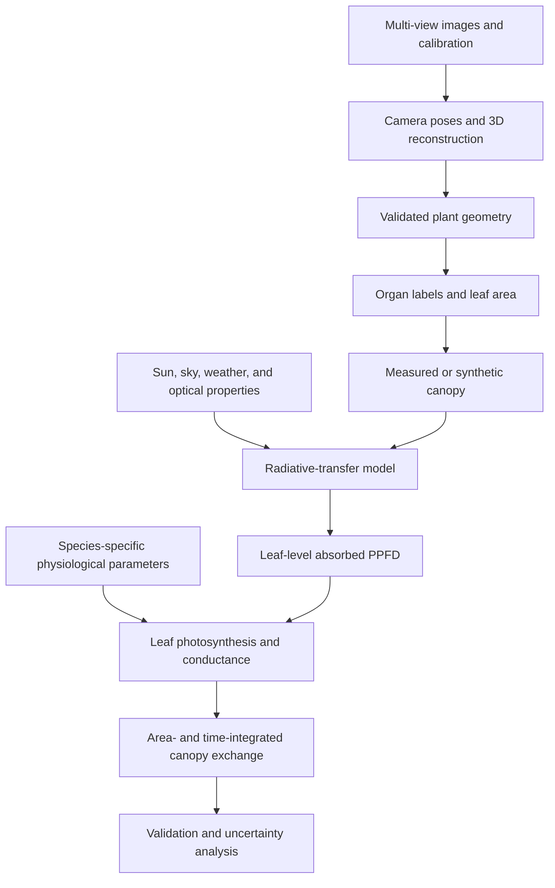

## 项目概述

冠层光合作用建模把若干不同的系统连接起来：图像采集、三维重建、器官几何、辐射传输、叶片生理和环境驱动。本文定义了这些阶段之间的接口和验证要求。

它是一套**概念性科研工作流**，不是一个完整可运行的模拟器。每个阶段都需要经过测试的实现、定标参数、单位、不确定性分析，以及与独立测量的比较。

<!-- truncate -->

## 工作流图



这些箭头是数据契约。例如，辐射传输模型需要带已知单位和法线的几何；光合作用模型需要以物理单位表示的吸收辐射，而不是任意的射线命中计数。

## 1. 先定义科学问题

可能的问题包括：

- 叶角分布如何影响冠层内的光照？
- 哪些结构性性状解释了日碳增益的差异？
- 重建的冠层能否复现测得的光截获？
- 某个作物模型参数对三维结构变异有多敏感？

问题决定了必要的空间和时间分辨率。一个可视化模型并不能自动支持定量的碳通量声明。

预注册或记录：

- 目标变量和单位；
- 空间单元：叶片、植株、小区或冠层；
- 时间单元：瞬时、小时或天；
- 实验因子和重复；
- 定标和验证观测；
- 可接受的误差或决策阈值。

## 2. 采集多视图图像

使用与植株尺度相称的采集方案：

- 稳定的光照和最小的叶片运动；
- 锁定或记录对焦、曝光、白平衡和焦距；
- 足够的重叠和多个高度；
- 测量过的尺度控制；
- 定标图像和相机元数据；
- 把图像与田间或人工气候室记录关联起来的受试者标识符。

转台和田间采集需要不同的背景策略。在转台装置中，必须掩膜静态房间特征，因为植株相对于它们旋转。在田间采集中，风和移动的阴影会违反静态场景假设。

### 采集验证

报告图像数量、被剔除的图像、角向或空间覆盖、模糊筛查、标志点可见性和缺失视图。对部分植株重复采集以量化采集可重复性。

## 3. 重建几何

### 运动恢复结构与多视图立体

SfM 估计相机位姿和稀疏场景结构；多视图立体创建更稠密的点云。诸如 COLMAP 之类的工具可提供这些阶段，但命令行选项名称会随版本变化。保存确切的软件版本和配置。

几何流程应产出：

- 相机位姿和内参；
- 带尺度的点云或网格；
- 逐顶点或逐面法线；
- 可用时的置信度或密度信息；
- 重建诊断信息。

### 三维高斯泼溅

三维高斯泼溅主要是一种用于新视图渲染的学习型辐射场表示。一组优化后的高斯并不自动是一个水密、经过度量验证的植株网格。几何提取需要一种额外的、有文档的方法及其自身的验证。

不要用几个张量参数替换 SfM 到网格的流程，就把结果称为完整的 3DGS。一个实际实现需要可微光栅化器、受约束的尺度/旋转/不透明度参数化、致密化和剪枝、相机定标，以及一条明确的导出路径。

## 4. 验证并处理网格

薄叶、自遮挡、纹理贫乏的表面和运动会产生孔洞和虚假表面。表面重建还可能填充无支撑的区域。

检查：

- 相对独立距离的尺度误差；
- 按器官和冠层深度的完整度；
- 重叠叶片之间的虚假连接；
- 网格法线和朝向；
- 非流形或退化几何；
- 对掩膜和重建设置的敏感性。

泊松重建返回一个光滑封闭表面，并可能外推到低密度区域。使用密度信息和测量证据来裁剪无支撑的表面，而不是接受默认网格。

## 5. 提取植株器官和叶面积

单凭一个曲率阈值并不是稳健的叶/茎分割方法。曲率取决于尺度、网格分辨率、噪声和邻域定义。

使用经过验证的组合：

- 几何和拓扑；
- 颜色或光谱信息；
- 有监督的器官标签；
- 植株发育约束；
- 在有代表性子集上的人工复核。

对每个器官，保留：

- 表面积及其计算方法；
- 朝向和法线约定；
- 厚度或双面叶假设；
- 分割置信度；
- 与原始植株和处理的关联。

把重建得到的总叶面积与破坏性叶面积测量或另一种独立方法进行比较。

## 6. 构建实测或合成冠层

有两种不同的科研产物：

1. **实测冠层：** 位置和几何从一个观测到的群体重建而来。
2. **合成冠层：** 生成植株实例和性状以检验假设。

合成扰动必须是可解释的。记录株距、株高、方位角、叶角和尺寸的分布、协方差、边界和随机种子。反复克隆一株植株并添加任意顶点噪声，并不能复现群体层面的结构多样性。

检查植株重叠、地下几何、不切实际的叶片相交，以及变换后叶面积的变化。

## 7. 以物理单位对光照环境建模

辐射传输阶段需要：

- 冠层坐标和单位；
- 直射和散射天空辐射；
- 由日期、时间和位置计算的太阳位置；
- 按波段的叶片反射率和透射率；
- 土壤/背景光学属性；
- 吸收和散射模型；
- 从截获能量到吸收 PPFD 或另一个定义量的映射。

以度给出的角度在使用 NumPy 三角函数前必须先转换：

```python
import numpy as np

elevation = np.deg2rad(elevation_degrees)
azimuth = np.deg2rad(azimuth_degrees)
```

统计首次射线交点产生的是采样密度，而不是辐照度。每条射线需要一个定义过的能量或概率权重，并且模型必须说明是否包含透射、反射、多次散射和散射辐射。

### 光照模型验证

把预测与独立观测比较，例如：

- 冠层上方和下方的 PAR 传感器；
- 垂直或水平光剖面；
- 截获辐射测量；
- 鱼眼图像或叶面积仪；
- 能量守恒和收敛性检查。

增加射线数量或空间分辨率，直到感兴趣的输出在预定义容差内收敛。

## 8. 参数化叶片光合作用

Farquhar–von Caemmerer–Berry 模型通过生化限制描述 C3 叶片光合作用。一个可信的实现需要的不仅仅是一个通用的 `Vcmax25` 和 `Jmax25`。

定义并说明：

- 物种、品种、叶龄和氮状况；
- 当叶片温度与气温不同时，使用叶片温度；
- 胞间或叶绿体 CO₂ 的处理方式；
- 受 Rubisco 限制、受电子传递限制，以及在相关时受 TPU 限制的速率；
- 日间呼吸；
- 温度响应函数；
- 气孔导度，以及在需要时的叶肉导度；
- 吸收光和光谱假设；
- 拟合参数的不确定性。

环境 CO₂ 浓度不能在没有导度模型或明确合理的近似下直接替代胞间 CO₂。

从适当的气体交换观测拟合生理参数，或引用与生物材料和条件相匹配的参数来源。通用文献常数适用于敏感性分析，不自动适用于定量预测。

## 9. 在不丢失单位的情况下积分叶片速率

对于净同化 `A_i`（单位为每平方米每秒微摩尔 CO₂）和单面面积 `a_i`（单位为平方米）的叶片元素 `i`：

```text
P_canopy = sum_i(A_i × a_i)
```

结果是每秒微摩尔 CO₂。面积加权平均为：

```text
A_mean = sum_i(A_i × a_i) / sum_i(a_i)
```

把总同化除以已占据体素的数量，并不能得到基于面积的速率。

对于日碳增益，使用环境驱动和一致的时间单位对时间积分。报告冠层域代表的是一株植株、一行片段、一平方米地面还是整个小区。

## 10. 保持实现的模块化

一个可复现的项目可以暴露明确的阶段接口：

```text
images + calibration
    -> camera poses + scaled geometry
geometry + organ labels
    -> leaf elements + area + normals
leaf elements + environment + optics
    -> absorbed PPFD by element and time
absorbed PPFD + physiology
    -> leaf assimilation by element and time
leaf assimilation + area
    -> canopy exchange + uncertainty
```

对每个接口，验证：

- 文件模式和坐标约定；
- 形状、单位、范围和缺失值；
- 来源和软件版本；
- 跨阶段的稳定标识符；
- 一个带有已知或人工检查结果的小型夹具。

## 11. 不确定性与敏感性

不确定性通过以下途径进入：

- 相机定标和尺度；
- 缺失或被错误重建的叶面积；
- 器官分割；
- 叶片法线和光学属性；
- 天空和太阳驱动；
- 生理参数拟合；
- 数值采样和时间积分。

使用扰动、蒙特卡洛或有设计的敏感性分析，来确定哪些不确定性控制了最终冠层结果。报告分布或区间，而不仅仅是一个单一模拟值。

## 定量声明的最低证据

- 独立的几何测量；
- 测量或有据支持的光学属性；
- 光照模型验证；
- 生理定标或适当的参数来源；
- 在可用时的冠层层面气体交换或生物量/碳证据；
- 跨植株或小区的可重复性；
- 一个完全版本化的环境、配置和数据清单。

没有这些证据，应把输出作为生成假设的模拟或可视化来呈现。

## 参考资料与实现

- [COLMAP 命令行界面](https://colmap.github.io/cli.html)
- [三维高斯泼溅论文与参考实现](https://repo-sam.inria.fr/fungraph/3d-gaussian-splatting/)
- [Open3D 表面重建指南](https://www.open3d.org/docs/latest/tutorial/Advanced/surface_reconstruction.html)
- [Farquhar, von Caemmerer, and Berry (1980)](https://biocycle.atmos.colostate.edu/Documents/SiB/Farquhar_1980.pdf)

这些资源记录了各个单独阶段。它们并不能免除对集成作物或冠层模型针对预期实验进行验证的需要。
