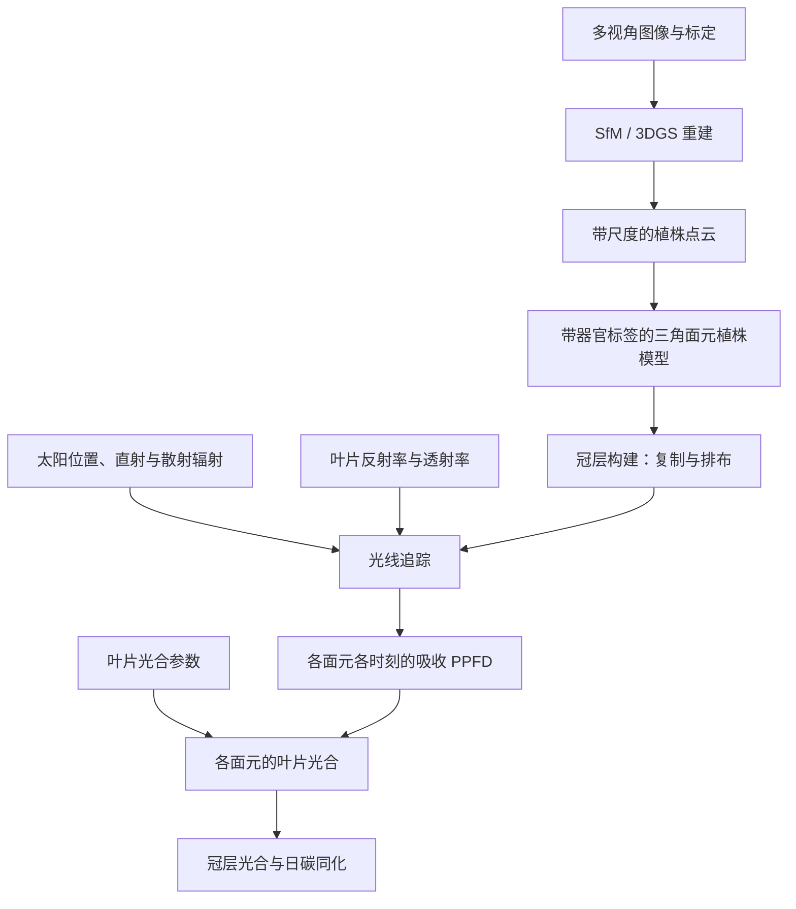

import { CottonCanopyFigure } from '@site/src/components/figures/Cotton3D';

## 概述

冠层光合作用取决于叶片在空间中的排布：株型决定每片叶接收多少光，叶片生理决定这些光有多少被固定为碳。大叶模型和多层模型把这种结构平均掉了。为了保留它，我构建了一个模块化模型：从真实植株的图像出发，中间经过显式的三维冠层，最终得到冠层碳同化。

模型分为五个环节：**多视角成像 → 三维重建 → 三角面元植株模型 → 光线追踪光分布 → 叶片到冠层的光合作用。** 每个环节输出确定的数据产品，因此各环节可以独立替换或重算，例如把 SfM 换成 3D 高斯溅射，而不改动光模型。

<!-- truncate -->

## 模型结构


```mermaid
flowchart TD
    A[多视角图像与标定] --> B[SfM / 3DGS 重建]
    B --> C[带尺度的植株点云]
    C --> D[带器官标签的三角面元植株模型]
    D --> E[冠层构建：复制与排布]
    F[太阳位置、直射与散射辐射] --> G[光线追踪]
    O[叶片反射率与透射率] --> G
    E --> G
    G --> H[各面元各时刻的吸收 PPFD]
    I[叶片光合参数] --> J[各面元的叶片光合]
    H --> J
    J --> K[冠层光合与日碳同化]
```

## 1. 多视角图像采集

在多个高度上环绕植株一周拍摄：人工气候室中使用转台，田间则由相机围绕植株移动。采集时固定对焦、曝光、白平衡和焦距，保持植株静止，并放置尺度标志物，使重建结果可以恢复到米制单位。转台采集时需要遮蔽静止背景，因为植株相对背景在旋转。

## 2. 三维重建

**运动恢复结构与多视图立体。** SfM（COLMAP）估计相机位姿和稀疏结构，多视图立体再将其加密为稠密点云。每次重建都保存软件版本和参数配置。

**3D 高斯溅射。** 3DGS 以图像为监督优化一组各向异性高斯基元，对细薄、相互遮挡的叶片重建得比稠密立体匹配更完整。由于高斯基元是辐射场表示而不是曲面，在进入光模拟之前需要单独的曲面提取步骤将其转换为几何。

重建几何用独立测量的距离校核尺度，并在进入下一环节前检查缺失或错误粘连的叶片。

## 3. 三角面元植株模型

光模型以三角形为计算单元。带尺度的点云经网格化后，每个三角面元包含：

- 三个顶点坐标和法向量，单位为米；
- 器官标签：叶片或非叶器官（茎、分枝、叶柄）；
- 该器官的光学参数：反射率和透射率。

器官标签来自点云分割，结合几何与颜色信息，并在代表性子集上人工复核。按器官汇总面元面积即得到单株叶面积，并与破坏性叶面积测量进行比对。

## 4. 冠层构建

按群体的种植位置（行距、株距、行数）摆放植株模型即构成冠层。每个植株实例可绕竖直轴旋转并对位置做扰动，避免相邻植株的叶片人为对齐。构建完成后检查植株间穿插、地面以下的几何以及变换前后叶面积是否改变。

下图即模型中使用的棉花冠层输入：同一株重建棉花复制 24 次，以三角面元描述，每个面元带有所属类别（叶片或其他器官）的反射率和透射率。

<CottonCanopyFigure />

## 5. 光线追踪模拟光分布

根据日期、时刻和地理位置计算太阳位置。直射辐射沿太阳方向以平行光线追踪，散射辐射从离散化的天空方向追踪。光线每次命中面元时沉积被吸收的能量，反射和透射部分按面元的反射率和透射率继续传播，因此冠层内的多次散射被计入；到达地面的光线按土壤反射率处理。

每条光线携带能量权重，因此结果是各面元吸收的光合光量子通量密度（PPFD，µmol m⁻² s⁻¹），而不是命中次数。不断增加光线数，直到冠层尺度结果收敛。角度在三角函数计算前先转换为弧度：

```python
import numpy as np

elevation = np.deg2rad(elevation_degrees)
azimuth = np.deg2rad(azimuth_degrees)
```

## 6. 叶片光合作用

每个面元吸收的 PPFD 驱动 Farquhar–von Caemmerer–Berry 类型的 C3 叶片光合模型。净同化速率取 Rubisco 限制速率和电子传递限制速率中的较小者，再减去日间呼吸。电子传递速率 J 随吸收光强按非直角双曲线变化：

```text
θJ² − (αI + Jmax)J + αI·Jmax = 0
```

其中 I 为吸收 PPFD，α 为量子效率，θ 为曲率，Jmax 为最大电子传递速率。Vcmax 与 Jmax 通过 Arrhenius 型温度响应函数从 25 °C 校正到叶温。Vcmax、Jmax 和日间呼吸由所模拟作物的气体交换测量（A–Ci 曲线与光响应曲线）拟合得到。

## 7. 从叶片到冠层

对净同化速率为 A_i（µmol CO₂ m⁻² s⁻¹）、单面面积为 a_i（m²）的面元 i：

```text
P_canopy = Σ A_i · a_i                 (µmol CO₂ s⁻¹)
A_mean   = Σ A_i · a_i / Σ a_i         (µmol CO₂ m⁻² s⁻¹)
```

P_canopy 除以模拟群体所占的地面面积，即得到单位地面面积的冠层光合速率；对一天内各时间步积分，即得到日碳同化量。每个结果都同时报告地面面积、时间步长和模拟范围（单株、行段或小区）。

## 8. 模块化实现

各环节之间交换明确的数据产品：

```text
图像 + 标定              -> 相机位姿 + 带尺度点云
点云 + 器官标签          -> 三角面元 + 面积 + 法向 + 光学参数
面元 + 种植布局          -> 冠层
冠层 + 太阳与天空        -> 各面元各时刻的吸收 PPFD
吸收 PPFD + 叶片模型     -> 各面元各时刻的同化速率
同化速率 + 面元面积      -> 冠层光合
```

每个接口都定义了包含单位和坐标约定的数据格式，并配有人工核对过结果的小型测试样例。正是这种模块化，使同一冠层可以在不同太阳位置、光学参数或生理参数下重算，也使不同株型可以在相同光环境下比较。

## 应用

- 量化叶倾角、叶面积垂直分布和株距对冠层内光环境和日碳同化的影响；
- 在显式三维冠层上比较品种或栽培管理（密度、行向）；
- 检验叶片光学特性（包括基于 BRDF 的叶片反射）对冠层光吸收的影响；
- 为作物生长模型提供显式株型输入。

## 适用范围与局限

模型在单个面元尺度上解析光环境，因此其精度取决于重建的完整性：缺失或粘连的叶片会同时改变叶面积和光截获。由单株复制构建的冠层不包含株间差异；当株间差异重要时，应使用多株重建植株。光分布预测与冠层上方和下方的 PAR 传感器进行比较；在有冠层气体交换测量时，用其检验冠层光合。

## 参考文献

- Farquhar, G. D., von Caemmerer, S., & Berry, J. A. (1980). A biochemical model of photosynthetic CO₂ assimilation in leaves of C3 species. _Planta, 149_, 78–90.
- [COLMAP](https://colmap.github.io/)
- [3D Gaussian Splatting](https://repo-sam.inria.fr/fungraph/3d-gaussian-splatting/)
- [Open3D 曲面重建](https://www.open3d.org/docs/latest/tutorial/Advanced/surface_reconstruction.html)
