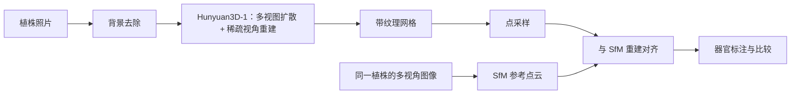

import { CottonCompareFigure } from '@site/src/components/figures/Cotton3D';

## 概述

多视角重建能得到准确的植株几何，但每株需要数十到数百张图像、受控的采集装置和较长的处理时间。生成式图像到三维模型走的是另一条路：仅凭**一张照片**就生成完整的带纹理三维模型，相机没有拍到的部分由模型推断。如果这种推断对植物足够准确，三维表型就能以低得多的成本扩展到多得多的植株上。

本工作将腾讯的 **Hunyuan3D-1** 应用于植物图像，并以同一植株的独立多视角重建为参照评估其结果。本文介绍以棉花为测试作物的生成流程以及与 SfM 的比较。


<!-- truncate -->

## 方法



Hunyuan3D-1 分两个阶段：扩散模型由输入照片生成一组一致的多视角图像，前馈重建模型再将这些视图转换为三维网格。生成的植株与同一植株的 SfM 重建进行比较，后者按[转台采集方案](/blog/growth-chamber-cotton-3d)获取。

## 1. 输入图像

在简单背景前拍摄植株，使整株完整入画，生成前去除背景。原始图像、背景去除方法、相机与光照信息、物种、基因型和生育期，与一个编号一并保存，使每个生成模型都能追溯到源图像。测试集既包括简单样本，也包括浓密冠层、细薄叶片和相互重叠的器官。

## 2. 安装

Hunyuan3D-1 有自己的代码仓库、权重目录结构和 `main.py` 入口。以下命令依照上游[代码仓库](https://github.com/tencent/Hunyuan3D-1)和[模型说明](https://huggingface.co/tencent/Hunyuan3D-1)，在配备 NVIDIA GPU 的 Linux 上执行；需先安装与驱动和 CUDA 运行时匹配的 PyTorch。

```bash
git clone https://github.com/tencent/Hunyuan3D-1
cd Hunyuan3D-1

conda create -n hunyuan3d-1 python=3.10
conda activate hunyuan3d-1
bash env_install.sh
python -m pip install "huggingface_hub[cli]"
```

权重：

```bash
mkdir -p weights
huggingface-cli download tencent/Hunyuan3D-1 --local-dir ./weights

mkdir -p weights/hunyuanDiT
huggingface-cli download Tencent-Hunyuan/HunyuanDiT-v1.1-Diffusers-Distilled \
  --local-dir ./weights/hunyuanDiT
```

每次运行都记录代码提交、模型版本和 Python 环境：

```bash
git rev-parse HEAD
python -m pip freeze > environment-lock.txt
```

Hunyuan3D 的后续版本在代码和硬件要求上有所不同；本流程针对 Hunyuan3D-1。

## 3. 生成

```bash
python3 main.py \
  --image_prompt "/absolute/path/to/plant.png" \
  --save_folder ./outputs/plant-001/ \
  --max_faces_num 90000 \
  --do_texture_mapping \
  --do_render
```

每个样本保存命令、随机种子、运行时间、GPU 峰值显存以及成功或失败状态。失败的生成同样保留在记录中，否则会高估方法的稳健性。

## 4. 从网格到点云

输出为带纹理的网格。为与 SfM 比较，用 Open3D 将其采样为点：

```python
import open3d as o3d

mesh = o3d.io.read_triangle_mesh("generated_mesh.obj")
if mesh.is_empty():
    raise ValueError("The generated mesh could not be loaded")

mesh.compute_vertex_normals()
points = mesh.sample_points_poisson_disk(number_of_points=100_000)
o3d.io.write_point_cloud("generated_mesh_sampled.ply", points)
```

## 5. 与 SfM 比较

生成模型没有物理尺度，位姿也是任意的。将其缩放并配准到同一植株的 SfM 重建上，并把两组点云标注为相同的器官类别：主茎、分枝与叶柄、叶片。下图为棉花样本 20240109-84-5：Hunyuan3D 点云已与 SfM 重建对齐，“叠加”视图显示生成几何与实测几何的偏差位置。

<CottonCompareFigure />

评估内容包括：

- **几何：** 相对 SfM 参考的点间距离和曲面距离，单位为米，分整体和器官类别统计；
- **性状：** 由两种重建分别计算株高、冠幅和器官尺度指标，逐株计算误差；
- **结构：** 器官缺失、重复或粘连；主茎与分枝的连续性；未观测一侧的合理性；
- **稳定性：** 随机种子、背景去除方式和输入视角带来的变化；
- **适用范围：** 按物种、生育期和遮挡程度分别给出结果。

每个样本的记录关联源图像、代码提交、模型版本、随机种子、命令和状态：

```json
{
  "sample_id": "plant-001",
  "source_image": "plant-001.png",
  "repository_commit": "<git-commit>",
  "model_revision": "<model-revision>",
  "seed": 0,
  "command": "python3 main.py ...",
  "status": "success"
}
```

## 适用范围与局限

单张图像观测不到植株背面、绝对尺度以及被叶片遮挡的器官，这些都由模型推断。因此，生成的几何在用于提取任何性状之前，都要与独立的、带尺度的重建进行比较，尺度取自参考重建而非模型本身。细薄叶片、叶柄、分枝连接处和浓密冠层是最难的情形。科研和商业使用均需遵守模型与代码的许可协议。
