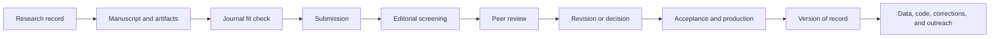

发表一篇科学论文不是一次单独的投稿事件。它是一个有记录的过程，把研究问题、站得住脚的方法、透明的证据、合适的期刊选择、同行评审，以及对论文、数据和代码的长期维护连接起来。

本指南提供一套不偏出版商的工作流。确切的状态标签、DOI 时间节点、录用稿件政策和索引惯例因期刊而异，因此请始终遵循所选期刊当前的作者须知。


<!-- truncate -->

## 发表工作流



## 1. 在选择期刊之前先定义贡献

为每一项写一句话：

- **问题：** 解决了什么未解决的问题或实际局限？
- **证据：** 哪些观测、实验、模拟或分析回答了它？
- **贡献：** 因为这项工作，什么变得可能或被更好地理解？
- **边界：** 结论不应推广到哪里？

选择与证据相匹配的论文类型：研究论文、方法论文、数据论文、软件论文、简报、观点或综述。一个没有验证的新工具不自动算是方法贡献，一个没有充分文档的大型数据集也不自动可复用。

## 2. 按契合度和可信度选择期刊

从范围和受众出发，而不是单一指标。

| 标准 | 要问的问题 |
| --- | --- |
| 范围 | 该期刊近期是否发表过类似问题和证据类型的工作？ |
| 受众 | 目标科学共同体是否会找到并使用该结果？ |
| 文章格式 | 它是否接受该稿件、数据、软件或方法格式？ |
| 审稿与生产 | 典型周期、编辑政策和费用是否透明？ |
| 访问与权利 | 开放获取选项、许可和自存档规则是什么？ |
| 科研诚信 | 是否明确说明伦理、更正、撤稿和数据政策？ |
| 索引 | 该期刊是否确实被本领域相关的数据库索引？ |

影响因子可以描述期刊层面的引用模式；它不衡量单篇论文的质量。避免那些保证录用、模仿其他期刊身份、隐瞒费用或提供无法核实编辑信息的期刊。

## 3. 构建可复现的稿件包

大多数实证论文使用类 IMRaD 结构，但期刊的作者指南优先。

| 章节 | 核心职责 |
| --- | --- |
| 引言 | 定义问题、空白和贡献，而不必综述每一篇相关论文 |
| 材料与方法 | 使合格的读者能够理解并尽可能复现该工作 |
| 结果 | 报告证据，不隐瞒阴性或零结果 |
| 讨论 | 解释结果、比较替代方案并说明局限 |
| 结论 | 回答研究问题，不引入新证据 |

把稿件与其支撑材料一起准备：

- 带单位、样本量、不确定性和无障碍标签的图表；
- 在允许共享时的数据字典和分析就绪数据；
- 源代码、环境信息和一个可执行的工作流；
- 使用一致分类法（如 CRediT）的作者贡献；
- 资助、利益冲突、伦理批准和知情同意声明；
- 数据和代码可用性声明；
- 本领域要求的报告清单；
- 依据期刊政策对任何生成式 AI 使用的披露。

矢量格式在受接受时适用于图表和曲线图，而光栅图像应满足期刊的尺寸、颜色模式和分辨率要求。单凭“300 dpi”并不是适用于每种图的通用规则。

## 4. 进行投稿前审计

- [ ] 标题和摘要与实际证据相符。
- [ ] 每个陈述的目标都在结果和讨论中得到回答。
- [ ] 样本计数在正文、表格、图和补充材料中一致。
- [ ] 统计单元与实验设计匹配。
- [ ] 代码能从归档输入复现最终图表。
- [ ] 参考文献完整并与原始来源核对。
- [ ] 所有作者认可稿件和作者顺序。
- [ ] 再利用材料已获许可。
- [ ] 稿件未同时投往他处。
- [ ] 期刊的格式和政策清单已完成。

Zotero 或 EndNote 等文献管理器可以减少格式工作，但导入的元数据仍需人工核对。

## 5. 提交一份完整、一致的记录

投稿门户各不相同，但通常要求：

| 项目 | 用途 |
| --- | --- |
| 稿件 | 主要科学叙述 |
| 图表 | 需要时单独提供生产级文件 |
| 补充材料 | 扩展方法、结果、媒体或附录 |
| 投稿信 | 期刊契合度、贡献和必要声明 |
| 作者元数据 | 姓名、单位、ORCID ID 和贡献角色 |
| 建议或回避的审稿人 | 在要求时的专长和利益冲突 |
| 数据/代码声明 | 持久链接、访问条件或合理限制 |

把提交的 PDF、源文件、元数据、投稿信和稿件编号一起保存。在最终确认前检查生成的提交 PDF；转换可能改变公式、字体、换行和图序。

## 6. 谨慎解读编辑状态

状态名称因出版商而异。下表描述常见模式，而非通用规则。

| 典型状态 | 通常含义 | 是否公开可引用？ |
| --- | --- | --- |
| Submitted / With editor | 行政或编辑评估 | 通常不公开；单独的预印本可能可引用 |
| Under review | 外审进行中 | 通常不通过期刊公开 |
| Revision requested | 作者可提交修改稿和回复 | 该决定不是录用 |
| Accepted | 科学决定为正面；生产可能未完成 | 引用格式取决于期刊和风格；DOI 可能尚未存在 |
| Article in press / early view | 在分配期号前可能有出版商托管的版本 | 通常可按 DOI 引用，但术语各异 |
| Version of record | 最终出版商版本 | 可用其最终 DOI 和可用书目元数据引用 |

卷、期、页码范围、文章编号、DOI 分配、在线发表和数据库索引并不总是同时发生。核对文章记录，而不是从一个标签推断其状态。

## 7. 逐条回应审稿人

一份有用的回复文档应便于导航，并把审稿人文字、回复和确切的稿件改动分开。

```text
Reviewer 1, Comment 3
[Paste the complete comment]

Response
Thank you for identifying this ambiguity. We now define the biological
replicate before the statistical model and have rerun the analysis at the
plot level.

Change in manuscript
Methods, Section 2.4: "The plot, rather than an individual image, was
treated as the biological replicate ..."
```

当拒绝某条建议时，说明科学或实际原因，并在可能时补充一条局限或替代分析。如果只是回复信改了而稿件没改，不要声称已作修改。

## 8. 校对清样和正式版本

在生产期间，核对：

- 标题、作者姓名、单位和通讯作者信息；
- 公式、符号、单位和特殊字符；
- 图分辨率、标签、题注和颜色解读；
- 表格行、脚注和补充材料链接；
- 资助、伦理、数据和代码声明；
- 参考文献和 DOI 链接。

校对通常不是重新设计研究的第二次机会。如果发现实质性错误，请透明地联系生产编辑。

## 9. 引用实际发表状态

使用所引版本可用的元数据，并遵循要求的格式。不要为录用稿件虚构 DOI、期号或年份。

该示例论文更新后的 APA 格式参考文献为：

> Deng, L., Yu, L. X., Mao, L., Wang, Y., Guo, X., Wang, M., Zhang, Y., Song, Q., & Zhu, X.-G. (2025). Leaf bidirectional reflectance distribution function (BRDF) prediction with phenotypic traits in four species: Development of a novel measuring and analyzing framework. *Plant Phenomics, 7*(4), 100135. https://doi.org/10.1016/j.plaphe.2025.100135

DOI 是持久链接：[https://doi.org/10.1016/j.plaphe.2025.100135](https://doi.org/10.1016/j.plaphe.2025.100135)。

## 10. 维护科研记录

发表之后：

1. 依据期刊政策存档许可的稿件版本。
2. 更新 ORCID、机构主页、Google Scholar、Web of Science Researcher Profile 和个人网站。
3. 在承诺的持久位置发布数据和代码。
4. 创建与论文匹配的带标签软件发布。
5. 监控仓库 issue 并记录已知局限。
6. 通过适当的期刊机制及时更正实质性错误。
7. 保全复现图表所需的分析环境和溯源。

## 期刊分析工作簿

附带的工作簿是个人比较辅助工具，不是权威或永久最新的排名。期刊指标、费用、范围和审稿惯例会变化；每个决定都请在期刊官方网站上核实。

[下载期刊分析工作簿（.xlsx）](/files/2025journalanalysis.xlsx)

## 最终清单

定义贡献 → 按契合度选择 → 保全溯源 → 从证据出发写作 → 一致地提交 → 透明地回应 → 核对记录 → 维护产物。

**本指南的引用**

Deng, L. (2025). *From manuscript to publication: A practical guide for researchers.* Digital Crop Photosynthesis Phenotyping Platform.

*内容审阅及文献示例更新：2026 年 7 月。*
