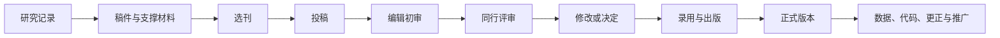

发表一篇论文并不是“投出去”这一个动作，而是一整个有记录的过程：从研究问题、可靠的方法、透明的证据，到选择合适的期刊、经历同行评审，再到对论文、数据和代码的长期维护。

本文介绍一套适用于各出版社的通用流程。具体的稿件状态名称、DOI 分配时间、录用稿政策和数据库收录规则因期刊而异，请以目标期刊最新的作者须知为准。


<!-- truncate -->

## 发表流程


```mermaid
flowchart LR
  A[研究记录] --> B[稿件与支撑材料]
  B --> C[选刊]
  C --> D[投稿]
  D --> E[编辑初审]
  E --> F[同行评审]
  F --> G[修改或决定]
  G --> H[录用与出版]
  H --> I[正式版本]
  I --> J[数据、代码、更正与推广]
```

## 1. 先想清楚贡献，再选期刊

每一项用一句话写下来：

- **问题：** 解决了什么尚未解决的问题或现有方法的什么不足？
- **证据：** 用哪些观测、实验、模拟或分析回答了这个问题？
- **贡献：** 这项工作让什么成为可能，或让人们对什么理解得更清楚？
- **边界：** 结论不能推广到哪些情形？

文章类型要与证据相称：研究论文、方法论文、数据论文、软件论文、简报、观点或综述。新工具如果没有验证，算不上方法学贡献；大数据集如果缺乏说明文档，别人也很难复用。

## 2. 按契合度和可信度选期刊

先看期刊的收稿范围和读者群，而不是只看一个指标。

| 考虑因素 | 需要回答的问题 |
| --- | --- |
| 收稿范围 | 期刊近期是否发表过问题和证据类型相近的文章？ |
| 读者群 | 目标领域的研究者会不会读到并用上这项成果？ |
| 文章类型 | 是否接收这类论文、数据、软件或方法文章？ |
| 审稿与出版 | 审稿周期、编辑政策和费用是否公开透明？ |
| 获取与版权 | 开放获取选项、许可协议和自存档规定是什么？ |
| 学术规范 | 伦理、更正、撤稿和数据政策是否明确？ |
| 数据库收录 | 是否确实被本领域常用的数据库收录？ |

影响因子反映的是期刊整体的引用情况，不代表单篇论文的质量。对承诺保证录用、冒用其他期刊名称、隐瞒收费或编辑信息无法核实的期刊，要保持警惕。

## 3. 准备完整、可复现的稿件材料

多数实证研究论文采用 IMRaD 结构（引言、方法、结果、讨论），但以期刊的作者须知为准。

| 部分 | 主要任务 |
| --- | --- |
| 引言 | 讲清问题、研究空白和本文贡献，不必罗列所有相关文献 |
| 材料与方法 | 让同行能看懂，并尽可能复现这项工作 |
| 结果 | 如实报告证据，阴性或无显著差异的结果也不回避 |
| 讨论 | 解释结果，与其他方法或研究比较，并说明局限 |
| 结论 | 回答研究问题，不引入新的证据 |

稿件之外，同时准备好支撑材料：

- 图表标注单位、样本量和不确定性，并考虑无障碍阅读；
- 在允许共享的前提下，提供数据字典和整理好的分析数据；
- 源代码、运行环境信息和可执行的分析流程；
- 按统一标准（如 CRediT）写明的作者贡献；
- 基金资助、利益冲突、伦理审批和知情同意声明；
- 数据与代码可用性声明；
- 本领域要求的报告规范清单；
- 按期刊政策披露生成式 AI 的使用情况。

期刊允许时，示意图和曲线图优先使用矢量格式；位图须满足期刊对尺寸、色彩模式和分辨率的要求。“300 dpi”并不适用于所有类型的图。

## 4. 投稿前自查

- [ ] 标题和摘要与实际证据相符；
- [ ] 文中提出的每个研究目标，在结果和讨论中都有回应；
- [ ] 正文、表格、图和补充材料中的样本数一致；
- [ ] 统计单元与实验设计相符；
- [ ] 代码能从归档的原始输入重新生成最终图表；
- [ ] 参考文献完整，并已与原文核对；
- [ ] 全体作者同意稿件内容和署名顺序；
- [ ] 引用他人的图表等材料已获得许可；
- [ ] 稿件没有一稿多投；
- [ ] 已完成期刊要求的格式和政策核查。

Zotero、EndNote 等文献管理软件能减少排版工作，但导入的文献信息仍需人工核对。

## 5. 提交完整、一致的材料

各投稿系统不尽相同，通常需要：

| 材料 | 作用 |
| --- | --- |
| 正文 | 论文的主体内容 |
| 图表 | 需要时单独提交可用于出版的文件 |
| 补充材料 | 补充的方法、结果、多媒体或附录 |
| 投稿信 | 说明与期刊的契合度、贡献和必要声明 |
| 作者信息 | 姓名、单位、ORCID 和贡献角色 |
| 推荐或回避的审稿人 | 期刊要求时提供，说明专长和利益冲突 |
| 数据与代码声明 | 永久链接、获取条件或合理的限制说明 |

把提交的 PDF、源文件、作者信息、投稿信和稿件编号一并存档。最终确认前，务必检查系统生成的 PDF，格式转换可能改变公式、字体、换行和图的顺序。

## 6. 正确理解稿件状态

各出版社的状态名称不同，下表是常见情况，并非统一规则。

| 常见状态 | 一般含义 | 能否公开引用 |
| --- | --- | --- |
| Submitted / With editor | 编辑部初审 | 通常不能；另行发布的预印本可以引用 |
| Under review | 外审进行中 | 通常不能通过期刊公开 |
| Revision requested | 可以提交修改稿和回复信 | 要求修改不等于录用 |
| Accepted | 学术上已录用，出版流程可能尚未完成 | 引用格式视期刊和引文规范而定，DOI 可能还没有分配 |
| Article in press / early view | 编入卷期前，出版社已在线发布 | 一般可按 DOI 引用，各家叫法不同 |
| Version of record | 出版社的最终版本 | 用最终 DOI 和完整的书目信息引用 |

卷、期、页码或文章编号、DOI 分配、在线发表和数据库收录，往往不是同时完成的。请以文章的实际记录为准，不要只凭状态名称推断。

## 7. 逐条回复审稿意见

好的回复信条理清楚，把审稿意见、作者回复和稿件中的具体修改分开写：

```text
Reviewer 1, Comment 3
[Paste the complete comment]

Response
Thank you for identifying this ambiguity. We now define the biological
replicate before the statistical model and have rerun the analysis at the
plot level.

Change in manuscript
Methods, Section 2.4: "The plot, rather than an individual image, was
treated as the biological replicate ..."
```

不采纳某条建议时，要说明科学上或实际操作上的理由，并尽可能补充一段局限说明或替代分析。只在回复信里说明、稿件却没有修改的，不能写“已修改”。

## 8. 校对清样和正式版本

出版过程中，逐项核对：

- 标题、作者姓名、单位和通讯作者信息；
- 公式、符号、单位和特殊字符；
- 图的分辨率、标注、图题，以及颜色是否易于辨识；
- 表格内容、表注和补充材料链接；
- 基金、伦理、数据和代码声明；
- 参考文献和 DOI 链接。

校对阶段一般不能再对研究内容做大的改动。如果发现实质性错误，应如实联系出版编辑。

## 9. 按实际发表状态引用

引用时使用该版本已有的信息，并遵循要求的引文格式。不要为已录用的论文编造 DOI、期号或年份。

以本人论文为例，最新的 APA 格式引用为：

> Deng, L., Yu, L. X., Mao, L., Wang, Y., Guo, X., Wang, M., Zhang, Y., Song, Q., & Zhu, X.-G. (2025). Leaf bidirectional reflectance distribution function (BRDF) prediction with phenotypic traits in four species: Development of a novel measuring and analyzing framework. *Plant Phenomics, 7*(4), 100135. https://doi.org/10.1016/j.plaphe.2025.100135

DOI 永久链接：[https://doi.org/10.1016/j.plaphe.2025.100135](https://doi.org/10.1016/j.plaphe.2025.100135)。

## 10. 发表之后

1. 按期刊政策，在允许的平台存档相应版本的稿件；
2. 更新 ORCID、单位主页、Google Scholar、Web of Science 研究者档案和个人网站；
3. 在承诺的永久存储位置公开数据和代码；
4. 为软件打一个与论文对应的版本标签；
5. 关注代码仓库中的问题反馈，并记录已知局限；
6. 发现实质性错误时，及时通过期刊的更正机制处理；
7. 保存重现图表所需的分析环境和数据来源记录。

## 期刊分析表

附带的表格是我个人比较期刊时用的参考，不是权威排名，也不保证始终最新。期刊指标、费用、收稿范围和审稿方式都会变化，做决定前请到期刊官网核实。

[下载期刊分析表（.xlsx）](/files/2025journalanalysis.xlsx)

## 小结

明确贡献 → 按契合度选刊 → 保留数据来源 → 用证据写作 → 规范投稿 → 如实回复 → 核对出版记录 → 持续维护成果。

**引用本文**

Deng, L. (2025). *From manuscript to publication: A practical guide for researchers.* Digital Crop Photosynthesis Phenotyping Platform.
