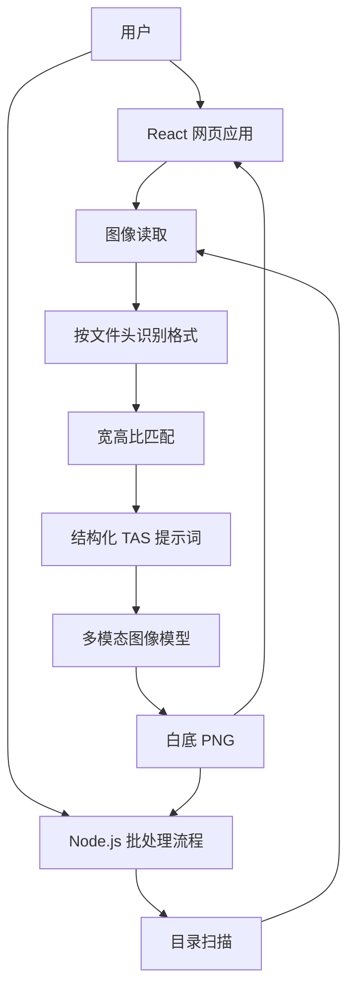

## 概述


温室、人工气候室和田间拍摄的植株图像背景复杂，包括土壤、花盆、墙面、标签和相邻植株。去除背景是大多数图像表型分析的第一步：人工分割耗时，而训练分割模型又需要针对每个物种和场景标注数据。

**Botanical Extract AI Pro** 无需针对任务训练即可去除植株背景。它利用多模态模型的视觉理解和图像编辑能力：模型接收植株照片和结构化指令，返回置于纯白（#FFFFFF）背景上的同一植株。同一套核心逻辑既运行在面向单张图像的交互式网页应用中，也运行在面向整批图像的 Node.js 处理流程中。

<!-- truncate -->

## 系统设计

系统由两个客户端和一个共享核心组成。



- **网页端：** React 19、TypeScript、Vite 和 Tailwind CSS。支持拖拽上传、原图与结果并排对比，以及宽高比和输出格式设置。
- **批处理端：** 基于 Node.js 与 `fs/promises`，用于处理数百到数千张图像。
- **核心层：** 格式识别、宽高比匹配和提示词构建由两端共享，保证交互测试与批量运行发出完全相同的请求。

## 关键方法

### 结构化提示词（Task–Action–Specification）

指令写成技术性编辑任务而非创作任务，以减少模型对植株重新绘制的倾向：

```text
TASK: Image segmentation / background replacement.
INPUT: A photo of a plant.
OUTPUT: The same plant, with the background replaced by pure solid white (#FFFFFF).

INSTRUCTIONS:
1. OUTPUT: Return the input image with the background replaced by solid white.
2. PRESERVATION: The plant (leaves, stems, flowers, pots if integral) must remain
   identical to the original. Do not redraw or restyle.
3. BACKGROUND: All non-plant pixels (walls, ground, shadows) must be solid white.
4. FORMAT: Return a PNG image.
```

提示词明确了任务、需要保留的对象、背景的范围（墙面、地面、阴影）以及输出格式。

### 宽高比匹配

图像模型只支持固定的几种输出比例。为避免拉伸和裁切，系统计算输入图像的宽高比 R = W/H，并从 `{1:1, 3:4, 4:3, 9:16, 16:9}` 中选择最接近的比例：

```typescript
const supported = [
  { id: "1:1", val: 1.0 },
  { id: "4:3", val: 4 / 3 },
  { id: "3:4", val: 3 / 4 },
  { id: "16:9", val: 16 / 9 },
  { id: "9:16", val: 9 / 16 },
];
const closest = supported.reduce((prev, curr) =>
  Math.abs(curr.val - ratio) < Math.abs(prev.val - ratio) ? curr : prev
);
```

### 基于文件头的格式识别

输入可能是浏览器中的 `File` 对象，也可能是 Node.js 的 `Buffer`。核心层不依赖文件扩展名，而是读取文件开头的特征字节来识别 PNG（`89 50 4E 47`）、JPEG（`FF D8`）或 BMP，去除 data URL 前缀后，以正确的 MIME 类型发送 Base64 数据。

### 批处理流程

批处理脚本（`batch-process.js`）：

1. 递归扫描输入目录中的图像文件；
2. 在输出目录中复刻输入目录结构，使结果仍按实验、处理或日期组织；
3. 捕获 API 错误，对限流（`429`）和服务端（`5xx`）错误延时重试，并记录失败文件的路径；
4. 运行过程中实时显示进度及成功、失败数量。

## 质量控制

每个输出都与未改动的原图并排保存。用于表型分析时，将输出与原图按相同比例叠加，检查细茎、叶尖、孔洞和花盆边缘。由于背景是均匀的纯白，通过简单阈值即可得到植株二值掩膜，从而在验证子集上与人工标注掩膜进行比较。

## 适用范围与局限

模型是在编辑图像而不是对像素分类，因此细茎、叶缘、小花等精细结构可能被改变或丢失，重复请求或更换模型版本也可能得到不同结果。对于叶面积、病斑面积等需要像素级精确掩膜的测量，输出需与标注掩膜核对，或改用训练过的分割模型。图像由模型服务商处理，研究图像适用服务商的数据政策；API 密钥保存在服务端或环境变量中，不写入客户端代码。
